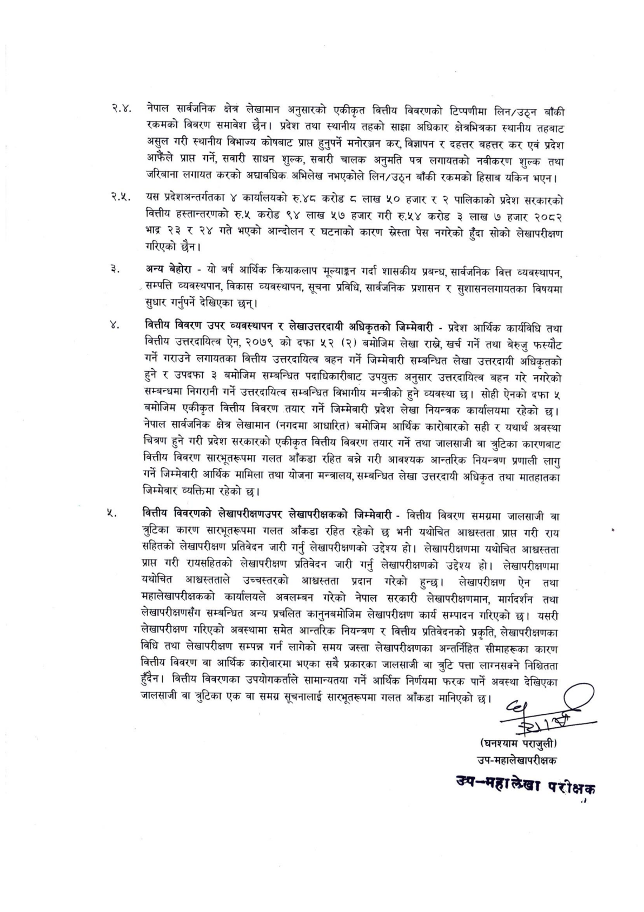

# Page 14 QA

## Rendered page


## Extracted text

```text
नेपाल सार्वजनिक क्षेत्र लेखामान अनुसारको एकीकृत वित्तीय विवरणको टिप्पणीमा लिन/उठ्न बाँकी रकमको विवरण समावेश छैन। प्रदेश तथा स्थानीय तहको साझा अधिकार क्षेत्रभित्रका स्थानीय तहबाट असुल गरी स्थानीय विभाज्य कोषबाट प्राप्त हुनुपर्ने मनोरञ्जन कर, विज्ञापन र दहत्तर बहत्तर कर एवं प्रदेश आफैंले प्राप्त गर्ने, सवारी साधन शुल्क, सवारी चालक अनुमति पत्र लगायतको नवीकरण शुल्क तथा जरिबाना लगायत करको अद्यावधिक अभिलेख नभएकोले लिन/उठ्न बाँकी रकमको हिसाब यकिन भएन।
२.५. यस प्रदेशअन्तर्गतका ४ कार्यालयको रु.४८ करोड ८ लाख ५० हजार र २ पालिकाको प्रदेश सरकारको वित्तीय हस्तान्तरणको रु.५ करोड ९४ लाख ५७ हजार गरी रु.५४ करोड ३ लाख ७ हजार २०८२ भाद्र २३ र २४ गते भएको आन्दोलन र घटनाको कारण स्ेस्ता पेस नगरेको हुँदा सोको लेखापरीक्षण गरिएको छैन।
अन्य बेहोरा -यो वर्ष आर्थिक क्रियाकलाप मूल्याङ्कन गर्दा शासकीय प्रबन्ध, सार्वजनिक वित्त व्यवस्थापन, सम्पत्ति व्यवस्थपान, विकास व्यवस्थापन, सूचना प्रविधि, सार्वजनिक प्रशासन र सुशासनलगायतका विषयमा सुधार गर्नुपर्ने देखिएका छन्‌।
बित्तीय विवरण उपर व्यवस्थापन र लेखाउत्तरदायी अधिकृतको जिम्मेवारी -प्रदेश आर्थिक कार्यविधि तथा वित्तीय उत्तरदायित्व ऐन, २०७९ को दफा ५२ (२) बमोजिम लेखा राख, खर्च गर्ने तथा बेरुजु फस्यौट गर्ने गराउने लगायतका वित्तीय उत्तरदायित्व बहन गर्ने जिम्मेवारी सम्बन्धित लेखा उत्तरदायी अधिकृतको हुने र उपदफा ३ बमोजिम सम्बन्धित पदाधिकारीबाट उपयुक्त अनुसार उत्तरदायित्व बहन गरे नगरेको सम्बन्धमा निगरानी गर्ने उत्तरदायित्व सम्बन्धित विभागीय मन्त्रीको हुने व्यवस्था छ। सोही ऐनको दफा ५ बमोजिम एकीकृत वित्तीय विवरण तयार गर्ने जिम्मेवारी प्रदेश लेखा नियन्त्रक कार्यालयमा रहेको छ। नेपाल सार्वजनिक क्षेत्र लेखामान (नगदमा आधारित) बमोजिम आर्थिक कारोबारको सही र यथार्थ अवस्था चित्रण हुने गरी प्रदेश सरकारको एकीकृत वित्तीय विवरण तयार गर्ने तथा जालसाजी वा ज्ुटिका कारणबाट वित्तीय विवरण सारभूतरूपमा गलत आँकडा रहित बन्ने गरी आवश्यक आन्तरिक नियन्त्रण प्रणाली लागु गर्ने जिम्मेवारी आर्थिक मामिला तथा योजना मन्त्रालय, सम्बन्धित लेखा उत्तरदायी अधिकृत तथा मातहातका जिम्मेवार व्यक्तिमा रहेको छ।
वित्तीय विवरणको लेखापरीक्षणउपर लेखापरीक्षकको जिम्मेवारी -वित्तीय विवरण समग्रमा जालसाजी वा कारण सारभूतरूपमा गलत आँकडा रहित रहेको छ भनी यथोचित आध्स्तता प्राप्त गरी राय सहितको लेखापरीक्षण प्रतिवेदन जारी गर्नु लेखापरीक्षणको उद्देश्य हो। लेखापरीक्षणमा यथोचित आश्वस्तता प्राप्त गरी रायसहितको लेखापरीक्षण प्रतिवेदन जारी गर्नु लेखापरीक्षणको उद्देश्य हो। लेखापरीक्षणमा यथोचित आध्चस्तताले उच्चस्तरको आध्चस्तता प्रदान गरेको हुन्छ। लेखापरीक्षण ऐन तथा महालेखापरीक्षकको कार्यालयले अवलम्बन गरेको नेपाल सरकारी लेखापरीक्षणमान, माग्दिर्शन तथा लेखापरीक्षणसँग सम्बन्धित अन्य प्रचलित कानुनबमोजिम लेखापरीक्षण कार्य सम्पादन गरिएको छ। यसरी लेखापरीक्षण गरिएको अवस्थामा समेत आन्तरिक नियन्त्रण र वित्तीय प्रतिवेदनको प्रकृति, लेखापरीक्षणका विधि तथा लेखापरीक्षण सम्पन्न गर्न लागेको समय जस्ता लेखापरीक्षणका अन्तर्निहित सीमाहरूका कारण वित्तीय विवरण वा आर्थिक कारोबारमा भएका सबै प्रकारका जालसाजी वा त्रुटि पत्ता लाग्नसक्ने निश्चितता हुँदैन। वित्तीय विवरणका उपयोगकर्ताले सामान्यतया गर्ने आर्थिक निर्णयमा फरक पार्ने अवस्था छै जालसाजी वा त्रुटिका एक वा समग्र सूचनालाई सारभूतरूपमा गलत आँकडा मानिएको |
(घनश्याम पराजुली) उप-महालेखापरीक्षक
उप-्महालेखा परीक्षक
उप-्महालेखा परीक्षक
```

## Flags
- None
