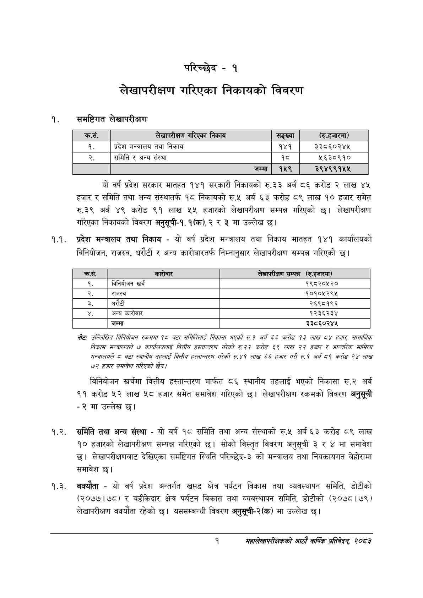

# Page 17 QA

## Rendered page


## Extracted text

```text
परिच्छेद -१
लेखापरीक्षण गरिएका निकायको विवरण
१. समष्टिगत लेखापरीक्षण
यो वर्ष प्रदेश सरकार मातहत १४१ सरकारी निकायको रु.३३ अर्ब ८६ करोड २ लाख ४५ हजार र समिति तथा अन्य संस्थातर्फ १८ निकायको रु.५ अर्ब ६३ करोड ८९ लाख ९० हजार समेत रु.३९ अर्ब करोड ९१ लाख ५४ हजारको लेखापरीक्षण सम्पन्न गरिएको छ। लेखापरीक्षण गरिएका निकायको विवरण अनुसूची-१, १(क),२ र ३ मा उल्लेख
१.१. प्रदेश मन्त्रालय तथा निकाय -यो वर्ष प्रदेश मन्त्रालय तथा निकाय मातहत १४१ कार्यालयको विनियोजन, राजस्व, धरौटी र अन्य कारोबारतर्फ निम्नानुसार लेखापरीक्षण सम्पन्न गरिएको छ।
नोटः उल्लिखित बिनियोजन रकममा १८ वटा समितिलाई निकासा भएको रु१ अर्ब §§ करोड ९३ लाख हजार सामाजिक विकास मन्त्रालयले ७ कार्यलियलाई बित्तीय हस्तान्तरण गरेको रु२२ करोड ५९ लाख २२ हजार र आन्तरिक मामिला मन्त्रालयले ८ वटा स्थानीय तहलाई बित्तीय हस्तान्तरण गरेको रु.४१ लाख ५६ हजार गरी रु१ अर्ब ८९ करोड २४ लाख ७२ हजार समावेश गरिएको छैन।
विनियोजन खर्चमा वित्तीय हस्तान्तरण मार्फत ८६ स्थानीय तहलाई भएको निकासा रु.२ अर्व ९१ करोड लाख ५८ हजार समेत समावेश गरिएको | लेखापरीक्षण रकमको विवरण अनुसूची
-२ मा उल्लेख छ।
१.२. समिति तथा अन्य संस्था -यो वर्ष १८ समिति तथा अन्य संस्थाको रु.५ अर्ब ६३ करोड ८९ लाख १० हजारको लेखापरीक्षण सम्पन्न गरिएको छ। सोको विस्तृत विवरण अनुसूची ३ र ४ मा समावेश छ। लेखापरीक्षणबाट देखिएका समष्टिगत स्थिति परिच्छेद-३ को मन्त्रालय तथा नियकायगत बेहोरामा समावेश छ।
१.३. बक्यौता -यो वर्ष प्रदेश अन्तर्गत खप्तड क्षेत्र पर्यटन विकास तथा व्यवस्थापन समिति, डोटीको (२०७७।७८) र बडीकेदार क्षेत्र पर्यटन विकास तथा व्यवस्थापन समिति, डोटीको (२०७८ | ७९) लेखापरीक्षण बक्यौता रहेको छ। यससम्बन्धी विवरण अनुसूची-२(क) मा उल्लेख छ।
१
महालेखापरीक्षकको आठौँ वार्षिक प्रतिवेदन २०८२

| क्रस. | लेखापरीक्षण निकाय | सङ्ख्या | (रि.हजारमा) |
| --- | --- | --- | --- |
| १. | प्रदेश सन्तालय तथा निकाय | १४१ | ३३८६०२४५ |
| २. | समिति र अन्य संस्था | १८ | ५६३८९१० |
|  | जम्मा | १५९ | २९४९९१५५ |

| क्रस. | कारोबार | लेखापरीक्षण सम्पन्न (रु.हजारमा) |
| --- | --- | --- |
| १. | विनियोजन खर्च | १९८२०५२० |
| २. | राजस्व | १०१०५२९५ |
| डे. | घरौटी | २६९८१९६ |
|  | अन्य कारोबार | १२३६२३४ |
|  | जम्मा | ३३८६०२४५ |
```

## Flags
- table_page
- medium_quality_table
