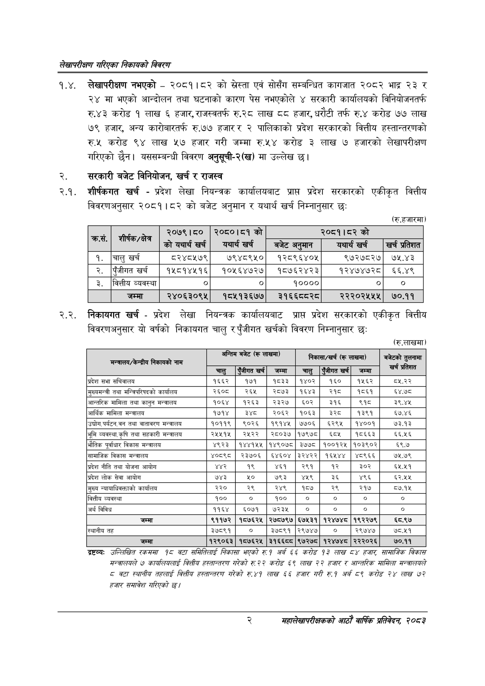

# Page 18 QA

## Rendered page


## Extracted text

```text
लेखापरीक्षण गरिएका निकायको बिवरण
१.४. लेखापरीक्षण नभएको -२०८१।८२ को स्नेस्ता एवं सोसँग सम्बन्धित कागजात २०८२ भाद्र २३ र २४ मा भएको आन्दोलन तथा घटनाको कारण पेस नभएकोले ४ सरकारी कार्यालयको विनियोजनतर्फ रु.४३ करोड १ लाख ६ हजार, राजस्वतर्फ रु.२८ लाख ८८ हजार, धरौटी तर्फ रु.४ करोड ७७ लाख ७९ हजार, अन्य कारोबारतर्फ रु.७७ हजार र २ पालिकाको प्रदेश सरकारको वित्तीय हस्तान्तरणको रु.५ करोड ९४ लाख ५७ हजार गरी जम्मा रु.५४ करोड ३ लाख ७ हजारको लेखापरीक्षण गरिएको छैन। यससम्बन्धी विवरण अनुसूची-२(ख) मा उल्लेख छ।
२. सरकारी बजेट विनियोजन, खर्च र राजस्व
२.१. शीर्षकगत खर्च -प्रदेश लेखा नियन्त्रक कार्यालयबाट प्राप्त प्रदेश सरकारको एकीकृत वित्तीय विवरणअनुसार २०८१।८२ को बजेट अनुमान र यथार्थ खर्च निम्नानुसार छः
(रु.हजारमा)
२.२. निकायगत खर्च -प्रदेश लेखा नियन्त्रक कार्यालयबाट प्राप्त प्रदेश सरकारको एकीकृत वित्तीय विवरणअनुसार यो वर्षको निकायगत चालु र पुँजीगत खर्चको विवरण निम्नानुसार छः
(रु.ललाखमा)
द्रष्टव्यः उल्लिखित रकममा ९८ बटा समितिलाई निकासा भएको रु१ अर्न ५६५ करोड ९३ लाख ८४ हजार सामाजिक विकास सन्तालयले ७ कायलियलाई बित्तीय हस्तान्तरण गरेको रु २२ करोड ५९ लाख २२ हजार र आन्तरिक सामिला मन्त्रालयले ८ बटा स्थानीय तहलाई बित्तीय हस्तान्तरण गरेको रु.४१ लाख ५६५ हजार गरी रु१ अर्ब ८९ करोड २४ लाख ७२ हजार समावेश गरिएको छ।
२
महालेखापरीक्षकको आठौँ वार्षिक प्रतिवेदन २०८२

|  | सहीत | \| ४८०५ \| | २७ को |  | २०८१।८२को |  |
| --- | --- | --- | --- | --- | --- | --- |
|  |  | कोयथार्श खर्च | यथार्थ खर्ब | बजेट अनमान | यथार्थ खर्च | खर्च प्रतिशत |
| १. | चालु खर्च | ८२४८५७९ | ७९४८९५० | १२८९६४०५ | ९७२७८२७ | ७१५.४३ |
| २. | पुँजीगत खर्च | १५८१४५१६ | १०५६४७२७ | १८७६२४२३ | १२४७४७२८ | ६६.४९ |
| ३. | वित्तीय व्यवस्था | ० |  | ४०००० |  |  |
|  | जम्मा | २४०६३०९५ | १८५१३६७७ | ३१६६८०२८ | २२२०२५५५ | ७०.११ |

| अन्तालय/केन्द्रीय निकायको नाम | अन्तिम | बजेट (€ | लाखमा) |  | निकासा/खर्च (रू | लाखमा) | बजेटको तुलनामा |
| --- | --- | --- | --- | --- | --- | --- | --- |
|  | चालु | पंजीगत खर्च | जम्मा | चालु | एंजीगत खर्च | जम्मा | खर्च प्रतिशत |
| प्रदेश सभा सचिवालय | १६६२ | १७१ | १८३३ | १४०२ | १६० | १५६२ | ८५.२२ |
| सुल्यभन्त्री तथा नन्जिचरिषएको कार्यालय | २६०८ | २६५ | २८७३ | १६४३ | २१८ | १८६१ | ६४.७८ |
| आन्तरिक मामिला तथा कानुन मन्त्रालय | १०६४ | १२६३ | २३२७ | ६०२ | ३१६ | २९ | ३९.४५ |
| आर्थिक मामिला मन्त्रालय | १७१४ | इश्द | २०६२ | १०६३ | इेरङ | १३९१ | ६७.४६ |
| 'उच्चोग,पर्यटन,वन तथा वातावरण मन्त्रालय | १०११९ | ९०२६ | १९१४५ | ७७०६ | ६२९५ | १४००१ | ७३.१३ |
| भूमि व्यवस्था,कृषि तथा सहकारी मन्त्रालय | २५५१५ | २५२२ | २८०३७ | १७९७८ | ६८५ | १८६६३ | ६६५६ |
| भौतिक पूर्वाधार विकास मन्त्रालय | ४९२३ | १४४१५५ | १४९०७८ | ३७७८ | १००१२५ | १०३९०२ | ६९.७ |
| सामाजिक विकास मन्त्रालय | ४०८९८ | २३७०६ | ६४६०४ | ३२४२२ | १६१४४ | ४८९६६ | ७५.७९ |
| प्रदेश नीति तथा योजना आयोग | ४४२ | १९ | ४६१ | २९१ | १२ | ३०२ | ६५.५१ |
| प्रदेश लोक सेवा आयोग | ७४३ | ५० | ७९३ | ४५९ | ३६ | ४९६ | ६२,५४५ |
| मुख्य न्वावाधिवक्ताको कार्यालय | २२० | २९ | २४९ | १८७ | २९ | २१७ | ८७.१५ |
| वित्तीय व्यवस्था | १०० | ० | १०० | ० | ० | ० | ० |
| अर्थ विविध | ११६४ | ६०७१ | ७२३५ | ० | ० | ० | ० |
| जम्मा | ९११७२ | १८७६२५ | २७८७९७ | ६७५३१ | १२४७४८ | १९२२७९ | ६८.९७ |
| स्थानीय तह | ३७८९१ | ० | ३७८९१ | २९७४७ | ० | २९७४७ | ७८.५१ |
| जम्मा | १२९०६३ | १८७६२५ | ३१६६८८ | ९७२७८ | १२४७४८ | २२२०२६ | ७०.११ |
```

## Flags
- table_page
- medium_quality_table
