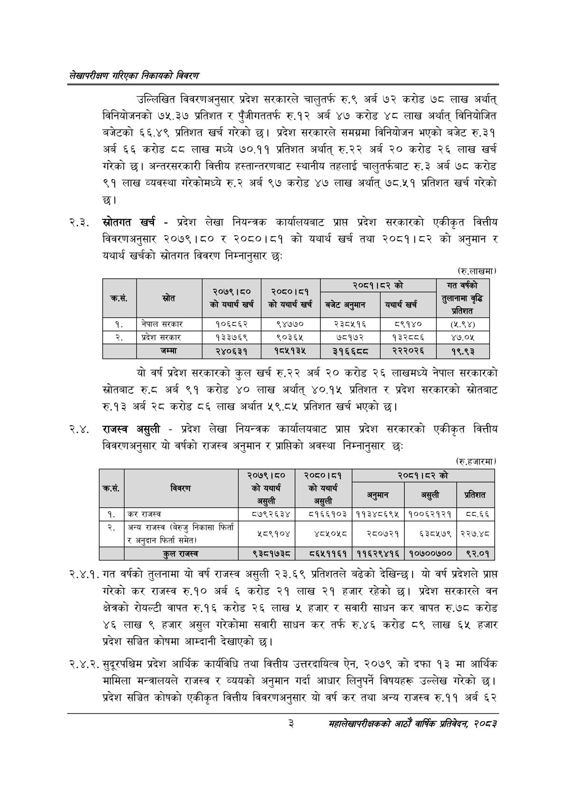

# Page 19 QA

## Rendered page


## Extracted text

```text
लेखापरीक्षण गरिएका निकायको बिवरण
उल्लिखित विवरणअनुसार प्रदेश सरकारले चालुतर्फ रु.९ अर्ब ७२ करोड ७८ लाख अर्थात्‌ विनियोजनको ७५.३७ प्रतिशत र पुँजीगततर्फ रु.१२ अर्ब ४७ करोड ४८ लाख अर्थात्‌ विनियोजित बजेटको ६६.४९ प्रतिशत खर्च गरेको | प्रदेश सरकारले समग्रमा विनियोजन भएको बजेट रु.३१ अर्ब ६६ करोड ६ लाख मध्ये ७०.११ प्रतिशत अर्थात्‌ रु.२२ अर्ब २० करोड २६ लाख खर्च गरेको | अन्तरसरकारी वित्तीय हस्तान्तरणबाट स्थानीय तहलाई चालुतर्फबाट रु.३ अर्ब ७८ करोड ९१ लाख व्यवस्था गरेकोमध्ये रु.२ अर्ब ९७ करोड ४७ लाख अर्थात्‌ ७८.५१ प्रतिशत खर्च गरेको छ।
२.३. स्रोतगत खर्च -प्रदेश लेखा नियन्त्रक कार्यालयबाट प्राप्त प्रदेश सरकारको एकीकृत वित्तीय विवरणअनुसार २०७९ |५० र २०८०।८१ को यथार्थ खर्च तथा २०८१।८२ को अनुमान र यथार्थ खर्चको स्रोतगात विवरण निम्नानुसार छः:
(रु.लाखमा)
यो वर्ष प्रदेश सरकारको कुल खर्च रु.२२ अर्ब २० करोड २६ लाखमध्ये नेपाल सरकारको स्रोतबाट रु.ठ अर्ब ९१ करोड ४० लाख अर्थात्‌ ४०.१५ प्रतिशत र प्रदेश सरकारको स्रोतबाट रु.१३ अर्ब २८ करोड ८६ लाख अर्थात ५९.८५ प्रतिशत खर्च भएको छ।
२.४. राजस्व असुली -प्रदेश लेखा नियन्त्रक कार्यालयबाट प्राप्त प्रदेश सरकारको एकीकृत वित्तीय विवरणअनुसार यो वर्षको राजस्व अनुमान र प्राप्तिको अवस्था निम्नानुसार छः
(रु.हजारमा)
२.४.१. गत वर्षको तुलनामा यो वर्ष राजस्व असुली २३.६९ प्रतिशतले बढेको देखिन्छ। यो वर्ष प्रदेशले प्राप्त गरेको कर राजस्व रु.१० अर्ब ६ करोड २१ लाख २१ हजार रहेको छ। प्रदेश सरकारले वन क्षेत्रको रोयल्टी वापत रु.१६ करोड २६ लाख ५ हजार र सवारी साधन कर वापत रु.७८ करोड ४६ लाख ९ हजार असुल गरेकोमा सवारी साधन कर तर्फ रु.४६ करोड ८९ लाख ६५ हजार प्रदेश सञ्चित कोषमा आम्दानी देखाएको छ।
२.४.२. सुदूरपश्चिम प्रदेश आर्थिक कार्यविधि तथा वित्तीय उत्तरदायित्व ऐन, २०७९ को दफा १३ मा आर्थिक मामिला मन्त्रालयले राजस्व र व्ययको अनुमान गर्दा आधार लिनुपर्ने विषयहरू उल्लेख गरेको छ। प्रदेश सञ्चित कोषको एकीकृत वित्तीय विवरणअनुसार यो वर्ष कर तथा अन्य राजस्व रु.११ अर्ब ६२
३
महालेखापरीक्षकको आठौँ वार्षिक प्रतिवेदन २०८२

| कस |  | २०७९।८० कोययार्थ खर्च | २०८०।८१ कोयथार्थ खर्च | २०८१।५२ बजेट अनुमान | को यथार्थ खर्च | गत वर्षको बृढि तशत |
| --- | --- | --- | --- | --- | --- | --- |
| १. | नेपाल सरकार | १०६८६२ | ९४७७० | २३८५१६ | ९१४० | (२५.९४) |
| २. | प्रदेश सरकार | १३३७६९ | ९०३६५ | ७८१७२ | १३२८८६ | ४७.०५ |
|  | जम्मा | २४०६३१ | १८४५१३५ | ३१६६८० | २२२०२६ | १९.९३ |

|  |  | २०७९।८० | २०८०।८१ |  | २०८१।८२ को |  |
| --- | --- | --- | --- | --- | --- | --- |
| कस. | विवरण | को यथार्थ असुली | को यथार्थ असुली | अनुमान अनुमा | अझुसी सुत | प्रतिशत |
| १. | कर राजस्व | ८७९२६३४ | ५१६६१०३ | ११३४८६९५ | १००६२१२१ | व५८०.६६ |
| २. | अन्य राजस्व (बेरुजु निकासा फिर्ता फिर्ता समे र अनुदान फिर्ता समेत) | १८९१०४ | ४८५०५८ | _ २८०७२१ | ६३८५७९ | २२७.४८ |
|  | हल राजस्व | ९३८१७३८ | ८६५११६१ | ११६२९४१६ | १०७००७०० | ९२.०१ |
```

## Flags
- table_page
- medium_quality_table
