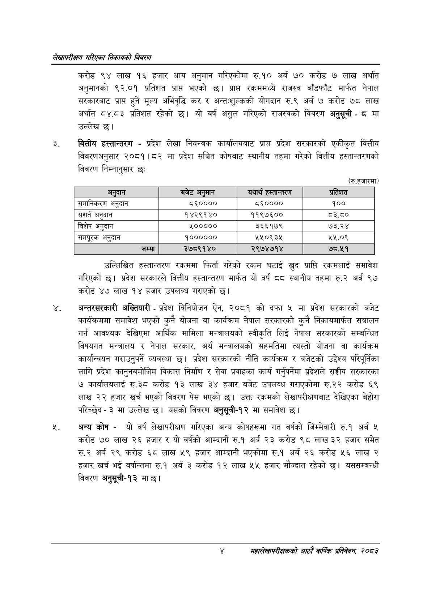

# Page 20 QA

## Rendered page


## Extracted text

```text
लेखापरीक्षण गरिएका निकायको बिवरण
करोड ९४ लाख १६ हजार आय अनुमान गरिएकोमा रु.१० अर्ब ७० करोड ७ लाख अर्थात अनुमानको ९२.०१ प्रतिशत प्राप्त भएको छ। प्राप्त रकममध्ये राजस्व बाँडफाँट मार्फत नेपाल सरकारबाट प्राप्त हुने मूल्य अभिवृद्धि कर र अन्त:शुल्कको योगदान रु.९ अर्ब ७ करोड ७८ लाख अर्थात ८४.८३ प्रतिशत रहेको छ। यो वर्ष असुल गरिएको राजस्वको विवरण अनुसूची -८ मा उल्लेख छ।
वित्तीय हस्तान्तरण -प्रदेश लेखा नियन्त्रक कार्यालयबाट प्राप्त प्रदेश सरकारको एकीकृत वित्तीय विवरणअनुसार २०८१।८२ मा प्रदेश सञ्चित कोषबाट स्थानीय तहमा गरेको वित्तीय हस्तान्तरणको विवरण निम्नानुसार छः
(रु.हजारमा)
उल्लिखित हस्तान्तरण रकममा फिर्ता गरेको रकम घटाई खुद प्राप्ति रकमलाई समावेश गरिएको छ। प्रदेश सरकारले वित्तीय हस्तान्तरण मार्फत यो वर्ष स्थानीय तहमा रु.२ अर्ब ९७ करोड ४७ लाख १४ हजार उपलब्ध गराएको छ।
अन्तरसरकारी अख्तियारी -प्रदेश विनियोजन ऐन, २०८१ को दफा ४ मा प्रदेश सरकारको बजेट कार्यक्रममा समावेश भएको कुनै योजना वा कार्यक्रम नेपाल सरकारको कुनै निकायमार्फत सञ्चालन गर्न आवश्यक देखिएमा आर्थिक मामिला मन्त्रालयको स्वीकृति लिई नेपाल सरकारको सम्बन्धित विषयगत मन्त्रालय र नेपाल सरकार, अर्थ मन्त्रालयको सहमतिमा त्यस्तो योजना वा कार्यक्रम कार्यान्वयन गराउनुपर्ने व्यवस्था छ। प्रदेश सरकारको नीति कार्यक्रम र बजेटको उद्देश्य परिपूर्तिका लागि प्रदेश कानुनबमोजिम विकास निर्माण र सेवा प्रवाहका कार्य गर्नुपर्नेमा प्रदेशले सङ्घीय सरकारका ७ कार्यालयलाई रु.३८ करोड ९३ लाख ३४ हजार बजेट उपलब्ध गराएकोमा रु.२२ करोड ६९ लाख २२ हजार खर्च भएको विवरण पेस भएको छ। उक्त रकमको लेखापरीक्षणबाट देखिएका बेहोरा परिच्छेद३ मा उल्लेख | यसको विवरण अनुसूची-१२ मा समावेश छ।
%, अन्य कोष -यो वर्ष लेखापरीक्षण गरिएका अन्य कोषहरूमा गत वर्षको जिम्मेवारी रु.१ अर्ब ५ करोड ७० लाख २६ हजार र यो वर्षको आम्दानी रु.१ अर्ब २३ करोड ९८ लाख ३२ हजार समेत रु.२ अर्ब २९ करोड ६८ लाख ५९ हजार आम्दानी भएकोमा रु.१ अर्ब २६ करोड ५६ लाख २ हजार खर्च भई वर्षान्तमा रु.१ अर्ब ३ करोड १२ लाख ५५ हजार मौज्दात रहेको छ। यससम्बन्धी विवरण अनुसूची-१३ मा छ।
महालेखापरीक्षकको आठौँ वार्षिक प्रतिवेदन २०८२

| अनुदान | बजेट अन मान | यथार्थ हस्तान्तरण | प्रतिशत |
| --- | --- | --- | --- |
| समानिकरण अनुदान | ८६०००० | ८६०००० | १०० |
| सशर्त अनुदान | १४२९१४० | ११९७६०० | ८३.८० |
| विशेष अनुदान | ५००००० | ३६६१७९ | ७३.२४ |
| समपूरक अनुदान | १०००००० | २२०९३४ | २५.०९ |
| जम्मा | ३७८९१४० | २९७४७१४ | ७८.५१ |
```

## Flags
- table_page
- medium_quality_table
