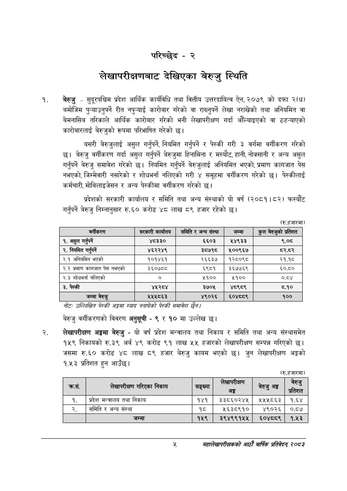

# Page 23 QA

## Rendered page


## Extracted text

```text
परिच्छेद -२
लेखापरीक्षणबाट देखिएका बेरुजु स्थिति
बेरुजु -सुदूरपश्चिम प्रदेश आर्थिक कार्यविधि तथा वित्तीय उत्तरदायित्व ऐन, २०७९ को दफा २(ध) बमोजिम पुन्याउनुपर्ने रीत नपुन्याई कारोबार गरेको वा राख्नुपर्ने लेखा नराखेको तथा अनियमित वा बेमनासिब तरिकाले आर्थिक कारोबार गरेको भनी लेखापरीक्षण गर्दा आँल्याइएको वा ठह-्याएको कारोबारलाई बेरुजुको रूपमा परिभाषित गरेको छ।
यसरी बेरुजुलाई असुल गर्नुपर्ने, नियमित गर्नुपर्ने र पेस्की गरी ३ वर्गमा वर्गीकरण गरेको छ। बेरुजु वर्गीकरण गर्दा असुल गर्नुपर्ने बेरुजुमा हिनामिना र मस्यौट, हानी, नोक्सानी र अन्य असुल गर्नुपर्ने बेरुजु समावेश गरेको छ। नियमित गर्नुपर्ने बेरुजुलाई अनियमित भएको, प्रमाण कागजात पेस नभएको, जिम्मेवारी नसारेको र शोधभर्ना नलिएको गरी ४ समूहमा वर्गीकरण गरेको छ। पेस्कीलाई कर्मचारी, मोबिलाइजेसन र अन्य पेस्कीमा वर्गीकरण गरेको छ।
प्रदेशको सरकारी कार्यालय र समिति तथा अन्य संस्थाको यो वर्ष (२०८१।८२) फस्यौट गर्नुपर्ने बेरुजु निम्नानुसार रु.६० करोड ४८ लाख ८९ हजार रहेको छ।
(रु.हजारमा)
नोटः उल्लिखित पेटकी अङ्गमा स्याद ननाघेको पेटकी समावेश छेन।
बेरुजु वर्गीकरणको विवरण अनुसूची -९ र ९० मा उल्लेख छ।
लेखापरीक्षण अङ्गमा बेरुजु -यो वर्ष प्रदेश मन्त्रालय तथा निकाय र समिति तथा अन्य संस्थासमेत १५९ निकायको रु.३९ अर्ब ४९ करोड ९१ लाख ५५ हजारको लेखापरीक्षण सम्पन्न गरिएको छ। जसमा रु.६० करोड ४८ लाख ८९ हजार बेरुजु कायम भएको छ। जुन लेखापरीक्षण अङ्गको १.५३ प्रतिशत हुन आउँछ।
(रु.हजारमा)
प्‌
महालेखापरीक्षकको आठौँ वाषिकि प्रतिवेदन्‌ २०८२

| बर्माकरण | सरकारी | समिति र अन्य संस्था | जम्मा | कुल बेरुजुको प्रतिशत |
| --- | --- | --- | --- | --- |
| १. असुल गर्नपर्ने | ४८३३० | ६६०३ | ५४९३३ | ९.०८ |
| २. नियमित गर्र्ने | ४६२२४९ | ३७१८ | १००९६७ | .५ |
| २.१ अनिवनित भएको | १०१४६१ | २६६३७ | १२८०९८ | २१.१८ |
| २.२ प्रमाण कागजात पेस नभएको | ३६०७८८ | ६९८१ | ३६७७६९ | ६०.८० |
| २.३ शोधभर्ना नलिएको | ० | ५१०० | ५१०० | ०.८४ |
| ३. पेस्की | ४५२८४ | ३७०५ | ४९८९ | ८.१० |
| जम्मा बेरुजु | २५५५८६३ | ४९०२६ | ६०४९ | १०० |

| क्रस. | लेखापरीक्षण गरिएका निकाय | सङ्ख्या | ा | अङ्क | डा |
| --- | --- | --- | --- | --- | --- |
| १. | प्रदेश मन्त्रालय तथा निकाय | १४१ | ३३८६०२४५ | १५५८६३ | १.६४ |
| २. | समिति र अन्य संस्था | १८ | ५६३८९१० | ४९०२६ | ०.८७ |
|  | जम्मा | १५९ | २९४९९१५५ | ६०४८८९ | १.५३ |
```

## Flags
- table_page
- medium_quality_table
