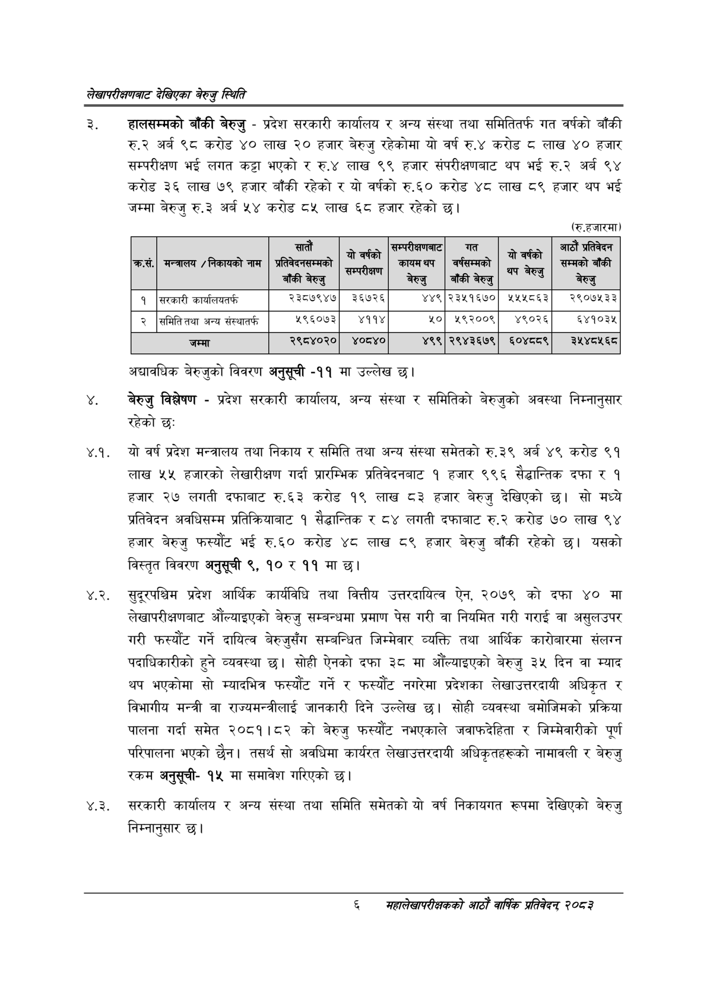

# Page 24 QA

## Rendered page


## Extracted text

```text
लेखापरीक्षणबाट देखिएका बेरुजु स्थिति
हालसम्मको बाँकी बेरुजु -प्रदेश सरकारी कार्यालय र अन्य संस्था तथा समितितर्फ गत वर्षको बाँकी अर्ब ९८ करोड ४० लाख २० हजार बेरुजु रहेकोमा यो वर्ष रु.४ करोड लाख ४० हजार सम्परीक्षण भई लगत कट्टा भएको र रु.४ लाख ९९ हजार संपरीक्षणबाट थप भई रु.२ अर्ब ९४ करोड ३६ लाख ७९ हजार बाँकी रहेको र यो वर्षको रु.६० करोड ४८ लाख ८९ हजार थप भई जम्मा बेरुजु रु.३ अर्ब ५४ करोड ८५ लाख ६८ हजार रहेको छ।
(रु.हजारमा)
अद्यावधिक बेरुजुको विवरण अनुसूची -११ मा उल्लेख छ।
बेरुजु विश्लेषण -प्रदेश सरकारी कार्यालय, अन्य संस्था र समितिको बेरुजुको अवस्था निम्नानुसार रहेको छः
४.१. यो वर्ष प्रदेश मन्त्रालय तथा निकाय र समिति तथा अन्य संस्था समेतको रु.३९ अर्ब ४९ करोड ९१ लाख ५५ हजारको लेखारीक्षण गर्दा प्रारम्भिक प्रतिवेदनबाट १ हजार ९९६ सैद्धान्तिक दफा र १ हजार २७ दफाबाट रु.६३ करोड १९ लाख ८३ हजार बेरुजु देखिएको सो मध्ये प्रतिवेदन अवधिसम्म प्रतिक्रियाबाट १ सैद्धान्तिक र ८४ लगती दफाबाट रु.२ करोड ७० लाख ९४ हजार बेरुजु फस्यौट भई रु.६० करोड ४८ लाख ८९ हजार बेरुजु बाँकी रहेको छ। यसको विस्तृत विवरण अनुसूची ९, १० र ११ मा छ।
४.२. सुदूरपश्चिम प्रदेश आर्थिक कार्यविधि तथा वित्तीय उत्तरदायित्व ऐन, २०७९ को दफा ४० मा लेखापरीक्षणबाट औंल्याइएको बेरुजु सम्बन्धमा प्रमाण पेस गरी वा नियमित गरी गराई वा असुलउपर गरी फस्यौट गर्ने दायित्व बेरुजुसँग सम्बन्धित जिम्मेवार व्यक्ति तथा आर्थिक कारोबारमा संलग्न पदाधिकारीको हुने व्यवस्था छु। सोही ऐनको दफा ३८ मा औँल्याइएको बेरुजु ३५ दिन वा म्याद थप भएकोमा सो म्यादभित्र फस्यौट गर्ने र फस्यौट नगरेमा प्रदेशका लेखाउत्तरदायी अधिकृत र विभागीय मन्त्री वा राज्यमन्त्रीलाई जानकारी दिने उल्लेख छ। सोही व्यवस्था बमोजिमको प्रक्रिया पालना गर्दा समेत २०८१।८२ को बेरुजु फरस्यौट नभएकाले जवाफदेहिता र जिम्मेवारीको पूर्ण परिपालना भएको छैन। तसर्थ सो अवधिमा कार्यरत लेखाउत्तरदायी अधिकृतहरूको नामावली र बेरुजु रकम अनुसूची१५ मा समावेश गरिएको छ।
४.३. सरकारी कार्यालय र अन्य संस्था तथा समिति समेतको यो वर्ष निकायगत रूपमा देखिएको बेरुजु निम्नानुसार छ।
६
महालेखापरीक्षकको आठौं वा्िकि २०८२

| कस. | नन्तासय / निकावको नाम | त बाँकी बेरुजु | #fi भि ५ १ १ १ २ ४ ४६७ ६५ ३४ २३ ६०.६९७६५५ बेल्नु ५ १ १ १ २ ५ ५४० ६५ ७४ २३ ३०.०२९८६९ बाँकीबेरुजु ५ १ १ १ २ ६ ६६५ ५२ ३४ २२ ०.०००००० ५ १ १ १ २ ७ ७५२ ६५ ३५ २३ ९६.३२१७३९ बेरुजु ३ १ १ २ ० ० २० १०१ ८०० १८ -१ ४ १ १ २ १ ० २० १०१ ८०० १८ -१ ५ १ १ २ १ १ २० १०५ ७ १४ ९६.४६७३७७ १ ५ १ १ २ १ २ ५० १०२ ४९ १६ ९३.२७४११७ सरकारी ५ १ १ २ १ ३ १०७ १०२ ७५ १५ ६९.५७५६६८ कार्यालबतर्फ ५ १ १ २ १ ४ २६९ १०२ ७९ १३ ८५.६६७९२३ २३८७९४७ ५ १ १ २ १ ५ ३७६ १०२ ५३ १३ ८५.८०३७७२ ३६७२६ ५ १ १ २ १ ६ ४९३ १०२ ३३ १३ ८६.१७७९८६ ४४९ ५ १ १ २ १ ७ ५३७ १०१ ७९ १४ ६५.९९३०२७ २३५१६७० ५ १ १ २ १ ८ ६३९ १०२ ६६ १३ १९.९३१८४१ २५५८६३ ५ १ १ २ १ ९ ७४३ १०२ ७७ १३ ७७.५४६८०६ २९०७५३३ ३ १ १ ३ ० ० २० १३७ ८०१ १७ -१ ४ १ १ ३ १ ० २० १३७ ८०१ १७ -१ ५ १ १ ३ १ १ २० १४२ ७ १२ ९१.७०४०४८ २ ५ १ १ ३ १ २ ५० १३७ ६७ १७ ८९.०६२३३२ समितितथा ५ १ १ ३ १ ३ १२६ १४३ २८ १० ९३.३०१२३९ अन्य ५ १ १ ३ १ ४ १६२ १३८ ५४ १६ ७७.३६८३७० संस्थातर्फ ५ १ १ ३ १ ५ २८१ १३८ ६६ १३ ७३.१३७१८४ ५९६०७३ ५ १ १ ३ १ ६ ३८६ १३७ ४५ १४ ९४.११६१०४ ४११४ ५ १ १ ३ १ ७ ५०६ १३८ २० १३ ७०.८९५४८५ ४० ५ १ १ ३ १ ८ ५४९ १३८ ६६ १३ ४६.८२७०१९ ४५९२००९ ५ १ १ ३ १ ९ ६५० १३८ ५५ १३ ९०.५२९६९४ ४९०२६ ५ १ १ ३ १ १० ७५५ १३७ ६६ १४ ७८.८२०८६२ ६४१०३४५ ३ १ १ ४ ० ० ९६ १७० ७२६ २६ -१ ४ १ १ ४ १ ० ९६ १७० ७२६ २६ -१ ५ १ १ ४ १ १ ९६ १७० ४४ २६ ५८.४९८१६१ जम्मा ५ १ १ ४ १ २ २७० १७३ ७८ १५ ८७.७४५२७० २९८४०२० ५ १ १ ४ १ ३ ३७५ १७३ ५६ १३ ८९.३४२६६७ ४०८४० ५ १ १ ४ १ ४ ४९४ १७३ ३२ १५ ९०.७४४३१६ ४९९ ५ १ १ ४ १ ५ ५३९ १७३ ७७ १५ ८७.२४१२११ २९४३६७९ ५ १ १ ४ १ ६ ६४१ १७३ ६५ १५ ५८.६४११०९ ६०४८८९ ५ १ १ ४ १ ७ ७४४ १७३ ७८ १५ ३९.३३८७७६ ३५४८४५६८ | छाए | पाको | दो | न |
| --- | --- | --- | --- | --- | --- | --- | --- |
|  |  |  |  |  |  |  |  |
|  |  |  |  |  |  |  |  |
|  |  |  |  |  |  |  |  |
```

## Flags
- table_page
- medium_quality_table
