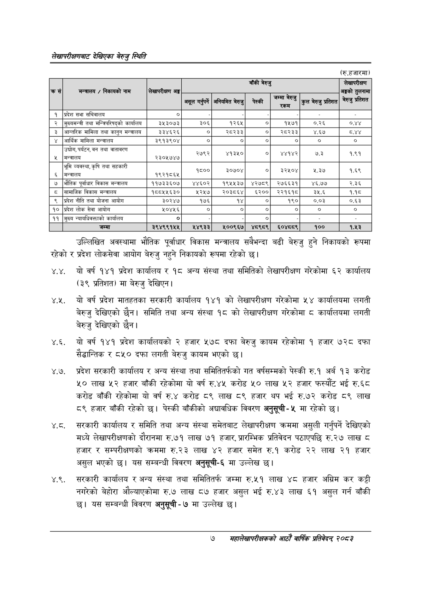

# Page 25 QA

## Rendered page


## Extracted text

```text
लेखापरीक्षणबाट देखिएका बेरुजु स्थिति
(रु.हजारमा)
उल्लिखित अवस्थामा भौतिक पूर्वाधार विकास मन्त्रालय सबैभन्दा बढी बेरुजु हुने निकायको रूपमा रहेको र प्रदेश लोकसेवा आयोग बेरुजु नहुने निकायको रूपमा रहेको छ।
४.४. यो वर्ष १४१ प्रदेश कार्यालय र १८ अन्य संस्था तथा समितिको लेखापरीक्षण गरेकोमा ६२ कार्यालय (३९ प्रतिशत) मा बेरुजु देखिएन |
४.२. यो वर्ष प्रदेश मातहतका सरकारी कार्यालय १४१ को लेखापरीक्षण गरेकोमा ५४ कार्यालयमा लगती बेरुजु देखिएको छैन। समिति तथा अन्य संस्था १८ को लेखापरीक्षण गरेकोमा ८ कार्यालयमा लगती बेरुजु देखिएको छैन।
४.६. यो वर्ष १४१ प्रदेश कार्यालयको २ हजार ५७८ दफा बेरुजु कायम रहेकोमा १ हजार ७२८ दफा सैद्धान्तिक र ८५० दफा लगती बेरुजु कायम भएको छ।
४.७. प्रदेश सरकारी कार्यालय र अन्य संस्था तथा समितितर्फको गत वर्षसम्मको पेस्की रु.१ अर्ब १३ करोड ५० लाख ५२ हजार बाँकी रहेकोमा यो वर्ष रु.४५ करोड ५० लाख ५२ हजार फस्यौट भई रु.६८ करोड बाँकी रहेकोमा यो वर्ष रु.४ करोड ८९ लाख ८९ हजार थप भई रु.७२ करोड ८९ लाख ८९ हजार बाँकी रहेको छ। पेस्की बाँकीको अद्यावधिक विवरण अनुसूची५ मा रहेको छ।
सरकारी कार्यालय र समिति तथा अन्य संस्था समेतबाट लेखापरीक्षण क्रममा असुली गर्नुपर्ने देखिएको मध्ये लेखापरीक्षणको दौरानमा रु.७१ लाख ७१ हजार, प्रारम्भिक प्रतिवेदन पठाएपछि रु.२७ लाख ८ हजार र सम्परीक्षणको क्रममा रु.२३ लाख ४२ हजार समेत रु.१ करोड २२ लाख २१ हजार असुल भएको छ। यस सम्बन्धी विवरण अनुसूची-६ मा उल्लेख छ।
४.९. सरकारी कार्यालय र अन्य संस्था तथा समितितर्फ जम्मा रु.५१ लाख ४८ हजार अग्रिम कर कट्टी नगरेको बेहोरा औल्याएकोमा रु.७ लाख ८७ हजार असुल भई रु.४३ लाख ६१ असुल गर्न बाँकी छ। यस सम्बन्धी विवरण अनुसूची -७ मा उल्लेख छ।
७
महालेखापरीक्षकको आठौँ वार्षिक प्रतिवेदन २०८२

| क्रस | मन्त्रालय / निकायको नाम | अङ्ग |  |  | बाँकी बेरुजु |  |  | लेखापरीक्षण अङ्गको तुलनामा |
| --- | --- | --- | --- | --- | --- | --- | --- | --- |
|  |  |  | असूल गर्ने सूल गर | अनियमित बेरुजु | पेस्की | रकम | कुल बेरुजु प्रतिशत कुल भैरुचु प्रतिशत | ३ प्रतिशत |
| १ | प्रदेश सभा सचिवालय | ० |  |  |  |  |  |  |
| २ | मुख्यमन्त्री तथा कार्यालय | ३५३०७३ | ३०६ | १२६५ | ० | १५७१ | ०.२६ | ०.४४ |
| ३ | अन्तरिक मामिला तथा कानुन मन्त्रालय | ३३४६२६ | ० | २८२३३ |  | र२८२३३ | ४.६७ | दश |
| ४ | आर्थिक मामिला मन्त्रालय | ३९१३९०४ | ० | ० | ० | ० | ० | ० |
| ४ | उद्योग, पर्यटन, वन तथा वातावरण मन्त्रालय | २३०५७४७ | २७९२ | ४१३४० | ० | ४४१४२ | ७.३ | १९१ |
| ६ | भूमि व्यवस्था, कृषि तथा सहकारी मन्त्रालय | १९२१८६४५ | १८०० | ३०७०४ | ० | इ२६०४ | २३७ | १६९ |
| ७ | भौतिक पूर्वाधार विकास मन्त्रालय | ११७३३६०७ | ४४६०२ | १९५५३७ | ४२७८९ | २७६६३१ | ४६.७७ | २.३६ |
| ८ | सामाजिक विकास मन्त्रालय | १८८५५६३० | ५२५७ | र२०३८६४ | ६२०० | २२१६१८ | ३५.६ | १.१८ |
| ९ | प्रदेश नीति तथा योजना आयोग | ३०२४७ | १७६ | १४ | ० | १९० | ०.०३ | ०.६३ |
| १० | प्रदेश लोक सेवा आयोग | २०४५६ | ० | ० | ० | ० | ० | ० |
| ९९ | मुख्य न्याथधिवक्ताको कार्यालय | ० |  |  | ० |  |  |  |
|  | जम्मा | ३९४९९१५५ | ५४९३३ | ५००९६७ | ४८९८९ | ६०४८८९ | १०० | १.५३ |
```

## Flags
- table_page
- medium_quality_table
