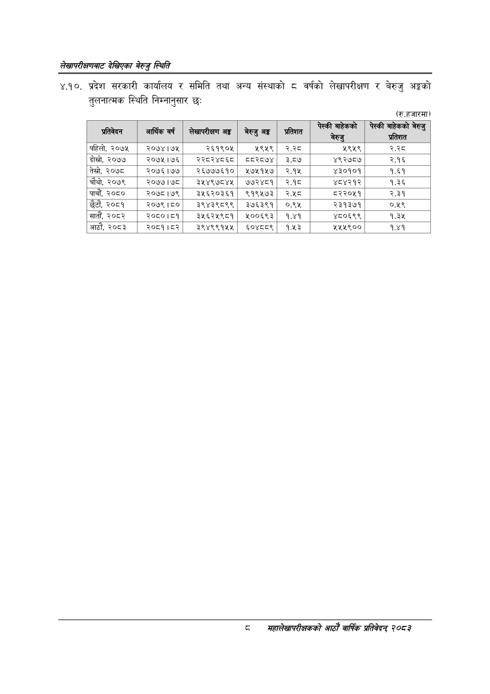

# Page 26 QA

## Rendered page


## Extracted text

```text
लेखापरीक्षणबाट देखिएका बेरुजु स्थिति
४.१०. प्रदेश सरकारी कार्यालय र समिति तथा अन्य संस्थाको ८ वर्षको लेखापरीक्षण र बेरुजु अङ्गको तुलनात्मक स्थिति निम्नानुसार छः
(रु.हजारमा)
८
सहालेखापरीक्षकको आठौँ वाषिक प्रतिवेदन २०८२

| प्रतिवेदन | गार्विक वर्ष | सेषापरीमण अङ्ग | बेरुजु अङ्क | प्रतिशत | लन | = हि ६) |
| --- | --- | --- | --- | --- | --- | --- |
| पहिलो, २०७५ | २०७४।७५ | २६१९०४५ | २९५९ | ३% | ५९५९ | २३५ |
| दोस्रो, २०७७ | २०७५।७६ | २२८२४८६८ | व८२८७४ | ३.८७ | ४९२७८७ | २.१६ |
| तेस्रो, २०७८ | २०७६।७७ | २६७७७६१० | २७५१५७ | २.१५ | ४३०१०१ | १.६१ |
| चौथो, २०७९ | २०७७।७८ | ३५४९७८४५ | ७७२४८१ | २.१८ | ४८४२१२ | १.३६ |
| पाचौं, २०८० | २०७८।७९ | ३५६२०३६१ | ९१९५७३ | २.५८ | ८२२०५१ | २.३१ |
| छैटौं, २०८१ | २०७९।८० | ३९४३९८९९ | ३७६३९१ | ०.९५ | २३१३७१ | ०४८ |
| सातौं, २०८२ | २०८०।८४१ | ३५६२५९८१ | ४५००६९३ | १.४१ | ४८०६९९ | ९.३% |
| आठौं, २०८३ | २०८१।८२ | ३९४९९१५५ | ६०४८५८९ | १.५३ | ५५५९०० | १.४१ |
```

## Flags
- table_page
- medium_quality_table
