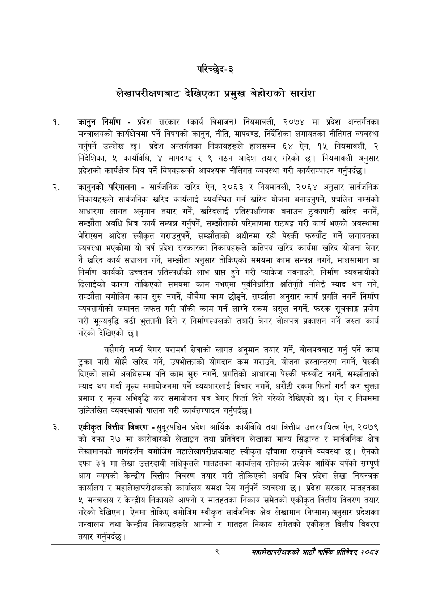

# Page 29 QA

## Rendered page


## Extracted text

```text
परिच्छेद-३
लेखापरीक्षणबाट देखिएका प्रमुख बेहोराको सारांश
कानुन निर्माण -प्रदेश सरकार (कार्य विभाजन) नियमावली, २०७४ मा प्रदेश अन्तर्गतका मन्त्रालयको कार्यक्षेत्रमा पर्ने विषयको कानुन, नीति, मापदण्ड, निर्देशिका लगायतका नीतिगत व्यवस्था गर्नुपर्ने उल्लेख छ। प्रदेश अन्तर्गतका निकायहरूले हालसम्म ६४ ऐन, १५ नियमावली, २ निर्देशिका, ५ कार्यविधि, ४ मापदण्ड र ९ गठन आदेश तयार गरेको छ। नियमावली अनुसार प्रदेशको कार्यक्षेत्र भित्र पर्ने विषयहरूको आवश्यक नीतिगत व्यवस्था गरी कार्यसम्पादन गर्नुपर्दछ |
कानुनको परिपालना -सार्वजनिक खरिद ऐन, २०६३ र नियमावली, २०६४ अनुसार सार्वजनिक निकायहरूले सार्वजनिक खरिद कार्यलाई व्यवस्थित गर्न खरिद योजना बनाउनुपर्ने, प्रचलित नम्सको आधारमा लागत अनुमान तयार गर्ने, खरिदलाई प्रतिस्पर्धात्मक बनाउन टुक्रापारी खरिद नगर्ने, सम्झौता अवधि भित्र कार्य सम्पन्न गर्नुपर्ने, सम्झौताको परिमाणमा घटबढ गरी कार्य भएको अवस्थामा भेरिएसन आदेश स्वीकृत गराउनुपर्ने, सम्झौताको अधीनमा रही पेस्की फस्यौट गर्ने लगायतका व्यवस्था भएकोमा यो वर्ष प्रदेश सरकारका निकायहरूले कतिपय खरिद कार्यमा खरिद योजना बेगर नै खरिद कार्य सञ्चालन गर्ने, सम्झौता अनुसार तोकिएको समयमा काम सम्पन्न नगर्ने, मालसामान वा निर्माण कार्यको उच्चतम प्रतिस्पर्धाको लाभ प्राप्त हुने गरी प्याकेज नबनाउने, निर्माण व्यवसायीको ढिलाईको कारण तोकिएको समयमा काम नभएमा पूर्वनिर्धारित क्षतिपूर्ति नलिई म्याद थप गर्ने, सम्झौता बमोजिम काम सुरु नगर्ने, बीचैमा काम छोड्ने, सम्झौता अनुसार कार्य प्रगति नगर्ने निर्माण व्यवसायीको जमानत जफत गरी बाँकी काम गर्न लाग्ने रकम असुल नगर्ने, फरक सूचकाङ्ग प्रयोग गरी मूल्यवृद्धि बढी भुक्तानी दिने र निर्माणस्थलको तयारी बेगर बोलपत्र प्रकाशन गर्ने जस्ता कार्य गरेको देखिएको छ।
यसैगरी नर्स बेगर परामर्श सेवाको लागत अनुमान तयार गर्ने, बोलपत्रबाट गर्नु पर्ने काम टुक्रा पारी सोझै खरिद गर्ने, उपभोक्ताको योगदान कम गराउने, योजना हस्तान्तरण नगर्ने, पेस्की दिएको लामो अवधिसम्म पनि काम सुरु नगर्ने, प्रगतिको आधारमा पेस्की फस्यौट नगर्ने, सम्झौताको म्याद थप गर्दा मूल्य समायोजनमा पर्ने व्ययभारलाई विचार नगर्ने, धरौटी रकम फिर्ता गर्दा कर चुक्ता प्रमाण र मूल्य अभिवृद्धि कर समायोजन पत्र बेगर फिर्ता दिने गरेको देखिएको छ। ऐन र नियममा उल्लिखित व्यवस्थाको पालना गरी कार्यसम्पादन गर्नुपर्दछ |
एकीकृत वित्तीय विवरण -सुदूरपश्चिम प्रदेश आर्थिक कार्यविधि तथा वित्तीय उत्तरदायित्व ऐन, २०७९ को दफा २७ मा कारोबारको लेखाङ्गन तथा प्रतिवेदन लेखाका मान्य सिद्धान्त र सार्वजनिक क्षेत्र लेखामानको मार्गदर्शन बमोजिम महालेखापरीक्षकबाट स्वीकृत ढाँचामा राख्ुपर्ने व्यवस्था छ। ऐनको दफा ३१ मा लेखा उत्तरदायी अधिकृतले मातहतका कार्यालय समेतको प्रत्येक आर्थिक वर्षको सम्पूर्ण आय व्ययको केन्द्रीय वित्तीय विवरण तयार गरी तोकिएको अवधि भित्र प्रदेश लेखा नियन्त्रक कार्यालय र महालेखापरीक्षकको कार्यालय समक्ष पेस गर्नुपर्ने व्यवस्था | प्रदेश सरकार मातहतका ५ मन्त्रालय र केन्द्रीय निकायले आफ्नो र मातहतका निकाय समेतको एकीकृत वित्तीय विवरण तयार गरेको देखिएन। ऐनमा तोकिए बमोजिम स्वीकृत सार्वजनिक क्षेत्र लेखामान (नेप्सास) अनुसार प्रदेशका मन्त्रालय तथा केन्द्रीय निकायहरूले आफ्नो र मातहत निकाय समेतको एकीकृत वित्तीय विवरण तयार गर्नुपर्दछ |
९
महालेखापरीक्षकको आठौँ वाषिकि प्रतिवेदन्‌ २०८२
```

## Flags
- None
