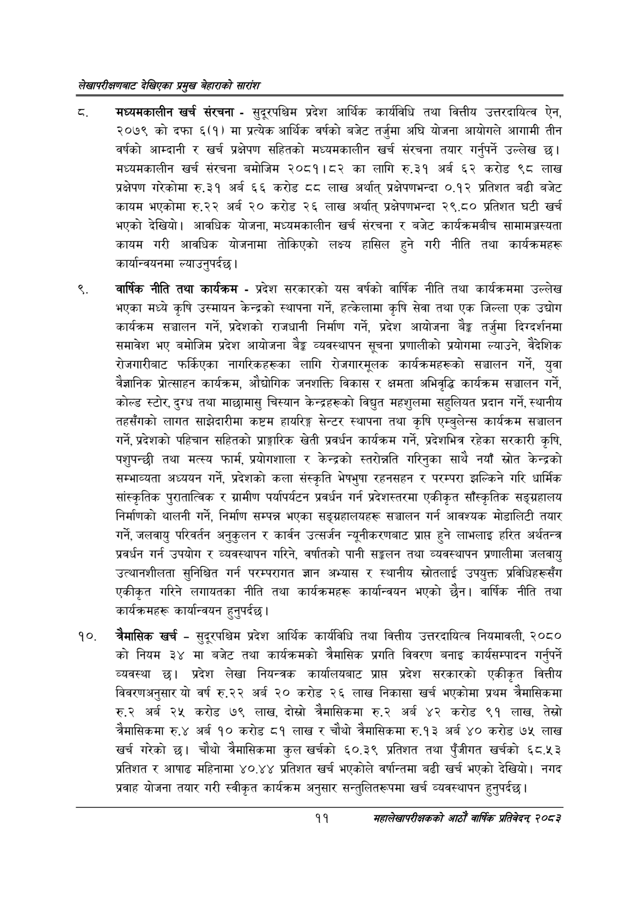

# Page 31 QA

## Rendered page


## Extracted text

```text
लेखापरीक्षणबाट देखिएका प्रमुख बेहाराको सारांश
मध्यमकालीन खर्च संरचना -सुदूरपश्चिम प्रदेश आर्थिक कार्यविधि तथा वित्तीय उत्तरदायित्व ऐन, २०७९ को दफा ६(१) मा प्रत्येक आर्थिक वर्षको बजेट तर्जुमा अघि योजना आयोगले आगामी तीन वर्षको आम्दानी र खर्च प्रक्षेपण सहितको मध्यमकालीन खर्च संरचना तयार गर्नुपर्ने उल्लेख छ। मध्यमकालीन खर्च संरचना बमोजिम २०८१।८२ का लागि रु.३१ अर्ब ६२ करोड ९८ लाख प्रक्षेपण गरेकोमा रु.३१ अर्ब ६६ करोड ठव लाख अर्थात्‌ प्रक्षेपणभन्दा ०.१२ प्रतिशत बढी बजेट कायम भएकोमा रु.२२ अर्ब २० करोड २६ लाख अर्थात्‌ प्रक्षेपणभन्दा २९.८० प्रतिशत घटी खर्च भएको देखियो। आवधिक योजना, मध्यमकालीन खर्च संरचना र बजेट कार्यक्रमबीच सामामञ्जस्यता कायम गरी आवधिक योजनामा तोकिएको लक्ष्य हासिल हुने गरी नीति तथा कार्यक्रमहरू कार्यान्वयनमा ल्याउनुपर्दछ।
वार्षिक नीति तथा कार्यक्रम -प्रदेश सरकारको यस वर्षको वार्षिक नीति तथा कार्यक्रममा उल्लेख भएका मध्ये कृषि उस्मायन केन्द्रको स्थापना गर्ने, हत्केलामा कृषि सेवा तथा एक जिल्ला एक उद्योग कार्यक्रम सञ्चालन गर्ने, प्रदेशको राजधानी निर्माण गर्ने, प्रदेश आयोजना बैङ्क तर्जुमा दिग्दर्शनमा समावेश भए बमोजिम प्रदेश आयोजना बेङ्ग व्यवस्थापन सूचना प्रणालीको प्रयोगमा ल्याउने, वैदेशिक रोजगारीबाट फर्किएका नागरिकहरूका लागि रोजगारमूलक कार्यक्रमहरूको सञ्चालन गर्ने, युवा वैज्ञानिक प्रोत्साहन कार्यक्रम, औद्योगिक जनशक्ति विकास र क्षमता अभिवृद्धि कार्यक्रम सञ्चालन गर्ने, कोल्ड स्टोर, दुग्ध तथा माछामासु चिस्यान केन्द्रहरूको विद्युत महशुलमा सहुलियत प्रदान गर्ने, स्थानीय तहसँगको लागत साझेदारीमा कष्टम हायरिङ्ग सेन्टर स्थापना तथा कृषि एम्बुलेन्स कार्यक्रम सञ्चालन गर्ने, प्रदेशको पहिचान सहितको प्राङ्गारिक खेती प्रवर्धन कार्यक्रम गर्ने, प्रदेशभित्र रहेका सरकारी कृषि, पशुपन्छी तथा मत्स्य फार्म, प्रयोगशाला र केन्द्रको स्तरोन्नति गरिनुका साथै नयाँ स्रोत केन्द्रको सम्भाव्यता अध्ययन गर्ने, प्रदेशको कला संस्कृति भेषभुषा रहनसहन र परम्परा झल्किने गरि धार्मिक सांस्कृतिक पुरातात्विक र ग्रामीण पर्यापर्यटन प्रवर्धन गर्न प्रदेशस्तरमा एकीकृत साँस्कृतिक सङ्ग्रहालय निर्माणको थालनी गर्ने, निर्माण सम्पन्न भएका सङ्ग्रहालयहरू सञ्चालन गर्न आवश्यक मोडालिटी तयार गर्ने, जलवायु परिवर्तन अनुकुलन र कार्वन उत्सर्जन न्यूनीकरणबाट प्राप्त हुने लाभलाइ हरित अर्थतन्त्र प्रवर्धन गर्न उपयोग र व्यवस्थापन गरिने, वर्षातको पानी सङ्गलन तथा व्यवस्थापन प्रणालीमा जलवायु उत्थानशीलता सुनिश्चित गर्न परम्परागत ज्ञान अभ्यास र स्थानीय स्रोतलाई उपयुक्त प्रविधिहरूसँग एकीकृत गरिने लगायतका नीति तथा कार्यक्रमहरू कार्यान्वयन भएको छैन। वार्षिक नीति तथा कार्यक्रमहरू कार्यान्वयन हुनुपर्दछ |
चैमासिक खर्च -सुदूरपश्चिम प्रदेश आर्थिक कार्यविधि तथा वित्तीय उत्तरदायित्व नियमावली, २०८० को नियम ३४ मा बजेट तथा कार्यक्रमको त्रैमासिक प्रगति विवरण बनाइ कार्यसम्पादन गर्नुपर्ने व्यवस्था छ। प्रदेश लेखा नियन्त्रक कार्यालयबाट प्राप्त प्रदेश सरकारको एकीकृत वित्तीय विवरणअनुसार यो वर्ष रु.२२ अर्ब २० करोड २६ लाख निकासा खर्च भएकोमा प्रथम त्रैमासिकमा रु.२ अर्ब २५ करोड ७९ लाख, दोस्रो त्रैमासिकमा रु.२ अर्ब ४२ करोड ९१ लाख, तेस्रो चैमासिकमा रु.४ अर्ब १० करोड ८१ लाख चौथो त्रैमासिकमा रु.१३ अर्ब ४० करोड ७५ लाख खर्च गरेको छ। चौथो त्रैमासिकमा कुल खर्चको ६०.३९ प्रतिशत तथा पुँजीगत खर्चको ६८.५३ प्रतिशत र आषाढ महिनामा ४०.४४ प्रतिशत खर्च भएकोले वर्षान्तमा बढी खर्च भएको देखियो। नगद प्रवाह योजना तयार गरी स्वीकृत कार्यक्रम अनुसार सन्तुलितरूपमा खर्च व्यवस्थापन हुनुपर्दछ |
११
महालेखापरीक्षकको आठौँ वाषिकि प्रतिवेदन्‌ २०८२
```

## Flags
- None
