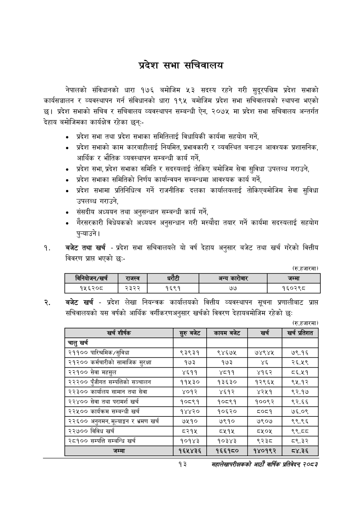

# Page 35 QA

## Rendered page


## Extracted text

```text
प्रदेश सभा सचिवालय
नेपालको संविधानको धारा १७६ बमोजिम ५३ सदस्य रहने गरी सुदूरपश्चिम प्रदेश सभाको कार्यसञ्चालन र व्यवस्थापन गर्न संविधानको धारा १९५ बमोजिम प्रदेश सभा सचिवालयको स्थापना भएको छ। प्रदेश सभाको सचिव र सचिवालय व्यवस्थापन सम्बन्धी ऐन, २०७५ मा प्रदेश सभा सचिवालय अन्तर्गत देहाय बमोजिमका कार्यक्षेत्र रहेका छन्‌:
प्रदेश सभा तथा प्रदेश सभाका समितिलाई विधायिकी कार्यमा सहयोग गर्ने,
प्रदेश सभाको काम कारबाहीलाई नियमित, प्रभावकारी र व्यवस्थित बनाउन आवश्यक प्रशासनिक, आर्थिक र भौतिक व्यवस्थापन सम्बन्धी कार्य गर्ने,
प्रदेश सभा, प्रदेश सभाका समिति र सदस्यलाई तोकिए बमोजिम सेवा सुविधा उपलब्ध गराउने,
प्रदेश सभाका समितिको निर्णय कार्यान्वयन सम्बन्धमा आवश्यक कार्य गर्ने,
प्रदेश सभामा प्रतिनिधित्व गर्ने राजनीतिक दलका कार्यालयलाई तोकिएबमोजिम सेवा सुविधा उपलब्ध गराउने,
० संसदीय अध्ययन तथा अनुसन्धान सम्बन्धी कार्य गर्ने,
० रौरसरकारी विधेयकको अध्ययन अनुसन्धान गरी मस्यौदा तयार गर्ने कार्यमा सदस्यलाई सहयोग पुन्याउने।
बजेट तथा खर्च -प्रदेश सभा सचिवालयले यो वर्ष देहाय अनुसार बजेट तथा खर्च गरेको वित्तीय विवरण प्रापत भएको छः-
(रु.हजारमा)
बजेट खर्च -प्रदेश लेखा नियन्त्रक कार्यालयको वित्तीय व्यवस्थापन सूचना प्रणालीबाट प्राप्त सचिवालयको यस वर्षको आर्थिक वर्गीकरणअनुसार खर्चको विवरण देहायबमोजिम रहेको छः
(रु.हजारमा)
१३
महालेखापरीक्षकको आठाोँ वाषिकि प्रतिवेदन २०८२

|  |  | बिनवोजन/खर्च | राजस्व | रेटी |  | अन्य कारोबार | जम्मा |
| --- | --- | --- | --- | --- | --- | --- | --- |
|  |  | १५६२०८ | २३२२ | १६९१ |  | ७७ | १६०२९८ |

| = शीर्षक | सुरुबबेट | कायम बजेट | खर्च | खर्च प्रतिशत |
| --- | --- | --- | --- | --- |
| चालु खर्च |  |  |  |  |
| २११०० पारिश्रमिक/सुविधा | ९३९३१ | ९४६७४५ | ७४९४५ | ७९.१६ |
| २१२०० कर्मचारीको सामाजिक सुरक्षा | १७३ | १७३ | ४६ | २६.५९ |
| २२१०० सेवा महसुल | ४६११ | ४८११ | ४१६२ | ८६.५१ |
| २२२०० पुँजीगत सम्पतिको सञ्चालन | ११५३० | १३६३० | १२९६४५ | ९५.१२ |
| २२३०० कार्यालय सामान तथा सेवा | ४०१२ | ४६१२ | ४२५१ | ९२.१७ |
| २२४०० सेवा तथा परामर्श खर्च | १०८९१ | १०८९१ | १००९२ | ९२.६६ |
| २२५०० कार्यक्रम सम्बन्धी खर्च | १४४२० | १०६२० | ८०८१ | ७६.०९ |
| २२६०० अनुगमन, भूल्याङ्गा र भ्रमण खर्च | ७५१० | ७९१० | ७९०७ | ९९.९६ |
| २२७०० विविध खर्च | ८२१५ | ८५१५ | ८१०४ | ९९.८८ |
| २८१०० सम्पत्ति सम्बन्धि खर्च | १०१४३ | १०३४३ | ९२३८ | ८९.३२ |
| जम्मा | १६५४३६ | १६६१८० | १४०१९२ | ८४.३६ |
```

## Flags
- table_page
- medium_quality_table
