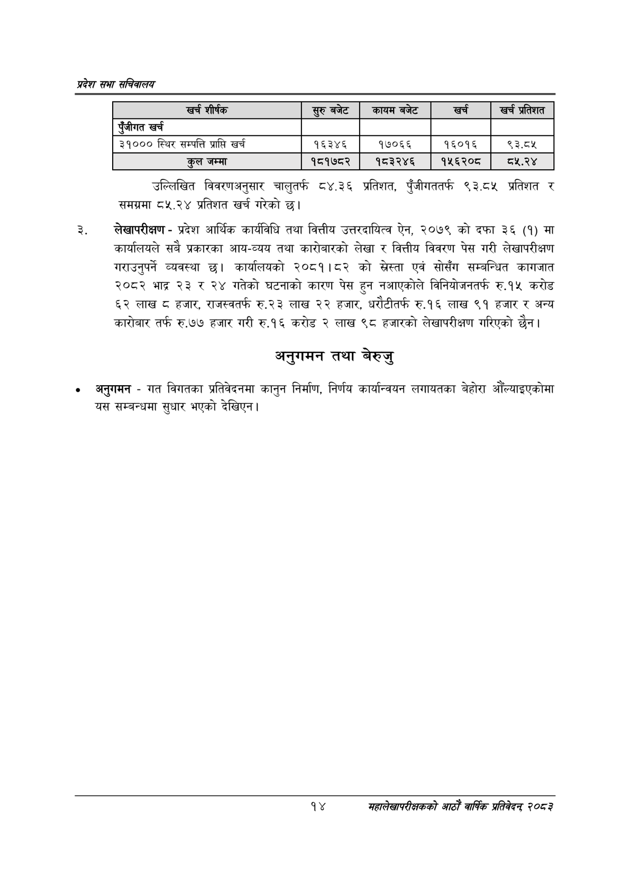

# Page 36 QA

## Rendered page


## Extracted text

```text
प्रदेश सभा सचिवालय
उल्लिखित विवरणअनुसार चालुतर्फ ८४.३६ प्रतिशत, पुँजीगततर्फ ९३.८५ प्रतिशत र समग्रमा ८५.२४ प्रतिशत खर्च गरेको छ।
लेखापरीक्षण -प्रदेश आर्थिक कार्यविधि तथा वित्तीय उत्तरदायित्व ऐन, २०७९ को दफा ३६ (१) मा कार्यालयले सबै प्रकारका आय-व्यय तथा कारोबारको लेखा र वित्तीय विवरण पेस गरी लेखापरीक्षण गराउनुपर्ने व्यवस्था छ। कार्यालयको २०८१।८२ को स्ेस्ता एवं सोसँग सम्बन्धित कागजात २०८२ भाद्र २३ र २४ गतेको घटनाको कारण पेस हुन नआएकोले विनियोजनतर्फ रु.१५ करोड ६२ लाख ८ हजार, राजस्वतर्फ रु.२३ लाख २२ हजार, धरोटीतर्फ रु.१६ लाख ९१ हजार र अन्य कारोबार तर्फ रु.७७ हजार गरी रु.१६ करोड २ लाख ९८ हजारको लेखापरीक्षण गरिएको छैन।
अनुगमन तथा बेरुजु
० अनुगमन -गत विगतका प्रतिवेदनमा कानुन निर्माण, निर्णय कार्यान्वयन लगायतका बेहोरा औँल्याइएकोमा यस सम्बन्धमा सुधार भएको देखिएन |
१४
महालेखापरीक्षकको आठाँ वाषिकि प्रतिवेदन्‌ २०८२

| खच शीर्षक | सुरुबबेट | कायम बजेट | खरी | खर्च प्रतिशत |
| --- | --- | --- | --- | --- |
| एंजीगत खर्च |  |  |  |  |
| ३१००० स्थिर सम्पत्ति प्राप्ति खर्च | १६३४६ | १७०६६ | १६०१६ | ९३.८५ |
| कुल जम्मा | १८१७८२ | १८३२४६ | १५६२०८ |  |
```

## Flags
- table_page
- medium_quality_table
