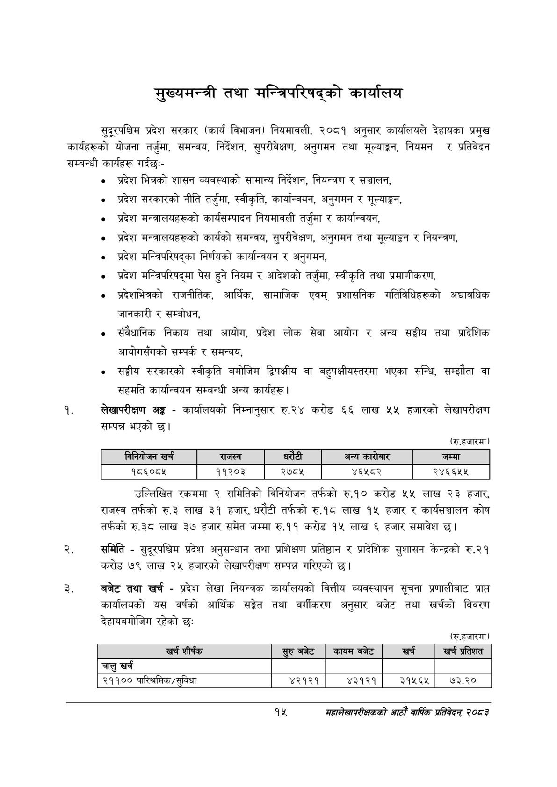

# Page 37 QA

## Rendered page


## Extracted text

```text
मुख्यमन्त्री तथा मन्त्रिपरिषद्को कार्यालय
सुदूरपश्चिम प्रदेश सरकार (कार्य विभाजन) नियमावली, २०८१ अनुसार कार्यालयले देहायका प्रमुख कार्यहरूको योजना तर्जुमा, समन्वय, निर्देशन, सुपरीवेक्षण, अनुगमन तथा मूल्याङ्कन, नियमन र प्रतिवेदन सम्बन्धी कार्यहरू गर्दछ:-
प्रदेश भित्रको शासन व्यवस्थाको सामान्य निर्देशन, नियन्त्रण र सञ्चालन,
प्रदेश सरकारको नीति तर्जुमा, स्वीकृति, कार्यान्वयन, अनुगमन र मूल्याङ्कन,
० प्रदेश मन्त्रालयहरूको कार्यसम्पादन नियमावली तर्जुमा र कार्यान्वयन,
प्रदेश मन्त्रालयहरूको कार्यको समन्वय, सुपरीवेक्षण, अनुगमन तथा मूल्याङ्कन र नियन्त्रण,
प्रदेश मन्त्रिपरिषद्का निर्णयको कार्यान्वयन र अनुगमन,
प्रदेश मन्त्रिपरिषद्मा पेस हुने नियम र आदेशको तर्जुमा, स्वीकृति तथा प्रमाणीकरण,
प्रदेशभित्रको राजनीतिक, आर्थिक, सामाजिक एवम्‌ प्रशासनिक गतिविधिहरूको अद्यावधिक जानकारी र सम्बोधन,
संवैधानिक निकाय तथा आयोग, प्रदेश लोक सेवा आयोग र अन्य सङ्घीय तथा प्रादेशिक आयोगसँगको सम्पर्क र समन्वय,
सङ्घीय सरकारको स्वीकृति बमोजिम द्विपक्षीय वा बहुपक्षीयस्तरमा भएका सन्धि, सम्झौता वा सहमति कार्यान्वयन सम्बन्धी अन्य कार्यहरू |
लेखापरीक्षण अङ्ग -कार्यालयको निम्नानुसार रु.२४ करोड ६६ लाख ५५ हजारको लेखापरीक्षण सम्पन्न भएको छ।
(रु.हजारमा)
उल्लिखित रकममा २ समितिको विनियोजन तर्फको रु.१० करोड ५५ लाख २३ हजार, राजस्व तर्फको रु.३ लाख ३१ हजार, धरौटी तर्फको रु.१८ लाख १५ हजार र कार्यसञ्चालन कोष तर्फको रु.३८ लाख ३७ हजार समेत जम्मा रु.११ करोड १४५ लाख ६ हजार समावेश |
समिति -सुदूरपश्चिम प्रदेश अनुसन्धान तथा प्रशिक्षण प्रतिष्ठान र प्रादेशिक सुशासन केन्द्रको रु.२१ करोड ७९ लाख २५ हजारको लेखापरीक्षण सम्पन्न गरिएको छ।
बजेट तथा खर्च -प्रदेश लेखा नियन्त्रक कार्यालयको वित्तीय व्यवस्थापन सूचना प्रणालीबाट प्राप्त कार्यालयको यस वर्षको आर्थिक सङ्गेत तथा वर्गीकरण अनुसार बजेट तथा खर्चको विवरण देहायबमोजिम रहेको छः
(रु.हजारमा)
१५
महालेखापरीक्षकको आठाँ वाषिकि प्रतिवेदन्‌ २०८२

|  |  | 'नानेकोजन खरी |  | राजस्व |  | ५ १ १ १ १ ५ ५२४ १३ ३२ १४ ९६.२१५३५५ अन्य ५ १ १ १ १ ६ ५६४ ७ ५७ २० २०.२१२९३६ कारोबार ५ १ १ १ १ ७ ७३१ १३ ४१ १४ ५७.७९४३७३ जम्मा ४ १ १ १ २ ० ६९ ४५ ७२० १५ -१ ५ १ १ १ २ १ ६९ ४५ ७४ १५ ७३.४६९४५२ १८६०८५ ५ १ १ १ २ २ २५० ४५ ६० १५ ९२.८९०९०० ११२०३ ५ १ १ १ २ ३ ३८८ ४५ ४९ १५ ७१.१११४०४ २७८५ ५ १ १ १ २ ४ ५४० ४५ ६१ १५ ८८.८३५०८३ ४६५८२ ५ १ १ १ २ ५ ७१४ ४५ ७५ १५ ८९.९०९५७६ २४६६५५ |  |  |
| --- | --- | --- | --- | --- | --- | --- | --- | --- |
|  |  |  |  |  |  |  |  |  |

| खर्च शीर्षक | र्रुबबेट | कायम बजेट | खच | खच प्रतिशत |
| --- | --- | --- | --- | --- |
| चालु खर्च |  |  |  |  |
| २११०० पारिश्रमिक/सुविधा | ४२१२१ | ४३१२१ | ३१५६५ | ७३.२० |
```

## Flags
- table_page
- medium_quality_table
