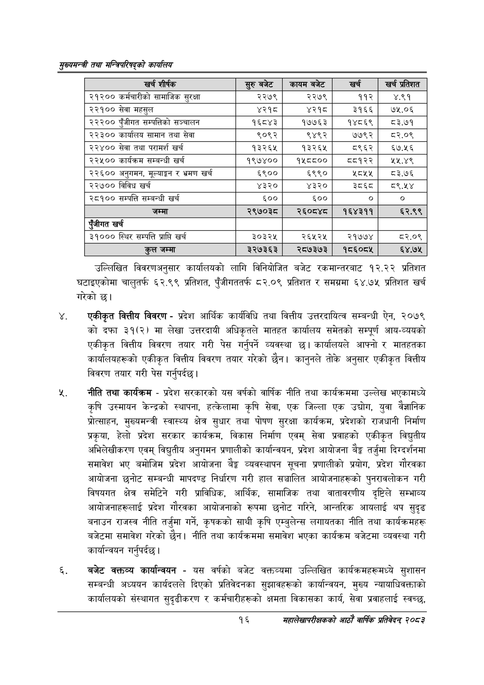

# Page 38 QA

## Rendered page


## Extracted text

```text
सुख्यसन्त्री तथा सन्तिपरिषद्को कायलिय
उल्लिखित विवरणअनुसार कार्यालयको लागि विनियोजित बजेट रकमान्तरबाट १२.२२ प्रतिशत घटाइएकोमा चालुतर्फ ६२.९९ प्रतिशत, पुँजीगततर्फ ८२.०९ प्रतिशत र समग्रमा ६४.७५ प्रतिशत खर्च गरेको छ।
एकीकृत वित्तीय विवरण -प्रदेश आर्थिक कार्यविधि तथा वित्तीय उत्तरदायित्व सम्बन्धी ऐन, २०७९ को दफा ३१(२) मा लेखा उत्तरदायी अधिकृतले मातहत कार्यालय समेतको सम्पूर्ण आय-व्ययको एकीकृत वित्तीय विवरण तयार गरी पेस गर्नुपर्ने व्यवस्था छ। कार्यालयले आफ्नो र मातहतका कार्यालयहरूको एकीकृत वित्तीय विवरण तयार गरेको छैन। कानुनले तोके अनुसार एकीकृत वित्तीय विवरण तयार गरी पेस गर्नुपर्दछ।
नीति तथा कार्यक्रम -प्रदेश सरकारको यस वर्षको वार्षिक नीति तथा कार्यक्रममा उल्लेख भएकामध्ये कृषि उस्मायन केन्द्रको स्थापना, हत्केलामा कृषि सेवा, एक जिल्ला एक उद्योग, युवा वैज्ञानिक प्रोत्साहन, मुख्यमन्त्री स्वास्थ्य क्षेत्र सुधार तथा पोषण सुरक्षा कार्यक्रम, प्रदेशको राजधानी निर्माण प्रकृया, हेलो प्रदेश सरकार कार्यक्रम, विकास निर्माण एवम्‌ सेवा प्रवाहको एकीकृत विद्युतीय अभिलेखीकरण एवम्‌ विद्युतीय अनुगमन प्रणालीको कार्यान्वयन, प्रदेश आयोजना बैङ्क तर्जुमा दिग्दर्शनमा समावेश भए बमोजिम प्रदेश आयोजना बैङ्क व्यवस्थापन सूचना प्रणालीको प्रयोग, प्रदेश गौरवका आयोजना छनोट सम्बन्धी मापदण्ड निर्धारण गरी हाल सञ्चालित आयोजनाहरूको पुनरावलोकन गरी विषयगत क्षेत्र समेटिने गरी प्राविधिक, आर्थिक, सामाजिक तथा वातावरणीय दृष्टिले सम्भाव्य आयोजनाहरूलाई प्रदेश गौरवका आयोजनाको रूपमा छनोट गरिने, आन्तरिक आयलाई थप सुदृढ बनाउन राजस्व नीति तर्जुमा गर्ने, कृषकको साथी कृषि एम्बुलेन्स लगायतका नीति तथा कार्यक्रमहरू बजेटमा समावेश गरेको छैन। नीति तथा कार्यक्रममा समावेश भएका कार्यक्रम बजेटमा व्यवस्था गरी कार्यान्वयन गर्नुपर्दछ।
बजेट वक्तव्य कार्यान्वयन -यस वर्षको बजेट वक्तव्यमा उल्लिखित कार्यक्रमहरूमध्ये सुशासन सम्बन्धी अध्ययन कार्यदलले दिएको प्रतिवेदनका सुझावहरूको कार्यान्वयन, मुख्य न्यायाधिवक्ताको कार्यालयको संस्थागत सुदृढीकरण र कर्मचारीहरूको क्षमता विकासका कार्य, सेवा प्रवाहलाई स्वच्छ,
१६
महालेखापरीक्षकको आठाँ वाषिकि प्रतिवेदन्‌ २०८२

| खर्च शीर्षक | र्रुबबेट | कायम बजेट |  | प्रतिशत |
| --- | --- | --- | --- | --- |
| २१२०० कर्मचारीको लामाजिक सुरक्षा | २२७९ | २२७९ | ११२ | ४.९१ |
| २२१०० सेवा महसुल | ४२१८ | ४२१८ | ३१६६ | ७५.०६ |
| २२२०० पुँजीगत सम्पत्तिको सञ्चालन | १६८४३ | १७७६३ | १४८६९ | ८३.७१ |
| २२३०० कार्यालय सामान तथा सेवा | ९०९२ | ९४९२ | ७७९२ | ८२.०९ |
| २२४०० सेवा तथा परामर्श खर्च | १३२६४५ | १३२६५ | ८९६२ | ६७.५६ |
| २२५०० कार्षक्रम सम्बन्धी खर्च | १९७४०० | १५८८०० | ८८१२२ | २५.४९ |
| २२६०० अनुगमन, मूल्याङ्कन र भ्रमण खर्च | ६९०० | ६९९० | २८५५ |  |
| २२७०० विविध खर्च | ४३२० | ४३२० | ३६ |  |
| २८१०० सम्पत्ति सम्बन्धी खर्च | ६०० | ६०० | ० | ० |
| जम्मा | २९७०३८ | र२६०८४८ | १६४३११ | ६२.९९ |
| एंजीगत खर्च |  |  |  |  |
| ३१००० स्थिर सम्पत्ति प्राप्ति खर्च | ३०३२५ | २६५२५ | २१७७४ | ८२.०९ |
| जम्मा | ३२७३६३ | २८७३७३ | १५६०८४५ | ६४.७५ |
```

## Flags
- table_page
- medium_quality_table
