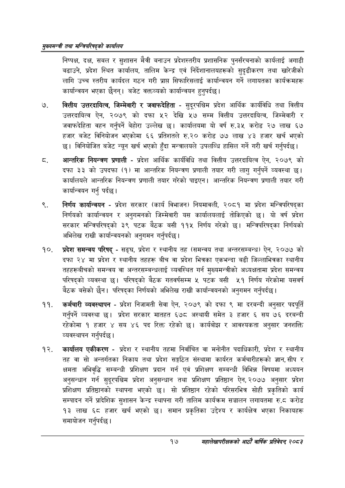

# Page 39 QA

## Rendered page


## Extracted text

```text
सुख्यसन्त्री तथा सन्तिपरिषद्को कायलिय
निष्पक्ष, दक्ष, सबल र सुशासन मैत्री बनाउन प्रदेशस्तरीय प्रशासनिक पुनर्संरचनाको कार्यलाई अगाडी बढाउने, प्रदेश स्थित कार्यालय, तालिम केन्द्र एवं निर्देशानालयहरूको सुदृढीकरण तथा खारेजीको लागि उच्च स्तरीय कार्यदल गठन गरी प्राप्त सिफारिसलाई कार्यान्वयन गर्ने लगायतका कार्यक्रमहरू कार्यान्वयन भएका छैनन्‌। बजेट वक्तव्यको कार्यान्वयन हुनुपर्दछ।
वित्तीय उत्तरदायित्व, जिम्मेवारी र जवाफदेहिता -सुदूरपश्चिम प्रदेश आर्थिक कार्यविधि तथा वित्तीय उत्तरदायित्व ऐन, २०७९ को दफा ५२ देखि ५७ सम्म वित्तीय उत्तरदायित्व, जिम्मेवारी र जवाफदेहिता वहन गर्नुपर्ने बेहोरा उल्लेख छ। कार्यालयमा यो वर्ष रु.३५ करोड २७ लाख ६७ हजार बजेट विनियोजन भएकोमा ६६ प्रतिशतले रु.२० करोड ७७ लाख ४३ हजार खर्च भएको \ विनियोजित बजेट न्यून खर्च भएको हुँदा मन्त्रालयले उपलब्धि हासिल गर्ने गरी खर्च गर्नुपर्दछ |
आन्तरिक नियन्त्रण प्रणाली -प्रदेश आर्थिक कार्यविधि तथा वित्तीय उत्तरदायित्व ऐन, २०७९ को दफा ३३ को उपदफा (१) मा आन्तरिक नियन्त्रण प्रणाली तयार गरी लागु गर्नुपर्ने व्यवस्था | कार्यालयले आन्तरिक नियन्त्रण प्रणाली तयार गरेको पाइएन। आन्तरिक नियन्त्रण प्रणाली तयार गरी कार्यान्वयन गर्नु पर्दछ।
निर्णय कार्यान्वयन -प्रदेश सरकार (कार्य विभाजन) नियमावली, २०८१ मा प्रदेश मन्त्रिपरिषद्का निर्णयको कार्यान्वयन र अनुगमनको जिम्मेवारी यस कार्यालयलाई तोकिएको छ। यो वर्ष प्रदेश सरकार मन्त्रिपरिषद्को ३९ पटक बैठक बसी ११५ निर्णय गरेको छ। मन्त्रिपरिषद्का निर्णयको अभिलेख राखी कार्यान्वयनको अनुगमन गर्नुपर्दछ |
१०, प्रदेश समन्वय परिषद्‌ -सङ्घ, प्रदेश र स्थानीय तह (समन्वय तथा अन्तरसम्बन्ध) ऐन, २०७७ को दफा २४ मा प्रदेश र स्थानीय तहहरू बीच वा प्रदेश भित्रका एकभन्दा बढी जिल्लाभित्रका स्थानीय तहहरूबीचको समन्वय वा अन्तरसम्बन्धलाई व्यवस्थित गर्न मुख्यमन्त्रीको अध्यक्षतामा प्रदेश समन्वय परिषद्को व्यवस्था छ। परिषद्को बैठक गतवर्षसम्म ५ पटक बसी ५१ निर्णय गरेकोमा यसवर्ष बैठक बसेको | परिषद्का निर्णयको अभिलेख राखी कार्यान्वयनको अनुगमन गर्नुपर्दछ |
कर्मचारी व्यवस्थापन -प्रदेश निजामती सेवा ऐन, २०७९ को दफा ९ मा दरबन्दी अनुसार पदपूर्ति गर्नुपर्ने व्यवस्था छ। प्रदेश सरकार मातहत ६७८ अस्थायी समेत ३ हजार ६ सय ७६ दरबन्दी रहेकोमा १ हजार ४ सय ४६ पद रिक्त रहेको छ। कार्यबोझ र आवश्यकता अनुसार जनशक्ति व्यवस्थापन गर्नुपर्दछ |
कार्यालय एकीकरण -प्रदेश र स्थानीय तहमा निर्वाचित वा मनोनीत पदाधिकारी, प्रदेश र स्थानीय तह वा सो अन्तर्गतका निकाय तथा प्रदेश सङ्गठित संस्थामा कार्यरत कर्मचारीहरूको ज्ञान,सीप र क्षमता अभिवृद्धि सम्बन्धी प्रशिक्षण प्रदान गर्न एवं प्रशिक्षण सम्बन्धी विभिन्न विषयमा अध्ययन अनुसन्धान गर्न सुदूरपश्चिम प्रदेश अनुसन्धान तथा प्रशिक्षण प्रतिष्ठान ऐन, २०७७ अनुसार प्रदेश प्रशिक्षण प्रतिष्ठानको स्थापना भएको छ। सो प्रतिष्ठान रहेको परिसरभित्र सोही प्रकृतिको कार्य सम्पादन गर्ने प्रादेशिक सुशासन केन्द्र स्थापना गरी तालिम कार्यक्रम सञ्चालन लगायतमा रु.८ करोड ९३ लाख ६८ हजार खर्च भएको छ। समान प्रकृतिका उद्देश्य र कार्यक्षेत्र भएका निकायहरू समायोजन गर्नुपर्दछ।
१७
महालेखापरीक्षकको आठाँ वाषिकि प्रतिवेदन्‌ २०८२
```

## Flags
- None
