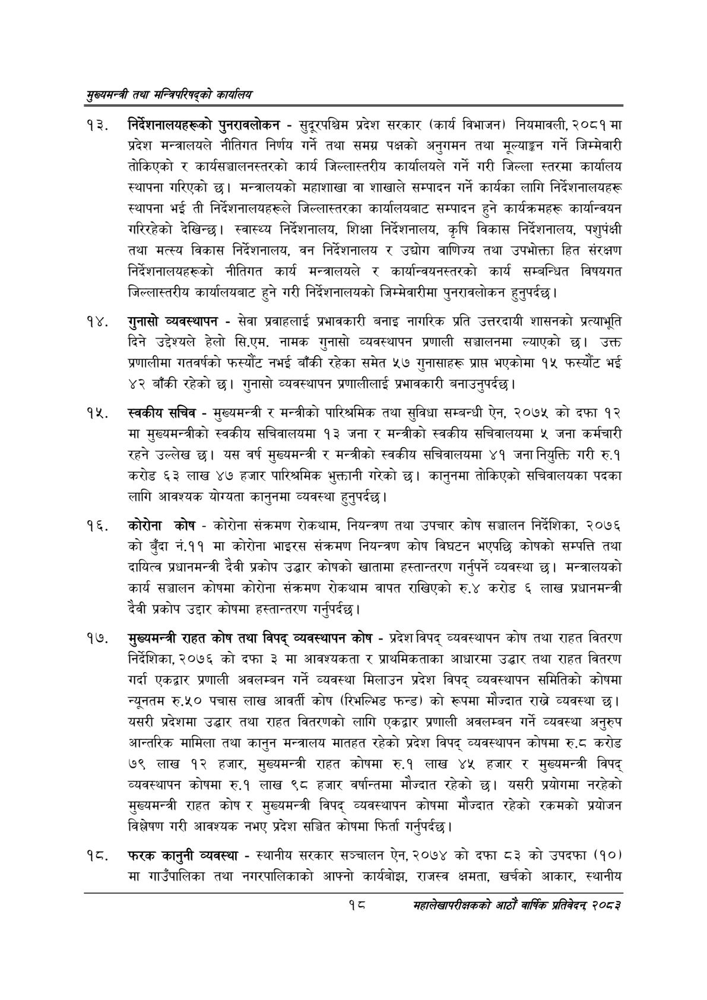

# Page 40 QA

## Rendered page


## Extracted text

```text
सुख्यसन्त्री तथा सन्तिपरिषद्को कायलिय
निर्देशनालयहरूको पुनरावलोकन -सुदूरपश्चिम प्रदेश सरकार (कार्य विभाजन) नियमावली, २०८१ मा प्रदेश मन्त्रालयले नीतिगत निर्णय गर्ने तथा समग्र पक्षको अनुगमन तथा मूल्याङ्कन गर्ने जिम्मेवारी तोकिएको र कार्यसञ्चालनस्तरको कार्य जिल्लास्तरीय कार्यालयले गर्ने गरी जिल्ला स्तरमा कार्यालय स्थापना गरिएको छ। मन्त्रालयको महाशाखा वा शाखाले सम्पादन गर्ने कार्यका लागि निर्देशनालयहरू स्थापना भई ती निर्देशनालयहरूले जिल्लास्तरका कार्यालयबाट सम्पादन हुने कार्यक्रमहरू कार्यान्वयन गरिरहेको देखिन्छ। स्वास्थ्य निर्देशनालय, शिक्षा निर्देशनालय, कृषि विकास निर्देशनालय, पशुपक्षी तथा मत्स्य विकास निर्देशनालय, वन निर्देशनालय र उद्योग वाणिज्य तथा उपभोक्ता हित संरक्षण निर्देशनालयहरूको नीतिगत कार्य मन्त्रालयले र कार्यान्वयनस्तरको कार्य सम्बन्धित विषयगत जिल्लास्तरीय कार्यालयबाट हुने गरी निर्देशनालयको जिम्मेवारीमा पुनरावलोकन हुनुपर्दछ |
गुनासो व्यवस्थापन -सेवा प्रवाहलाई प्रभावकारी बनाइ नागरिक प्रति उत्तरदायी शासनको प्रत्याभूति दिने उद्देश्यले हेलो सि.एम. नामक गुनासो व्यवस्थापन प्रणाली सञ्चालनमा ल्याएको छ। उक्त प्रणालीमा गतवर्षको फस्यौट नभई बाँकी रहेका समेत ५७ गुनासाहरू प्राप भएकोमा १५ फस्यौट भई ४२ बाँकी रहेको छ। गुनासो व्यवस्थापन प्रणालीलाई प्रभावकारी बनाउनुपर्दछ |
स्वकीय सचिव -मुख्यमन्त्री र मन्त्रीको पारिश्रमिक तथा सुविधा सम्बन्धी ऐन, २०७५ को दफा १२ मा मुख्यमन्त्रीको स्वकीय सचिवालयमा १३ जना र मन्त्रीको स्वकीय सचिवालयमा ५ जना कर्मचारी रहने उल्लेख छ। यस वर्ष मुख्यमन्त्री र मन्त्रीको स्वकीय सचिवालयमा ४१ जना नियुक्ति गरी रु.१ करोड ६३ लाख ४७ हजार पारिश्रमिक भुक्तानी गरेको छ। कानुनमा तोकिएको सचिवालयका पदका लागि आवश्यक योग्यता कानुनमा व्यवस्था हुन्‌पर्दछ।
कोरोना कोष -कोरोना संक्रमण रोकथाम, नियन्त्रण तथा उपचार कोष सञ्चालन निर्देशिका, २०७६ को बुँदा नं.११ मा कोरोना भाइरस संक्रमण नियन्त्रण कोष विघटन भएपछि कोषको सम्पत्ति तथा दायित्व प्रधानमन्त्री देवी प्रकोप उद्धार कोषको खातामा हस्तान्तरण गर्नुपर्ने व्यवस्था छ। मन्त्रालयको कार्य सञ्चालन कोषमा कोरोना संक्रमण रोकथाम वापत राखिएको रु.४ करोड ६ लाख प्रधानमन्त्री दैवी प्रकोप उद्दार कोषमा हस्तान्तरण गर्नुपर्दछ |
मुख्यमन्त्री राहत कोष तथा विपद्‌ व्यवस्थापन कोष -प्रदेश विपद्‌ व्यवस्थापन कोष तथा राहत वितरण निर्देशिका, २०७६ को दफा ३ मा आवश्यकता र प्राथमिकताका आधारमा उद्धार तथा राहत वितरण गर्दा एकद्वार प्रणाली अवलम्बन गर्ने व्यवस्था मिलाउन प्रदेश विपद्‌ व्यवस्थापन समितिको कोषमा न्यूनतम रु.५० पचास लाख आवर्ती कोष (रिभल्भिड फन्ड) को रूपमा मौज्दात राख्ने व्यवस्था | यसरी प्रदेशमा उद्धार तथा राहत वितरणको लागि एकद्वार प्रणाली अवलम्बन गर्ने व्यवस्था अनुरुप आन्तरिक मामिला तथा कानुन मन्त्रालय मातहत रहेको प्रदेश विपद्‌ व्यवस्थापन कोषमा रु.८ करोड ७९ लाख १२ हजार, मुख्यमन्त्री राहत कोषमा रु.१ लाख ४५ हजार र मुख्यमन्त्री विपद्‌ व्यवस्थापन कोषमा रु.१ लाख ९८ हजार वर्षान्तमा मौज्दात रहेको छ। यसरी प्रयोगमा नरहेको मुख्यमन्त्री राहत कोष र मुख्यमन्त्री विपद्‌ व्यवस्थापन कोषमा मौज्दात रहेको रकमको प्रयोजन विश्लेषण गरी आवश्यक नभए प्रदेश सञ्चित कोषमा फिर्ता गर्नुपर्दछ |
फरक कानुनी व्यवस्था -स्थानीय सरकार सञ्चालन ऐन, २०७४ को दफा ८३ को उपदफा (१०) मा गाउँपालिका तथा नगरपालिकाको आफ्नो कार्यबोझ, राजस्व क्षमता, खर्चको आकार, स्थानीय
१८
महालेखापरीक्षकको आठाँ वाषिकि प्रतिवेदन्‌ २०८२
```

## Flags
- None
