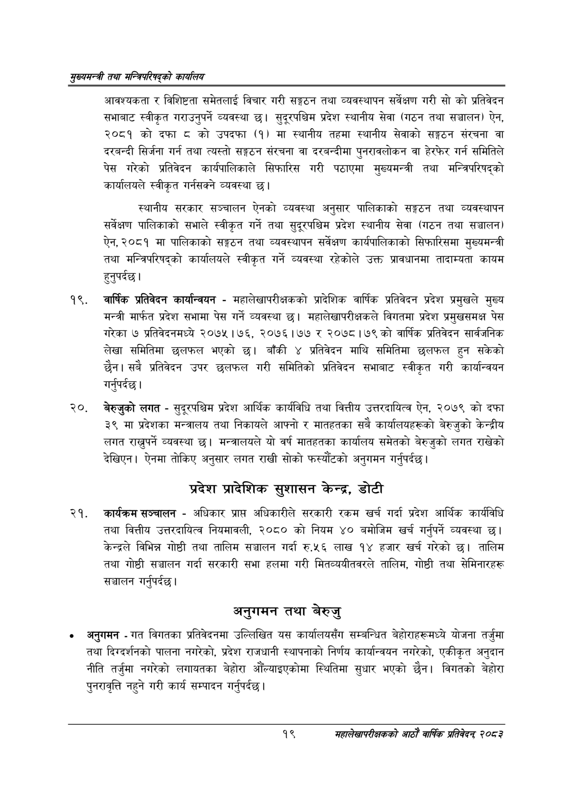

# Page 41 QA

## Rendered page


## Extracted text

```text
सुख्यसन्त्री तथा सन्तिपरिषद्को कायलिय
आवश्यकता र विशिष्टता समेतलाई विचार गरी सङ्गठन तथा व्यवस्थापन सर्वेक्षण गरी सो को प्रतिवेदन सभाबाट स्वीकृत गराउनुपर्ने व्यवस्था छ। सुदूरपश्चिम प्रदेश स्थानीय सेवा (गठन तथा सञ्चालन) ऐन, २०८१ को दफा ८ को उपदफा (१) मा स्थानीय तहमा स्थानीय सेवाको सङ्गठन संरचना वा दरबन्दी सिर्जना गर्न तथा त्यस्तो सङ्गठन संरचना वा दरबन्दीमा पुनरावलोकन वा हेरफेर गर्न समितिले पेस गरेको प्रतिवेदन कार्यपालिकाले सिफारिस गरी पठाएमा मुख्यमन्त्री तथा मन्त्रिपरिषद्को कार्यालयले स्वीकृत गर्नसक्ने व्यवस्था छ।
स्थानीय सरकार सञ्चालन ऐनको व्यवस्था अनुसार पालिकाको सङ्गठन तथा व्यवस्थापन सर्वेक्षण पालिकाको सभाले स्वीकृत गर्ने तथा सुदूरपश्चिम प्रदेश स्थानीय सेवा (गठन तथा सञ्चालन) ऐन, २०८१ मा पालिकाको सङ्गठन तथा व्यवस्थापन सर्वेक्षण कार्यपालिकाको सिफारिसमा मुख्यमन्त्री तथा मन्त्रिपरिषद्को कार्यालयले स्वीकृत गर्ने व्यवस्था रहेकोले उक्त प्रावधानमा तादाम्यता कायम हुनुपर्दछ |
वार्षिक प्रतिवेदन कार्यान्वयन -महालेखापरीक्षकको प्रादेशिक वार्षिक प्रतिवेदन प्रदेश प्रमुखले मुख्य मन्त्री मार्फत प्रदेश सभामा पेस गर्ने व्यवस्था | महालेखापरीक्षकले विगतमा प्रदेश प्रमुखसमक्ष पेस गरेका ७ प्रतिवेदनमध्ये २०७५। ७६, २०७६।७७ २०७८।७९ को वार्षिक प्रतिवेदन सार्वजनिक लेखा समितिमा छलफल भएको छ। बाँकी ४ प्रतिवेदन माथि समितिमा छलफल हुन सकेको छैन। सबै प्रतिवेदन उपर छलफल गरी समितिको प्रतिवेदन सभाबाट स्वीकृत गरी कार्यान्वयन गर्नुपर्दछ |
बेरुजुको लगत -सुदूरपश्चिम प्रदेश आर्थिक कार्यविधि तथा वित्तीय उत्तरदायित्व ऐन, २०७९ को दफा ३९ मा प्रदेशका मन्त्रालय तथा निकायले आफ्नो र मातहतका सबै कार्यालयहरूको बेरुजुको केन्द्रीय लगत राख्नुपर्ने व्यवस्था | मन्त्रालयले यो वर्ष मातहतका कार्यालय समेतको बेरुजुको लगत राखेको देखिएन। ऐनमा तोकिए अनुसार लगत राखी सोको फस्यौटको अनुगमन गर्नुपर्दछ |
प्रदेश प्रादेशिक सुशासन केन्द्र, डोटी
कार्यक्रम सञ्चालन -अधिकार प्राप्त अधिकारीले सरकारी रकम खर्च गर्दा प्रदेश आर्थिक कार्यविधि तथा वित्तीय उत्तरदायित्व नियमावली, २०८० को नियम ४० बमोजिम खर्च गर्नुपर्ने व्यवस्था छ। केन्द्रले विभिन्न गोष्ठी तथा तालिम सञ्चालन गर्दा रु.५६ लाख १४ हजार खर्च गरेको छ। तालिम तथा गोष्ठी सञ्चालन गर्दा सरकारी सभा हलमा गरी मितव्ययीतवरले तालिम, गोष्ठी तथा सेमिनारहरू सञ्चालन गर्नुपर्दछ |
अनुगमन तथा बेरुजु
अनुगमन -गत विगतका प्रतिवेदनमा उल्लिखित यस कार्यालयसँग सम्बन्धित बेहोराहरूमध्ये योजना तर्जुमा तथा दिग्दर्शनको पालना नगरेको, प्रदेश राजधानी स्थापनाको निर्णय कार्यान्वयन नगरेको, एकीकृत अनुदान नीति तर्जुमा नगरेको लगायतका बेहोरा औँल्याइएकोमा स्थितिमा सुधार भएको छैन। विगतको बेहोरा पुनरावृत्ति नहुने गरी कार्य सम्पादन गर्नुपर्दछ |
१९
महालेखापरीक्षकको आठाँ वाषिकि प्रतिवेदन्‌ २०८२
```

## Flags
- None
