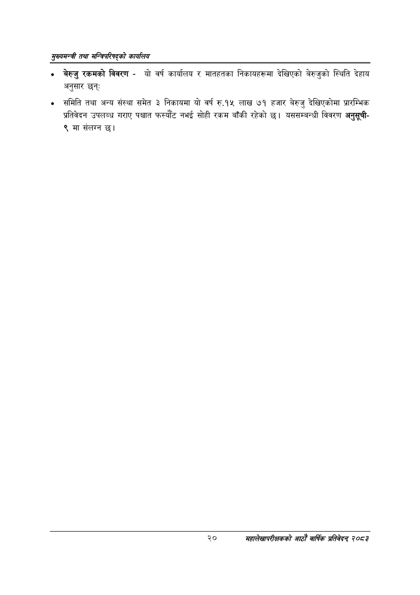

# Page 42 QA

## Rendered page


## Extracted text

```text
सुख्यसन्त्री तथा सन्तिपरिषद्को कायलिय
बेरुजु रकमको विवरण -यो वर्ष कार्यालय र मातहतका निकायहरूमा देखिएको बेरुजुको स्थिति देहाय अनुसार छन्‌ः
समिति तथा अन्य संस्था समेत ३ निकायमा यो वर्ष रु.१५ लाख ७१ हजार बेरुजु देखिएकोमा प्रारम्भिक प्रतिवेदन उपलब्ध गराए पश्चात फस्यौट नभई सोही रकम बाँकी रहेको छ। यससम्बन्धी विवरण अनुसूची९ मा संलग्न छ।
२०
महालेखापरीक्षकको आठाँ वाषिकि प्रतिवेदन्‌ २०८२
```

## Flags
- None
