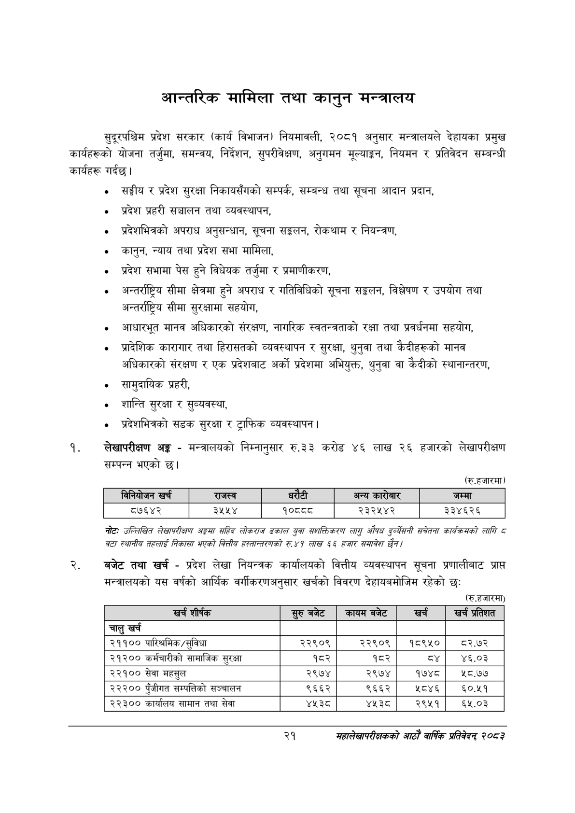

# Page 43 QA

## Rendered page


## Extracted text

```text
आन्तरिक मामिला तथा कानुन मन्त्रालय
सुदूरपश्चिम प्रदेश सरकार (कार्य विभाजन) नियमावली, २०८१ अनुसार मन्त्रालयले देहायका प्रमुख कार्यहरूको योजना तर्जुमा, समन्वय, निर्देशन, सुपरीवेक्षण, अनुगमन मूल्याङ्कन, नियमन र प्रतिवेदन सम्बन्धी कार्यहरू गर्दछ |
सङ्घीय र प्रदेश सुरक्षा निकायसँगको सम्पर्क, सम्बन्ध तथा सूचना आदान प्रदान,
प्रदेश प्रहरी सञ्चालन तथा व्यवस्थापन,
प्रदेशभित्रको अपराध अनुसन्धान, सूचना सङ्कलन, रोकथाम र नियन्त्रण,
कानुन, न्याय तथा प्रदेश सभा मामिला,
प्रदेश सभामा पेस हुने विधेयक तर्जुमा र प्रमाणीकरण,
अन्तर्राष्ट्रिय सीमा क्षेत्रमा हुने अपराध र गतिविधिको सूचना सङ्कलन, विश्लेषण र उपयोग तथा अन्तर्राष्ट्रिय सीमा सुरक्षामा सहयोग,
आधारभूत मानव अधिकारको संरक्षण, नागरिक स्वतन्त्रताको रक्षा तथा प्रवर्धनमा सहयोग,
प्रादेशिक कारागार तथा हिरासतको व्यवस्थापन र सुरक्षा, थुनुवा तथा कैदीहरूको मानव अधिकारको संरक्षण र एक प्रदेशबाट अर्को प्रदेशमा अभियुक्त, थुनुवा वा कैदीको स्थानान्तरण,
० सामुदायिक प्रहरी,
शान्ति सुरक्षा र सुव्यवस्था,
० प्रदेशभित्रको सडक सुरक्षा र ट्राफिक व्यवस्थापन |
लेखापरीक्षण अङ्ग -मन्त्रालयको निम्नानुसार रु.३३ करोड ४६ लाख २६ हजारको लेखापरीक्षण सम्पन्न भएको छ।
(रु.हजारमा)
नोटः उल्लिखित लेखापरीक्षण अङ्गसा सहिद लोकराज ढकाल युवा सशक्तिकरण लागु ओषध ढुरव्येसनी सचेतना कार्यक्रमको लागि ८ वटा स्थानीय तहलाई निकासा भएको बित्तीय हस्तान्तरणको रु४१ लाख ५६ हजार समावेश /
बजेट तथा खर्च -प्रदेश लेखा नियन्त्रक कार्यालयको वित्तीय व्यवस्थापन सूचना प्रणालीबाट प्राप्त मन्त्रालयको यस वर्षको आर्थिक वर्गीकरणअनुसार खर्चको विवरण देहायबमोजिम रहेको छ:
(रु.हजारमा)
२१
महालेखापरीक्षकको आठाँ वाषिकि प्रतिवेदन्‌ २०८२

|  | निनेबोजन खस |  | राजस्व |  | रेटी | अन्य कारेबार | जम्मा |
| --- | --- | --- | --- | --- | --- | --- | --- |
|  | ८७६४२ |  | ३५५४ | १०८८८ |  | २३२५४२ | ३३४६२६ |

| खर्च शीर्षक |  | कायम बजेट | खरी | खर्च प्रतिशत |
| --- | --- | --- | --- | --- |
| चालु खर्च |  |  |  |  |
| २११०० पारिश्रमिक/सुविधा | २२९०९ | २२९०९ | १८९५० | ब८२.७२ |
| २१२०० कर्मचारीको सामाजिक सुरक्षा | १८२ | १८२ |  | ४६.०३ |
| २२१०० सेवा महसुल | २९७४ | २९७४ | १७४८ | १८.७५ |
| २२२०० एंजीगत क्षम्पतिको सञ्चालन | ९६६२ | ९६६२ | ५८४६ | ६०.११ |
| २२३०० कार्यालष सामान तथा सेवा | १४१५ | ४३५ | २९५१ | ६५.०३ |
```

## Flags
- table_page
- medium_quality_table
