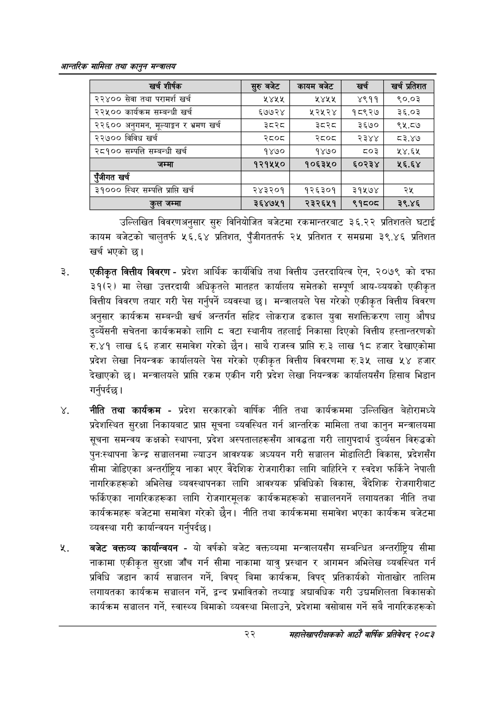

# Page 44 QA

## Rendered page


## Extracted text

```text
आन्तरिक सामिला तथा कालुन सन्बालय
उल्लिखित विवरणअनुसार सुरु विनियोजित बजेटमा रकमान्तरबाट ३६.२२ प्रतिशतले घटाई कायम बजेटको चालुतर्फ ५६.६४ प्रतिशत, पुँजीगततर्फ २५ प्रतिशत र समग्रमा ३९.४६ प्रतिशत खर्च भएको |
एकीकृत वित्तीय विवरण -प्रदेश आर्थिक कार्यविधि तथा वित्तीय उत्तरदायित्व ऐन, २०७९ को दफा ३१(२) मा लेखा उत्तरदायी अधिकृतले मातहत कार्यालय समेतको सम्पूर्ण आय-व्ययको एकीकृत वित्तीय विवरण तयार गरी पेस गर्नुपर्ने व्यवस्था छ। मन्त्रालयले पेस गरेको एकीकृत वित्तीय विवरण अनुसार कार्यक्रम सम्बन्धी खर्च अन्तर्गत सहिद लोकराज ढकाल युवा सशक्तिकरण लागु औषध दुर्व्यसनी सचेतना कार्यक्रमको लागि ८ वटा स्थानीय तहलाई निकासा दिएको वित्तीय हस्तान्तरणको रु.४१ लाख ६६ हजार समावेश गरेको छैन। साथै राजस्व प्राप्ति रु.३ लाख १८ हजार देखाएकोमा प्रदेश लेखा नियन्त्रक कार्यालयले पेस गरेको एकीकृत वित्तीय विवरणमा रु.३५ लाख ५४ हजार देखाएको छ। मन्त्रालयले प्राप्ति रकम एकीन गरी प्रदेश लेखा नियन्त्रक कार्यालयसँग हिसाब भिडान गर्नुपर्दछ |
नीति तथा कार्यक्रम -प्रदेश सरकारको वार्षिक नीति तथा कार्यक्रममा उल्लिखित बेहोरामध्ये प्रदेशस्थित सुरक्षा निकायबाट प्राप्त सूचना व्यवस्थित गर्न आन्तरिक मामिला तथा कानुन मन्त्रालयमा सूचना समन्वय कक्षको स्थापना, प्रदेश अस्पतालहरूसँग आवद्धता गरी लागुपदार्थ दुर्व्यसन विरुद्धको पुन:स्थापना केन्द्र सञ्चालनमा ल्याउन आवश्यक अध्ययन गरी सञ्चालन मोडालिटी विकास, प्रदेशसँग सीमा जोडिएका अन्तर्राष्ट्रिय नाका भएर वैदेशिक रोजगारीका लागि बाहिरिने र स्वदेश फर्किने नेपाली नागरिकहरूको अभिलेख व्यवस्थापनका लागि आवश्यक प्रविधिको विकास, वैदेशिक रोजगारीबाट फर्किएका नागरिकहरूका लागि रोजगारमूलक कार्यक्रमहरूको सञ्चालनगर्ने लगायतका नीति तथा कार्यक्रमहरू बजेटमा समावेश गरेको छैन। नीति तथा कार्यक्रममा समावेश भएका कार्यक्रम बजेटमा व्यवस्था गरी कार्यान्वयन गर्नुपर्दछ |
बजेट कक्तव्य कार्यान्वयन -यो वर्षको बजेट वक्तव्यमा मन्त्रालयसँग सम्बन्धित अन्तर्राष्ट्रिय सीमा नाकामा एकीकृत सुरक्षा जाँच गर्न सीमा नाकामा यात्रु प्रस्थान र आगमन अभिलेख व्यवस्थित गर्न प्रविधि जडान कार्य सञ्चालन गर्ने, विपद्‌ बिमा कार्यक्रम, विपद्‌ प्रतिकार्यको गोताखोर तालिम लगायतका कार्यक्रम सञ्चालन गर्ने, द्वन्द प्रभावितको तथ्याङ्क अद्यावधिक गरी उद्यमशिलता विकासको कार्यक्रम सञ्चालन गर्ने, स्वास्थ्य बिमाको व्यवस्था मिलाउने, प्रदेशमा वसोबास गर्ने सबै नागरिकहरूको
२२
महालेखापरीक्षकको आठाँ वाषिकि प्रतिवेदन्‌ २०८२

| खर्च शीर्षक | र्रुबबेट | कायम बजेट |  | खर प्रतिशत |
| --- | --- | --- | --- | --- |
| २२४०० सेवा तथा परामर्श खर्च | ५४४५ | ५४५५ | ४९११ | ९०.०३ |
| २२५०० कार्वक्रम सम्बन्धी खर्च | ६७७२४ |  | १८९२७ | ३६.०३ |
| २२६०० अनुगमन, मूल्याङ्कन र भ्रमण खर्च | डेटर८ट | डेटर८ट | ३६७० | ९५.८७ |
| २२७०० विविध खर्च | २८०८ | २८०८ | २३४४ | ०८३.४७ |
| २८१०० सम्पत्ति सम्बन्धी खर्च | १४७० | १४७० | ८०३ | ४.६४५ |
| जम्मा | १२१५४५० | १०६३५० | ६०२३४ | ५६.६४ |
| पूँजीगत खर्च |  |  |  |  |
| ३१००० स्थिर सम्पत्ति प्राप्ति खर्च | २४३२०१ | १२६३०१ | ३१५७४ | २५ |
| जम्मा | ३६४७५१ | २३२६५१ | ९१८० | ३९.४६ |
```

## Flags
- table_page
- medium_quality_table
