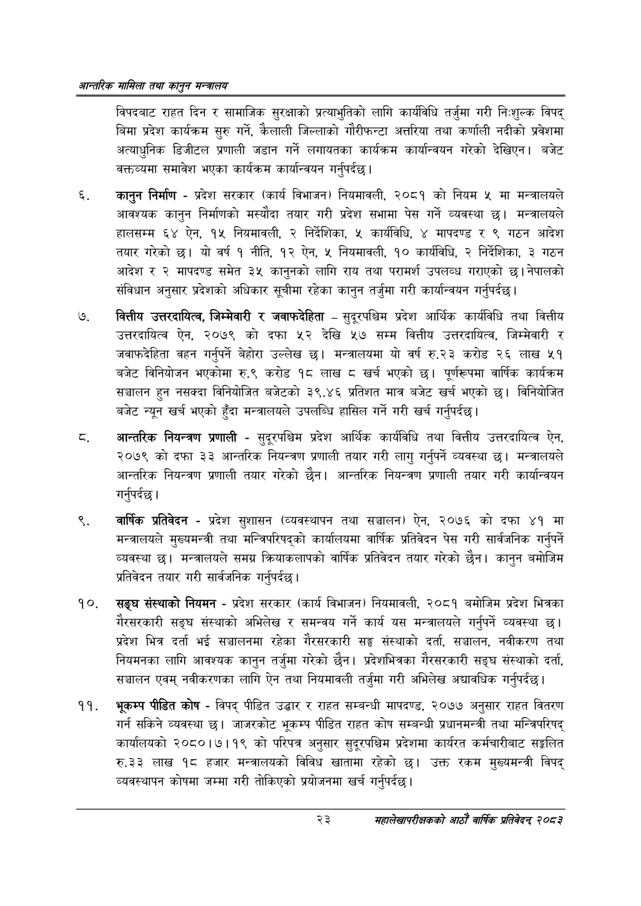

# Page 45 QA

## Rendered page


## Extracted text

```text
आन्तरिक सामिला तथा कालुन सन्बालय
विपदबाट राहत दिन र सामाजिक सुरक्षाको प्रत्याभुतिको लागि कार्यविधि तर्जुमा गरी निःशुल्क विपद्‌ बिमा प्रदेश कार्यक्रम सुरु गर्ने, कैलाली जिल्लाको गौरीफन्टा अत्तरिया तथा कर्णाली नदीको प्रवेशमा अत्याधुनिक डिजीटल प्रणाली जडान गर्ने लगायतका कार्यक्रम कार्यान्वयन गरेको देखिएन। बजेट वक्तव्यमा समावेश भएका कार्यक्रम कार्यान्वयन गर्नुपर्दछ |
कानुन निर्माण -प्रदेश सरकार (कार्य विभाजन) नियमावली, २०८१ को नियम ५ मा मन्त्रालयले आवश्यक कानुन निर्माणको मस्यौदा तयार गरी प्रदेश सभामा पेस गर्ने व्यवस्था छ। मन्त्रालयले हालसम्म ६४ ऐन, १५ नियमावली, २ निर्देशिका, ५ कार्यविधि, ४ मापदण्ड र ९ गठन आदेश तयार गरेको छ। यो वर्ष १ नीति, १२ ऐन, ५ नियमावली, १० कार्यविधि, २ निर्देशिका, ३ गठन आदेश र २ मापदण्ड समेत ३५ कानुनको लागि राय तथा परामर्श उपलव्ध गराएको | नेपालको संविधान अनुसार प्रदेशको अधिकार सूचीमा रहेका कानुन तर्जुमा गरी कार्यान्वयन गर्नुपर्दछ |
वित्तीय उत्तरदायित्व, जिम्मेवारी र जवाफदेहिता -सुदूरपश्चिम प्रदेश आर्थिक कार्यविधि तथा वित्तीय उत्तरदायित्व ऐन, २०७९ को दफा ५२ देखि ५७ सम्म वित्तीय उत्तरदायित्व, जिम्मेवारी र जवाफदेहिता वहन गर्नुपर्ने बेहोरा उल्लेख छ। मन्त्रालयमा यो वर्ष रु.२३ करोड २६ लाख ५१ बजेट विनियोजन भएकोमा रु.९ करोड १८ लाख खर्च भएको छ। पूर्णरूपमा वार्षिक कार्यक्रम सञ्चालन हुन नसक्दा विनियोजित बजेटको ३९.४६ प्रतिशत मात्र बजेट खर्च भएको छ। विनियोजित बजेट न्यून खर्च भएको हुँदा मन्त्रालयले उपलब्धि हासिल गर्ने गरी खर्च गर्नुपर्दछ।
आन्तरिक नियन्त्रण प्रणाली -सुदूरपश्चिम प्रदेश आर्थिक कार्यविधि तथा वित्तीय उत्तरदायित्व ऐन, २०७९ को दफा ३३ आन्तरिक नियन्त्रण प्रणाली तयार गरी लागु गर्नुपर्ने व्यवस्था छ। मन्त्रालयले आन्तरिक नियन्त्रण प्रणाली तयार गरेको छैन। आन्तरिक नियन्त्रण प्रणाली तयार गरी कार्यान्वयन गर्नुपर्दछ |
वार्षिक प्रतिवेदन -प्रदेश सुशासन (व्यवस्थापन तथा सञ्चालन) ऐन, २०७६ को दफा ४१ मा मन्त्रालयले मुख्यमन्त्री तथा मन्त्रिपरिषद्को कार्यालयमा वार्षिक प्रतिवेदन पेस गरी सार्वजनिक गर्नुपर्ने व्यवस्था छ। मन्त्रालयले समग्र क्रियाकलापको वार्षिक प्रतिवेदन तयार गरेको छैन। कानुन बमोजिम प्रतिवेदन तयार गरी सार्वजनिक गर्नुपर्दछ |
सङ्घ संस्थाको नियमन -प्रदेश सरकार (कार्य विभाजन) नियमावली, २०८१ बमोजिम प्रदेश भित्रका गैरसरकारी सङ्घ संस्थाको अभिलेख र समन्वय गर्ने कार्य यस मन्त्रालयले गर्नुपर्ने व्यवस्था छ। प्रदेश भित्र दर्ता भई सञ्चालनमा रहेका गैरसरकारी सङ्घ संस्थाको दर्ता, सञ्चालन, नवीकरण तथा नियमनका लागि आवश्यक कानुन तर्जुमा गरेको छैन। प्रदेशभित्रका गैरसरकारी सङ्घ संस्थाको दर्ता, सञ्चालन एवम्‌ नवीकरणका लागि ऐन तथा नियमावली तर्जुमा गरी अभिलेख अद्यावधिक गर्नुपर्दछ।
भूकम्प पीडित कोष -विपद्‌ पीडित उद्धार र राहत सम्बन्धी मापदण्ड, २०७७ अनुसार राहत वितरण गर्न सकिने व्यवस्था छ। जाजरकोट भूकम्प पीडित राहत कोष सम्बन्धी प्रधानमन्त्री तथा मन्त्रिपरिषद्‌ कार्यालयको २०८०।७।१९ को परिपत्र अनुसार सुदूरपश्चिम प्रदेशमा कार्यरत कर्मचारीबाट सङ्गलित रु.३२३ लाख १८ हजार मन्त्रालयको विविध खातामा रहेको उक्त रकम मुख्यमन्त्री विपद्‌ व्यवस्थापन कोषमा जम्मा गरी तोकिएको प्रयोजनमा खर्च गर्नुपर्दछ |
२३
महालेखापरीक्षकको आठाँ वाषिकि प्रतिवेदन्‌ २०८२
```

## Flags
- None
