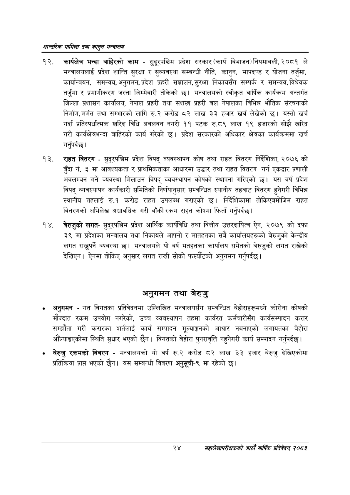

# Page 46 QA

## Rendered page


## Extracted text

```text
आन्तरिक सामिला तथा कालुन सन्बालय
कार्यक्षेत्र भन्दा बाहिरको काम -सुदूरपश्चिम प्रदेश सरकार (कार्य विभाजन) नियमावली, २०८१ ले मन्त्रालयलाई प्रदेश शान्ति सुरक्षा र सुव्यवस्था सम्बन्धी नीति, कानुन, मापदण्ड र योजना तर्जुमा, कार्यान्वयन, समन्वय, अनुगमन, प्रदेश प्रहरी सञ्चालन, सुरक्षा निकायसँग सम्पर्क र समन्वय, विधेयक तर्जुमा र प्रमाणीकरण जस्ता जिम्मेवारी तोकेको छ। मन्त्रालयको स्वीकृत वार्षिक कार्यक्रम अन्तर्गत जिल्ला प्रशासन कार्यालय, नेपाल प्रहरी तथा सशस्त्र प्रहरी बल नेपालका विभिन्न भौतिक संरचनाको निर्माण, मर्मत तथा सम्भारको लागि रु.२ करोड ८२ लाख ३३ हजार खर्च लेखेको यस्तो खर्च गर्दा प्रतिस्पर्धात्मक खरिद विधि अवलवन नगरी ११ पटक रु.८९ लाख १९ हजारको सोझै खरिद गरी कार्यक्षेत्रभन्दा बाहिरको कार्य गरेको छ। प्रदेश सरकारको अधिकार क्षेत्रका कार्यक्रममा खर्च गर्नुपर्दछ |
राहत वितरण -सुदूरपश्चिम प्रदेश विपद्‌ व्यवस्थापन कोष तथा राहत वितरण निर्देशिका, २०७६ को बुँदा नं. ३ मा आवश्यकता र प्राथमिकताका आधारमा उद्धार तथा राहत वितरण गर्न एकद्वार प्रणाली अवलम्बन गर्ने व्यवस्था मिलाउन विपद्‌ व्यवस्थापन कोषको स्थापना गरिएको छ। यस वर्ष प्रदेश विपद्‌ व्यवस्थापन कार्यकारी समितिको निर्णयानुसार सम्बन्धित स्थानीय तहबाट वितरण हुनेगरी विभिन्न स्थानीय तहलाई रु.१ करोड राहत उपलब्ध गराएको छ। निर्देशिकामा तोकिएबमोजिम राहत वितरणको अभिलेख अद्यावधिक गरी बाँकी रकम राहत कोषमा फिर्ता गर्नुपर्दछ |
बेरुजुको लगतसुदूरपश्चिम प्रदेश आर्थिक कार्यविधि तथा वित्तीय उत्तरदायित्व ऐन, २०७९ को दफा ३९ मा प्रदेशका मन्त्रालय तथा निकायले आफ्नो र मातहतका सबै कार्यालयहरूको बेरुजुको केन्द्रीय लगत राख्नुपर्ने व्यवस्था | मन्त्रालयले यो वर्ष मतहतका कार्यालय समेतको बेरुजुको लगत राखेको देखिएन। ऐनमा तोकिए अनुसार लगत राखी सोको फस्यौटको अनुगमन गर्नुपर्दछ |
अनुगमन तथा बेरुजु
अनुगमन -गत विगतका प्रतिवेदनमा उल्लिखित मन्त्रालयसँग सम्बन्धित बेहोराहरूमध्ये कोरोना कोषको मौज्दात रकम उपयोग नगरेको, उच्च व्यवस्थापन तहमा कार्यरत कर्मचारीसँग कार्यसम्पादन करार सम्झौता गरी करारका शार्तलाई कार्य सम्पादन मूल्याङ्गगको आधार नबनाएको लगायतका बेहोरा औंल्याइएकोमा स्थिति सुधार भएको छैन। विगतको बेहोरा पुनरावृत्ति नहुनेगरी कार्य सम्पादन गर्नुपर्दछ |
बेरुजु रकमको विवरण -मन्त्रालयको यो वर्ष रु.२ करोड ८२ लाख ३३ हजार बेरुजु देखिएकोमा प्रतिक्रिया प्राप्त भएको छैन। यस सम्बन्धी विवरण अनुसूची-९ मा रहेको |
२४
महालेखापरीक्षकको आठाँ वाषिकि प्रतिवेदन्‌ २०८२
```

## Flags
- None
