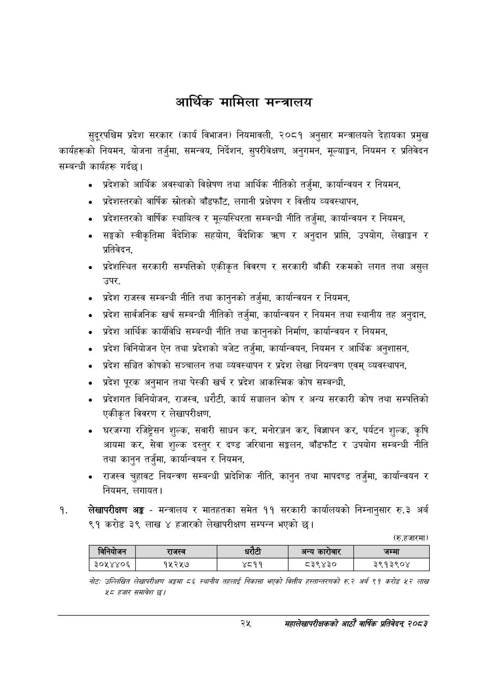

# Page 47 QA

## Rendered page


## Extracted text

```text
आर्थिक मामिला मन्त्रालय
सुदूरपश्चिम प्रदेश सरकार (कार्य विभाजन) नियमावली, २०८१ अनुसार मन्त्रालयले देहायका प्रमुख कार्यहरूको नियमन, योजना तर्जुमा, समन्वय, निर्देशन, सुपरीवेक्षण, अनुगमन, मूल्याङ्कन, नियमन र प्रतिवेदन सम्बन्धी कार्यहरू गर्दछ।
प्रदेशको आर्थिक अवस्थाको विश्लेषण तथा आर्थिक नीतिको तर्जुमा, कार्यान्वयन र नियमन,
प्रदेशस्तरको वार्षिक स्रोतको बाँडफाँट, लगानी प्रक्षेपण र वित्तीय व्यवस्थापन,
प्रदेशस्तरको वार्षिक स्थायित्व र मूल्यस्थिरता सम्बन्धी नीति तर्जुमा, कार्यान्वयन र नियमन,
सङ्घको स्वीकृतिमा वैदेशिक सहयोग, वैदेशिक र अनुदान प्राप्ति, उपयोग, लेखाङ्गन र प्रतिवेदन,
प्रदेशस्थित सरकारी सम्पत्तिको एकीकृत विवरण र सरकारी बाँकी रकमको लगत तथा असुल उपर,
प्रदेश राजस्व सम्बन्धी नीति तथा कानुनको तर्जुमा, कार्यान्वयन र नियमन,
प्रदेश सार्वजनिक खर्च सम्बन्धी नीतिको तर्जुमा, कार्यान्वयन र नियमन तथा स्थानीय तह अनुदान,
प्रदेश आर्थिक कार्यविधि सम्बन्धी नीति तथा कानुनको निर्माण, कार्यान्वयन र नियमन,
प्रदेश विनियोजन ऐन तथा प्रदेशको बजेट तर्जुमा, कार्यान्वयन, नियमन र आर्थिक अनुशासन,
प्रदेश सञ्चित कोषको सञ्चालन तथा व्यवस्थापन र प्रदेश लेखा नियन्त्रण एवम्‌ व्यवस्थापन,
प्रदेश पूरक अनुमान तथा पेस्की खर्च र प्रदेश आकस्मिक कोष सम्बन्धी,
प्रदेशगत विनियोजन, राजस्व, धरौटी, कार्य सञ्चालन कोष र अन्य सरकारी कोष तथा सम्पत्तिको एकीकृत विवरण र लेखापरीक्षण,
घरजग्गा रजिष्ट्रेसन शुल्क, सवारी साधन कर, मनोरञ्जन कर, विज्ञापन कर, पर्यटन शुल्क, कृषि आयमा कर, सेवा शुल्क दस्तुर र दण्ड जरिबाना सङ्कलन, बाँडफाँट र उपयोग सम्बन्धी नीति तथा कानुन तर्जुमा, कार्यान्वयन र नियमन,
राजस्व चुहावट नियन्त्रण सम्बन्धी प्रादेशिक नीति, कानुन तथा मापदण्ड तर्जुमा, कार्यान्वयन र नियमन, लगायत |
लेखापरीक्षण अङ्ग -मन्त्रालय र मातहतका समेत ११ सरकारी कार्यालयको निम्नानुसार रु.३ अर्ब ९१ करोड ३९ लाख ४ हजारको लेखापरीक्षण सम्पन्न भएको छ।
(रु.हजारमा)
नोटः उल्लिखित लेखापरीक्षण अङ्कमा ८६५ स्थानीय तहलाई निकासा भएको बित्तीय हस्तान्तरणको रु. २ अर्ब ९१ करोङ ७ लाख हजार समावेश १
२५
महालेखापरीक्षकको आठाँ वाषिकि प्रतिवेदन्‌ २०८२

|  |  | ननेकोजन | राजस्व |  | धरेटी | अन्य कारोबार | जम्मा |
| --- | --- | --- | --- | --- | --- | --- | --- |
|  |  | ३०५४४०६ | १५२५७ | ४८११ |  | ८३९४३० | ३९१३९०४ |
```

## Flags
- table_page
- medium_quality_table
