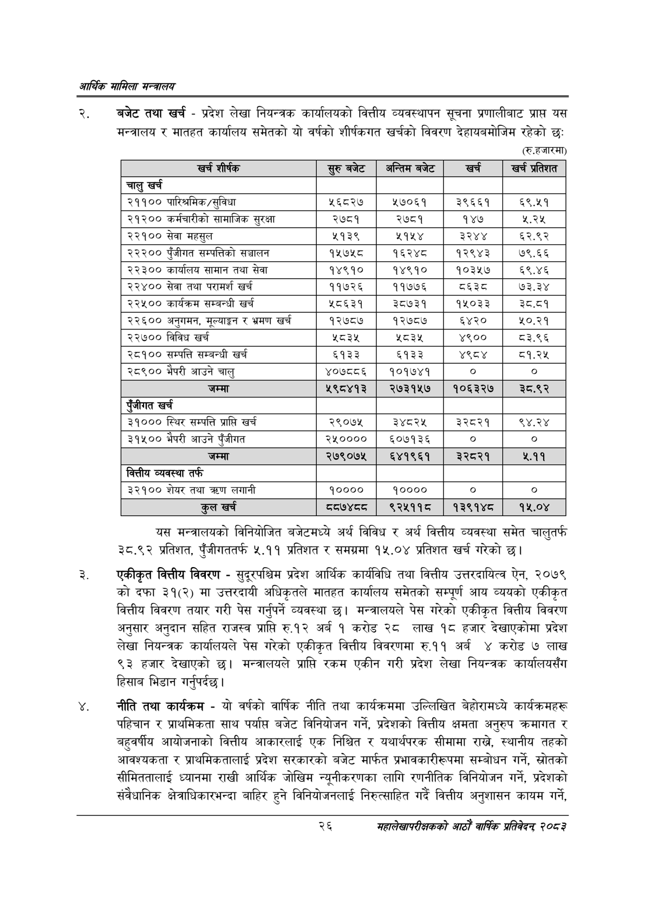

# Page 48 QA

## Rendered page


## Extracted text

```text
आर्थिक मामिला सन्वालय
यस
बजेट तथा खर्च -प्रदेश लेखा नियन्त्रक कार्यालयको वित्तीय व्यवस्थापन सूचना प्रणालीबाट प्रापत मन्त्रालय र मातहत कार्यालय समेतको यो वर्षको शीर्षकगत खर्चको विवरण देहायबमोजिम रहेको छः
(रुू.हजारमा)
यस मन्त्रालयको विनियोजित बजेटमध्ये अर्थ विविध र अर्थ वित्तीय व्यवस्था समेत चालुतर्फ ३८.९२ प्रतिशत, पुँजीगततर्फ ५.११ प्रतिशत र समग्रमा १५.०४ प्रतिशत खर्च गरेको छ।
एकीकृत वित्तीय विवरण -सुदूरपश्चिम प्रदेश आर्थिक कार्यविधि तथा वित्तीय उत्तरदायित्व ऐन, २०७९ को दफा ३१(२) मा उत्तरदायी अधिकृतले मातहत कार्यालय समेतको सम्पूर्ण आय व्ययको एकीकृत वित्तीय विवरण तयार गरी पेस गर्नुपर्ने व्यवस्था छ। मन्त्रालयले पेस गरेको एकीकृत वित्तीय विवरण अनुसार अनुदान सहित राजस्व प्राप्ति रु.१२ अर्ब १ करोड २८ लाख १८ हजार देखाएकोमा प्रदेश लेखा नियन्त्रक कार्यालयले पेस गरेको एकीकृत वित्तीय विवरणमा रु.११ अर्ब ४ करोड ७ लाख ९३ हजार देखाएको छ। मन्त्रालयले प्राप्ति रकम एकीन गरी प्रदेश लेखा नियन्त्रक कार्यालयसँग हिसाब भिडान गर्नुपर्दछ |
नीति तथा कार्यक्रम -यो वर्षको वार्षिक नीति तथा कार्यक्रममा उल्लिखित बेहोरामध्ये कार्यक्रमहरू पहिचान र प्राथमिकता साथ पर्याप्त बजेट विनियोजन गर्ने, प्रदेशको वित्तीय क्षमता अनुरुप क्रमागत र बहुवर्षीय आयोजनाको वित्तीय आकारलाई एक निश्चित र यथार्थपरक सीमामा राख्ने, स्थानीय तहको आवश्यकता र प्राथमिकतालाई प्रदेश सरकारको बजेट मार्फत प्रभावकारीरूपमा सम्बोधन गर्ने, स्रोतको सीमिततालाई ध्यानमा राखी आर्थिक जोखिम न्यूनीकरणका लागि रणनीतिक विनियोजन गर्ने, प्रदेशको संवैधानिक क्षेत्राधिकारभन्दा बाहिर हुने विनियोजनलाई निरुत्साहित गर्दै वित्तीय अनुशासन कायम गर्ने,
२६
महालेखापरीक्षकको आठाँ वाषिकि प्रतिवेदन्‌ २०८२

| खर्च शीर्षक | सुरु बबेट | अन्तिम बजेट | खर्च | खर्च प्रतिशत |
| --- | --- | --- | --- | --- |
| चालु खर्च |  |  |  |  |
| २११०० पारिश्रमिक/सुविधा | ५६८२७ | ५७०६१ | ३९६६१ | ६९.५१ |
| २१२०० कर्मचारीको सामाजिक सुरक्षा | २७८१ | २७८१ | १४७ | २.२५ |
| २२१०० सेवा महसुल | ५१३९ | ५१५४ | ३२४४ | ६२.९२ |
| २२२०० पुँजीगत सम्पत्तिको सञ्चालन | १५७५८ | १६२४८ | १२९४३ | ७९.६६ |
| २२३०० कार्यालय सामान तथा सेवा | १४९१० | १४९१० | १०३५७ | ६९.४६ |
| २२४०० सेवा तथा परामर्श खर्च | ११७२६ | ११७७६ | १ | ७३.३४ |
| २२५०० कार्यक्रम सम्बन्धी खर्च | ५८६३१ | ३८७३१ | १५०३३ | ३८.८१ |
| २२६०० अनुभसन, मूल्याङ्कन र भ्रमण खर्च | १२७८७ | १२७८७ | ६४२० | ५०.२१ |
| २२७०० विविध खर्च | ५८३५ | ५८३५ | ४९०० | ८३.९६ |
| २८१०० सम्पत्ति सम्बन्धी खर्च | ६१३३ | ६१३३ | ४९८४ | ८१.२५ |
| २८९०० भैपरी आउने चालु | ४०७८८६ | १०१७४१ | ० | ० |
| जम्मा | ५९८४१३ | २७३१५७ | १०६३२७ | र३े८.९२ |
| ऐंजीगत खर्च |  |  |  |  |
| ३१००० स्थिर सम्पत्ति प्राप्ति खर्च | २९०७५ | ३४८२५ | ३२८२१ | ९४.२४ |
| ३१५०० भैपरी आउने पुँजीगत | २५०००० | ६०७१३६ | ० | ० |
| जम्मा | २७९०७५ | ६४१९६१ | ३े२८२१ | ५.११ |
| वित्तीय व्यवस्था तर्फ |  |  |  |  |
| ३२१०० शेयर तथा क्रण लगानी | १०००० | १०००० | ० |  |
| कुल खर्च | ७४८८ | ९२५११५८ | १३९१४०८ | १५.०४ |
```

## Flags
- table_page
- medium_quality_table
