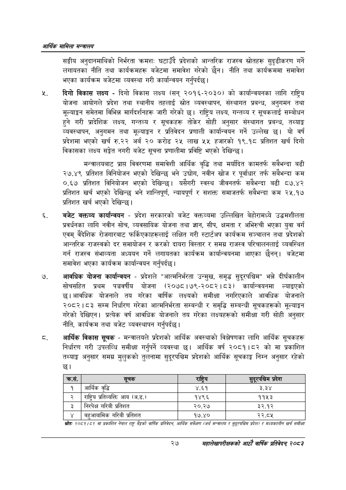

# Page 49 QA

## Rendered page


## Extracted text

```text
आर्थिक मामिला सन्वालय
सङ्घीय अनुदानमाथिको निर्भरता क्रमशः घटाउँदै प्रदेशको आन्तरिक राजस्व स्रोतहरू सुदृढीकरण गर्ने लगायतका नीति तथा कार्यक्रमहरू बजेटमा समावेश गरेको छैन। नीति तथा कार्यक्रममा समावेश भएका कार्यक्रम बजेटमा व्यवस्था गरी कार्यान्वयन गर्नुपर्दछ |
दिगो विकास लक्ष्य -दिगो विकास लक्ष्य (सन्‌ २०१६-२०३०) को कार्यान्वयनका लागि राष्ट्रिय योजना आयोगले प्रदेश तथा स्थानीय तहलाई स्रोत व्यवस्थापन, संस्थागत प्रबन्ध, अनुगमन तथा मूल्याङ्कन समेतमा विभिन्न मार्गदर्शनहरू जारी गरेको छ। राष्ट्रिय लक्ष्य, गन्तव्य र सूचकलाई सम्बोधन हुने गरी प्रादेशिक लक्ष्य, गन्तव्य र सूचकहरू तोकेर सोही अनुसार संस्थागत प्रबन्ध, तथ्याङ्क व्यवस्थापन, अनुगमन तथा मूल्याङ्कन र प्रतिवेदन प्रणाली कार्यान्वयन गर्ने उल्लेख छ। यो वर्ष प्रदेशमा भएको खर्च रु.२२ अर्ब २० करोड २५ लाख ५५ हजारको १९.१८ प्रतिशत खर्च दिगो विकासका लक्ष्य सङ्रेत नगरी बजेट सूचना प्रणालीमा प्रविष्टि भएको देखिन्छ।
मन्त्रालयबाट प्राप्त विवरणमा समावेशी आर्थिक बृद्धि तथा मर्यादित कामतर्फ सबैभन्दा बढी २७.४९ प्रतिशत विनियोजन भएको देखिन्छ भने उद्योग, नवीन खोज र पूर्वाधार तर्फ सबैभन्दा कम ०.६७ प्रतिशत विनियोजन भएको देखिन्छ। यसैगरी स्वस्थ जीवनतर्फ सबैभन्दा बढी ८७.४२ प्रतिशत खर्च भएको देखिन्छ भने शान्तिपूर्ण, न्यायपूर्ण र सशक्त समाजतर्फ सबैभन्दा कम २५.१७ प्रतिशत खर्च भएको देखिन्छ |
बजेट वक्तव्य कार्यान्वयन -प्रदेश सरकारको बजेट वक्तव्यमा उल्लिखित बेहोरामध्ये उद्धमशीलता प्रवर्धनका लागि नवीन सोच, व्यवसायिक योजना तथा ज्ञान, सीप, क्षमता र अभिरुची भएका युवा वर्ग एवम्‌ वैदेशिक रोजगारबाट फर्किएकाहरूलाई लक्षित गरी स्टार्टअप कार्यक्रम सञ्चालन तथा प्रदेशको आन्तरिक राजस्वको दर समायोजन र करको दायरा विस्तार र समग्र राजस्व परिचालनलाई व्यवस्थित गर्न राजस्व संभाव्यता अध्ययन गर्ने लगायतका कार्यक्रम कार्यान्वयनमा आएका छैनन्‌। बजेटमा समावेश भएका कार्यक्रम कार्यान्वयन गर्नुपर्दछ |
आवधिक योजना कार्यान्वयन -प्रदेशले "आत्मनिर्भरता उन्मुख, समृद्ध सुदूरपश्चिम" भन्ने दीर्घकालीन सोचसहित प्रथम पञ्चवर्षीय योजना (२०७८।७९-२०८२।८३) कार्यान्वयनमा ल्याइएको छ। आवधिक योजनाले तय गरेका वार्षिक लक्ष्यको समीक्षा नगरिएकाले आवधिक योजनाले २०८२।८३ सम्म निर्धारण गरेका आत्मनिर्भरता सम्बन्धी र समृद्धि सम्बन्धी सूचकहरूको मूल्याङ्कन गरेको देखिएन। प्रत्येक वर्ष आवधिक योजनाले तय गरेका लक्ष्यहरूको समीक्षा गरी सोही अनुसार नीति, कार्यक्रम तथा बजेट व्यवस्थापन गर्नुपर्दछ |
आर्थिक विकास सूचक -मन्त्रालयले प्रदेशको आर्थिक अवस्थाको विश्लेषणका लागि आर्थिक सूचकहरू निर्धारण गरी उपलव्धि समीक्षा गर्नुपर्ने व्यवस्था छ। आर्थिक वर्ष २०८१।८२ को मा प्रकाशित तथ्याङ्क अनुसार समग्र मुलुकको तुलनामा सुदूरपश्चिम प्रदेशको आर्थिक सूचकाङ्क निम्न अनुसार रहेको छ।
स्रोतः २०५९ १५७ मा प्रकाशित नेपाल राष्ट्र बैङ्कको वार्षिक प्रतिवेदन, आर्थिक सर्वेक्षण (अर्थ मन्बालय र टुद्रपक्चिम प्रदेश/ र सध्यकालीन खर्च समीक्षा
२७
महालेखापरीक्षकको आठाँ वाषिकि प्रतिवेदन्‌ २०८२

| क्रस. | 'सूचक | राष्ट्रिय | सुदूरप खन प्रदेश |
| --- | --- | --- | --- |
| १ | आर्थिक वृद्धि | ४.६१ | ३.३४ |
| २ | राष्ट्रिय प्रतिव्थत्ति आय (अ.ड.) | १४९६ | ११५३ |
| ३ | निरपेक्ष गरिबी प्रतिशत | २०.२४ | ३२.१२ |
| ४ | बहुआवामिक गरिबी प्रतिशत | १७.४० | २२.८४५ |
```

## Flags
- table_page
- medium_quality_table
