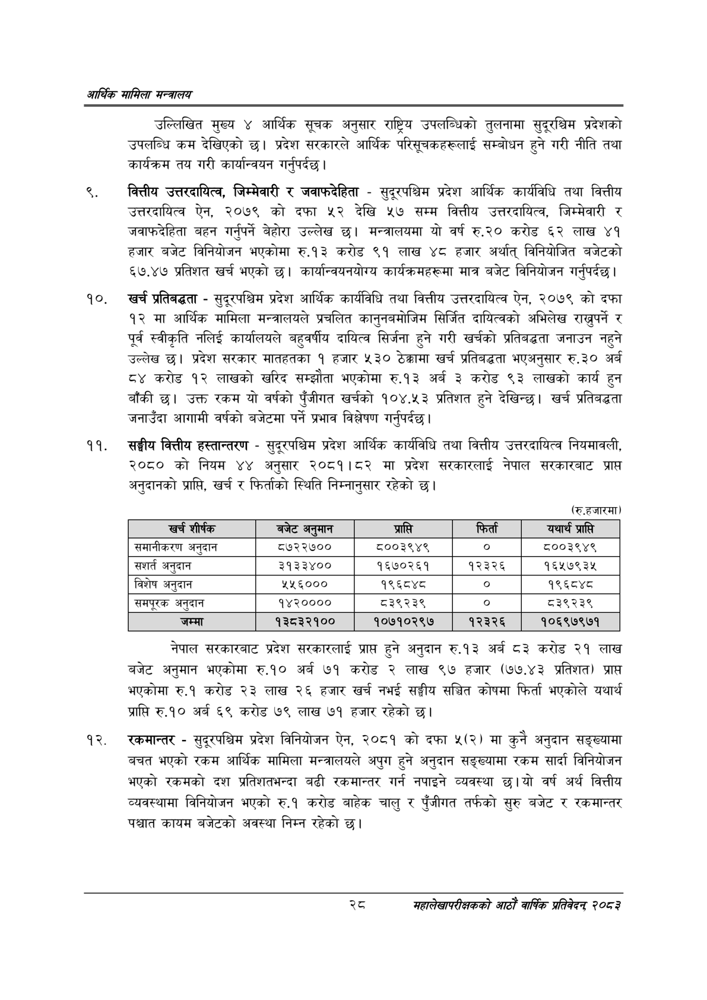

# Page 50 QA

## Rendered page


## Extracted text

```text
आर्थिक मामिला सन्वालय
उल्लिखित मुख्य ४ आर्थिक सूचक अनुसार राष्ट्रिय उपलब्धिको तुलनामा सुदूरश्विम प्रदेशको उपलब्धि कम देखिएको छ। प्रदेश सरकारले आर्थिक परिसूचकहरूलाई सम्बोधन हुने गरी नीति तथा कार्यक्रम तय गरी कार्यान्वयन गर्नुपर्दछ |
वित्तीय उत्तरदायित्व, जिम्मेवारी र जवाफदेहिता -सुदूरपश्चिम प्रदेश आर्थिक कार्यविधि तथा वित्तीय उत्तरदायित्व ऐन, २०७९ को दफा ५२ देखि ५७ सम्म वित्तीय उत्तरदायित्व, जिम्मेवारी र जवाफदेहिता बहन गर्नुपर्ने बेहोरा उल्लेख छ। मन्त्रालयमा यो वर्ष रु.२० करोड ६२ लाख ४१ हजार बजेट विनियोजन भएकोमा रु.१३ करोड ९१ लाख ४८ हजार अर्थात्‌ विनियोजित बजेटको ६७.४७ प्रतिशत खर्च भएको छ। कार्यान्वयनयोग्य कार्यक्रमहरूमा मात्र बजेट विनियोजन गर्नुपर्दछ |
खर्च प्रतिबद्धता -सुदूरपश्चिम प्रदेश आर्थिक कार्यविधि तथा वित्तीय उत्तरदायित्व ऐन, २०७९ को दफा १२ मा आर्थिक मामिला मन्त्रालयले प्रचलित कानुनबमोजिम सिर्जित दायित्वको अभिलेख राख्नुपर्ने र पूर्व स्वीकृति नलिई कार्यालयले बहुवर्षीय दायित्व सिर्जना हुने गरी खर्चको प्रतिबद्धता जनाउन नहुने उल्लेख छ। प्रदेश सरकार मातहतका १ हजार ५३० ठेक्कामा खर्च प्रतिबद्धता भएअनुसार रु.३० अर्ब ८४ करोड १२ लाखको खरिद सम्झौता भएकोमा रु.१३ अर्ब ३ करोड ९३ लाखको कार्य हुन बाँकी छ। उक्त रकम यो वर्षको पुँजीगत खर्चको १०४.५३ प्रतिशत हुने देखिन्छ। खर्च प्रतिबद्धता जनाउँदा आगामी वर्षको बजेटमा पर्ने प्रभाव विश्लेषण गर्नुपर्दछ |
सङ्घीय वित्तीय हस्तान्तरण -सुदूरपश्चिम प्रदेश आर्थिक कार्यविधि तथा वित्तीय उत्तरदायित्व नियमावली, २०८० को नियम ४४ अनुसार २०८१।८२ मा प्रदेश सरकारलाई नेपाल सरकारबाट प्राप्त अनुदानको प्राप्ति, खर्च र फिर्ताको स्थिति निम्नानुसार रहेको छ।
(रु.हजारमा)
नेपाल सरकारबाट प्रदेश सरकारलाई प्राप्त हुने अनुदान रु.१३ अर्ब ८३ करोड २१ लाख बजेट अनुमान भएकोमा रु.१० अर्ब ७१ करोड २ लाख ९७ हजार (७७.४३ प्रतिशत) प्राप्त भएकोमा रु.१ करोड २३ लाख २६ हजार खर्च नभई सङ्घीय सञ्चित कोषमा फिर्ता भएकोले यथार्थ प्राप्ति रु.१० अर्ब ६९ करोड ७९ लाख ७१ हजार रहेको छ।
रकमान्तर -सुदूरपश्चिम प्रदेश विनियोजन ऐन, २०८१ को दफा ५(२) मा कुनै अनुदान सङ्ख्यामा बचत भएको रकम आर्थिक मामिला मन्त्रालयले अपुग हुने अनुदान सङ्ख्यामा रकम सार्दा विनियोजन भएको रकमको दश प्रतिशतभन्दा बढी रकमान्तर गर्न नपाइने व्यवस्था छु।यो वर्ष अर्थ वित्तीय व्यवस्थामा विनियोजन भएको रु.१ करोड बाहेक चालु र पुँजीगत तर्फको सुरु बजेट र रकमान्तर पश्चात कायम बजेटको अवस्था निम्न रहेको छ।
२८
महालेखापरीक्षकको आठाँ वाषिकि प्रतिवेदन्‌ २०८२

| खच शीर्षक | बजेट अर्‌ मान | प्राप्ति | फिर्ता | यथार्थ प्रासे |
| --- | --- | --- | --- | --- |
| समानीकरण अनुदान | ८७२२७०० | ५००३९४९ | ० | ८००३९४९ |
| अनुदान | ३१३३४०० | १६७०२६१ | १२३२६ | १६५७९३५ |
| विशेष अनुदान | २५६००० | १९६८४८ |  | १९६८४८ |
| समपूरक अनुदान | १४२०००० | ८३९२३९ | ० | ८३९२३९ |
| जम्मा | १३८३२१०० | १०७१०२९७ | १२३२६ | १०६९७९७१ |
```

## Flags
- table_page
- medium_quality_table
