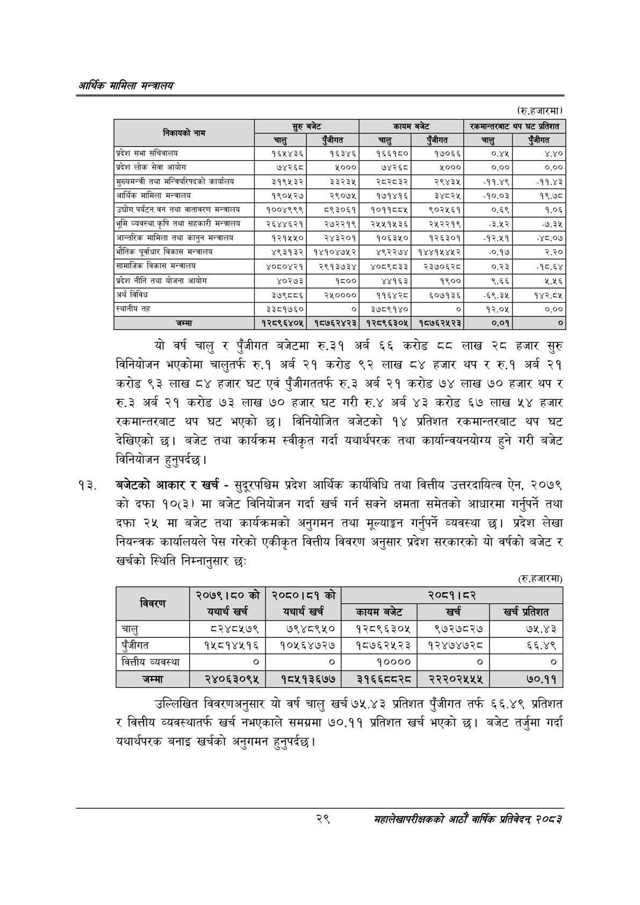

# Page 51 QA

## Rendered page


## Extracted text

```text
आर्थिक मामिला सन्वालय
(रु.हजारमा)
यो वर्ष चालु र पुँजीगत बजेटमा रु.३१ अर्ब ६६ करोड दद लाख २८ हजार सुरु विनियोजन भएकोमा चालुतर्फ रु.१ अर्ब २१ करोड ९२ लाख ८४ हजार थप र रु.१ अर्ब २१ करोड ९३ लाख ८४ हजार घट एवं पुँजीगततर्फ रु.३ अर्ब २१ करोड ७४ लाख ७० हजार थप र रु.३ अर्ब २१ करोड ७३ लाख ७० हजार घट गरी रु.४ अर्ब ४३ करोड ६७ लाख ५४ हजार रकमान्तरबाट थप घट भएको छ। विनियोजित बजेटको १४ प्रतिशत रकमान्तरबाट थप घट देखिएको छ। बजेट तथा कार्यक्रम स्वीकृत गर्दा यथार्थपरक तथा कार्यान्वयनयोग्य हुने गरी बजेट विनियोजन हुनुपर्दछ |
बजेटको आकार र खर्च -सुदूरपश्चिम प्रदेश आर्थिक कार्यविधि तथा वित्तीय उत्तरदायित्व ऐन, २०७९ को दफा १०(३) मा बजेट विनियोजन गर्दा खर्च गर्न सक्ने क्षमता समेतको आधारमा गर्नुपर्ने तथा दफा २५ मा बजेट तथा कार्यक्रमको अनुगमन तथा मूल्याङ्कन गर्नुपर्ने व्यवस्था छ। प्रदेश लेखा नियन्त्रक कार्यालयले पेस गरेको एकीकृत वित्तीय विवरण अनुसार प्रदेश सरकारको यो वर्षको बजेट र खर्चको स्थिति निम्नानुसार छः
(रुू.हजारमा)
उल्लिखित विवरणअनुसार यो वर्ष चालु खर्च ५५.४३ प्रतिशत पुँजीगत तर्फ ६६.४९ प्रतिशत र वित्तीय व्यवस्थातर्फ खर्च नभएकाले समग्रमा ७०.११ प्रतिशत खर्च भएको छ। बजेट तर्जुमा गर्दा यथार्थपरक बनाइ खर्चको अनुगमन हुनुपर्दछ |
२९
महालेखापरीक्षकको आठाँ वाषिकि प्रतिवेदन्‌ २०८२

| निकायको नाम | सुरु | ब्डिँ | कायम | बबेट | स्वन्नान्तरनाट | थप घट प्रतिशत |
| --- | --- | --- | --- | --- | --- | --- |
|  | चालु | एंजीगत | चालु | रजीगत | चालु | एंजीगत |
| प्रदेश सभा सचिवालय | १६५४३६ | १६३४६ | १६६१८० | १७०६६ | ०.४५ | ४.४० |
| प्रदेश लोक सेवा आयोग | ७४२६८ | ५००० | ७४२६८ | ५००० | ०.०० | ०.०० |
| सुल्यमन्त्री तथा भन्जिचरिष५को कार्यालय | ३१९५३२ | ३३२३५ | २८२८३२ | २९४३५ | -११.४९ | -११.४३ |
| आर्थिक मामिला मन्त्रालय | १९०१२७ | २९०७४५ | १७१४१६ | ३४८२५ | -१०.०३ | १९.७८ |
| 'उच्योग,पर्यटन,वन तथा वातावरण मन्त्रालय | १००४९९९ | ८९३०६१ | १०११८८४५ | ९०२५६१ | ०.६९ | १.०६ |
| भूमि व्यवस्था,कृषि तथा सहकारी मन्त्रालय | २६४४६२१ | २७२२१९ | २५५१५३६ | २५२२१९ |  | ३% |
| आन्तरिक मामिला तथा कानुन मन्त्रालय | १२१५५० | २४३२०१ | १०६३५० | १२६३०१ | -१२.११ | -४८.०७ |
| भौतिक पूर्वाधार विकास मन्चालय | ४९३१३२ | १४१०४७५२ | ४९२२७४ | १४४१५४५२ | -०.१७ | २.२० |
| सामाजिक विकास मन्त्रालय | ४०६०४२१ | २९१३७३४ | ४०८९८३३ | २३७०६२८ | ०.२३ | -१८.६४ |
| प्रदेश नीति तथा योजना आयोग | ४०२७३ | १८०० | ४४१६३ | १९०० | ६.६६ | २.५६ |
| अर्थ विविध | ३७९८८६ | २५०००० | ११६४२८ | ६०७१३६ | -६९.३५ | १४२.८५ |
| स्थानीय तह | ३३८१७६० | ० | ३७८९१४० | ० | १२.०४५ | ०.०० |
| जम्मा | १२८९६४०५ | १८७६२४२३ | १२८९६३०५ | १८७६२५२३ | ०.०१ |  |

| लि | २०७९। ५०को | २०८०।८१ को |  | २०८१।८२ |  |
| --- | --- | --- | --- | --- | --- |
|  | यथार्थ खरी | यथार्थ खर्च | 'कायम बजेट | खर्च | खर्च प्रतिशत |
| चालु | ८२४८५७९ | ७९४८९५० | १२८९६३०५ | १९७२७८२७ | ७१५.४३ |
| पुँजीगत | १५८१४५१६ | १०५६४७२७ | १८५७६२५२३ | १२४७४७२८ |  |
| वित्तीय व्यवस्था | ० | ० | १०००० | ० | ० |
| जम्मा | २४०६३०९५ | १८५१३६७७ | २१६६८८२८ | २२२०२४५५४५ | ७०.११ |
```

## Flags
- table_page
- medium_quality_table
