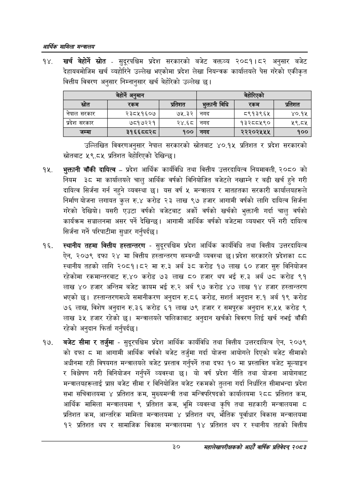

# Page 52 QA

## Rendered page


## Extracted text

```text
आर्थिक मामिला सन्वालय
खर्च बेहोर्ने ्रोत -सुदूरपश्चिम प्रदेश सरकारको बजेट वक्तव्य २०८१।८२ अनुसार बजेट देहायबमोजिम खर्च व्यहोरिने उल्लेख भएकोमा प्रदेश लेखा नियन्त्रक कार्यालयले पेस गरेको एकीकृत वित्तीय विवरण अनुसार निम्नानुसार खर्च बेहोरेको उल्लेख |
उल्लिखित विवरणअनुसार नेपाल सरकारको स्रोतबाट ४०.१५ प्रतिशत र प्रदेश सरकारको स्रोतबाट ५९.८५ प्रतिशत बेहोरिएको देखिन्छु |
भुक्तानी बाँकी दायित्व -प्रदेश आर्थिक कार्यविधि तथा वित्तीय उत्तरदायित्व नियमावली, २०८० को नियम ३८ मा कार्यालयले चालु आर्थिक वर्षको विनियोजित बजेटले नखाम्ने र बढी खर्च हुने गरी दायित्व सिर्जना गर्न नहुने व्यवस्था छ। यस वर्ष ५ मन्त्रालय र मातहतका सरकारी कार्यालयहरूले निर्माण योजना लगायत कुल रु.४ करोड २३ लाख ९७ हजार आगामी वर्षको लागि दायित्व सिर्जना गरेको देखियो। यसरी एउटा वर्षको बजेटबाट अर्को वर्षको खर्चको भुक्तानी गर्दा चालु वर्षको कार्यक्रम सञ्चालनमा असर पर्ने देखिन्छ। आगामी आर्थिक वर्षको बजेटमा व्ययभार पर्ने गरी दायित्व सिर्जना गर्ने परिपाटीमा सुधार गर्नुपर्दछ |
स्थानीय तहमा वित्तीय हस्तान्तरण -सुदूरपश्चिम प्रदेश आर्थिक कार्यविधि तथा वित्तीय उत्तरदायित्व ऐन, २०७९ दफा २४ मा वित्तीय हस्तान्तरण सम्बन्धी व्यवस्था छ। प्रदेश सरकारले प्रदेशका ६५ स्थानीय तहको लागि २०८१।८२ मा रु.३ अर्ब ३८ करोड १७ लाख ६० हजार सुरु विनियोजन रहेकोमा रकमान्तरबाट रु.४० करोड ७३ लाख ८० हजार थप भई रु.३ अर्ब ७८ करोड ९१ लाख ४० हजार अन्तिम बजेट कायम भई रु.२ अर्ब ९७ करोड ४७ लाख १४ हजार हस्तान्तरण भएको | हस्तान्तरणमध्ये समानीकरण अनुदान रु.८६ करोड, सशर्त अनुदान रु.१ अर्ब १९ करोड ७६ लाख, विशेष अनुदान रु.३६ करोड ६१ लाख ७९ हजार र समपूरक अनुदान रु.५५ करोड ९ लाख ३५ हजार रहेको छ। मन्त्रालयले पालिकाबाट अनुदान खर्चको विवरण लिई खर्च नभई बाँकी रहेको अनुदान फिर्ता गर्नुपर्दछ |
बजेट सीमा र तर्जुमा -सुदूरपश्चिम प्रदेश आर्थिक कार्यविधि तथा वित्तीय उत्तरदायित्व ऐन, २०७९ को दफा ८ मा आगामी आर्थिक वर्षको बजेट तर्जुमा गर्दा योजना आयोगले दिएको बजेट सीमाको अधीनमा रही विषयगत मन्त्रालयले बजेट प्रस्ताव गर्नुपर्ने तथा दफा १० मा प्रस्तावित बजेट मूल्याङ्कन र विश्लेषण गरी विनियोजन गर्नुपर्ने व्यवस्था छ। यो वर्ष प्रदेश नीति तथा योजना आयोगबाट मन्त्रालयहरूलाई प्राप्त बजेट सीमा र विनियोजित बजेट रकमको तुलना गर्दा निर्धारित सीमाभन्दा प्रदेश सभा सचिवालयमा ४ प्रतिशत कम, मुख्यमन्त्री तथा मन्त्रिपरिषदको कार्यालयमा २८८ प्रतिशत कम, आर्थिक मामिला मन्त्रालयमा ९ प्रतिशत कम, भूमि व्यवस्था कृषि तथा सहकारी मन्त्रालयमा ८ प्रतिशत कम, आन्तरिक मामिला मन्त्रालयमा ४ प्रतिशत थप, भौतिक पूर्वाधार विकास मन्त्रालयमा १२ प्रतिशत थप र सामाजिक विकास मन्त्रालयमा १४ प्रतिशत थप र स्थानीय तहको वित्तीय
३०
महालेखापरीक्षकको आठाँ वाषिकि प्रतिवेदन्‌ २०८२

|  | बेहोर्ने अनुमान |  |  | बहो२९को |  |
| --- | --- | --- | --- | --- | --- |
| स्रोत | रकम | प्रतिशत | भुक्तानी विध्वे | रकम | प्रतिशत |
| नेपाल सरकार | २३८५१६०७ | ७५.३२ | नगद | ८९१३९६४५ | ४०.१५ |
| प्रदेश सरकार | ७८१७२२१ | २४.६८० | नगद | १३२८८५९० | २९.८५ |
| जम्मा | ३१६६व००२८ | १०० | नगद | २२२०२५५५ | १०० |
```

## Flags
- table_page
- medium_quality_table
