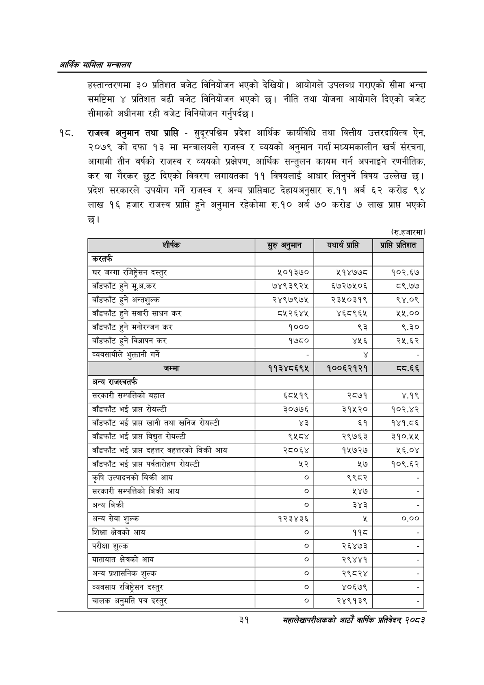

# Page 53 QA

## Rendered page


## Extracted text

```text
आर्थिक मामिला सन्वालय
हस्तान्तरणमा ३० प्रतिशत बजेट विनियोजन भएको देखियो। आयोगले उपलब्ध गराएको सीमा भन्दा समष्टिमा प्रतिशत बढी बजेट विनियोजन भएको छ। नीति तथा योजना आयोगले दिएको बजेट सीमाको अधीनमा रही बजेट विनियोजन गर्नुपर्दछ।
राजस्व अनुमान तथा प्राप्ति -सुदूरपश्चिम प्रदेश आर्थिक कार्यविधि तथा वित्तीय उत्तरदायित्व ऐन, २०७९ को दफा १३ मा मन्त्रालयले राजस्व र व्ययको अनुमान गर्दा मध्यमकालीन खर्च संरचना, आगामी तीन वर्षको राजस्व र व्ययको प्रक्षेपण, आर्थिक सन्तुलन कायम गर्न अपनाइने रणनीतिक, कर वा गैरकर छुट दिएको विवरण लगायतका ११ विषयलाई आधार लिनुपर्ने विषय उल्लेख छ। प्रदेश सरकारले उपयोग गर्ने राजस्व र अन्य प्राप्तिबाट देहायअनुसार रु.११ अर्ब ६२ करोड ९४ लाख १६ हजार राजस्व प्राप्ति हुने अनुमान रहेकोमा रु.१० अर्ब ७० करोड ७ लाख प्राप्त भएको
(रु.हजारमा)
३१
महालेखापरीक्षकको आठाँ वाषिकि प्रतिवेदन्‌ २०८२

| शीर्षक | सुरु अनुमान | यथार्थ प्राप्ति | प्राप्ति प्रतिशत |
| --- | --- | --- | --- |
| 'करतर्फ |  |  |  |
| घर जग्गा रजिष्ट्रेसन दस्तुर | ५०१३७० | ११४७७८ | १०२.६७ |
| बाँडफाँट हुने मूअ.कर | ७४९३९२५ | ६७२७५०६ | ८९.७७ |
| बाँडफाँट हुने अन्तशुल्क | २४९७९७५ | २३५०३१९ | ९४.०९ |
| बाँडफाँट हुने सवारी साधन कर | ८५२६४४ | ४६८९६५ | २५,.०० |
| बाँडफाँट हुने मनोरन्जन कर | १००० | ९३ | ९.३० |
| बाँडफाँट हुने विज्ञापन कर | १७८० | ४२५६ | २५.६२ |
| व्ववसाथीले भुक्तानी गर्ने |  |  |  |
| जम्मा | ११३४८६९४५ | १००६२१२१ | व्व्.६६ |
| अन्य राजस्वतर्फ |  |  |  |
| सरकारी सम्पतिको बहाल | ६८४५१९ | २८७१ | ४.१९ |
| बाँडफाँट भई प्राप्त रोयल्टी | ३०७७६ | ३१५२० | १०२.४२ |
| बाँडफाँट भई प्राप्त खानी तथा खनिज रोयल्टी | ४३ | ६१ | १४१.८६ |
| बाँडफाँट भई प्राप्त विद्युत रोयल्टी | ११०१ | २९७६३ | ३१०.५४ |
| बाँडफाँट भई प्राप्त दहत्तर पहतरको बिक्री आय | २८०६४ | १५७२७ | ५६.०४ |
| बाँडफाँट भई प्राप्त पर्वतारोहण रोयल्टी | ४३ | २७ | १०९.६२ |
| कृषि उत्पादनको बिक्री आय |  | ९९८२ |  |
| सरकारी सन्पतिको बिक्री आय |  | ५४७ |  |
| अन्य बिक्री | ० | ३४३ |  |
| अन्य सेवा शुल्क | १२३४३६ |  | ०.०० |
| शिक्षा क्षेत्रको आय | ० | ११८ |  |
| परीक्षा शुल्क | ० | २६४७३ |  |
| बाताबात क्षेत्रको आय | ० | २९४४१ |  |
| अन्य प्रशासनिक शुल्क | ० | २९८२४ |  |
| व्ववसाव रजिष्ट्रेसन दस्तुर | ० | ४०६७९ |  |
| चालक अनुमति पत्र दस्तुर | ० | २४९१३९ |  |
```

## Flags
- table_page
- medium_quality_table
