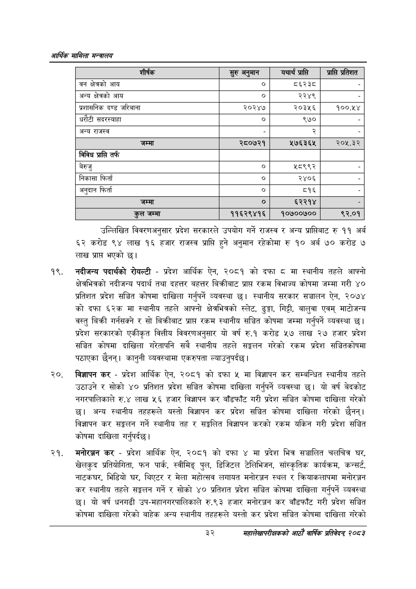

# Page 54 QA

## Rendered page


## Extracted text

```text
आर्थिक मामिला सन्वालय
उल्लिखित विवरणअनुसार प्रदेश सरकारले उपयोग गर्ने राजस्व र अन्य प्राप्तिबाट रु ११ अर्ब ६२ करोड ९४ लाख १६ हजार राजस्व प्राप्ति हुने अनुमान रहेकोमा रु १० अर्ब ७० करोड ७ लाख प्रापत भएको छ।
१९, नदीजन्य पदार्थको रोयल्टी -प्रदेश आर्थिक ऐन, २०८१ को दफा मा स्थानीय तहले आफ्नो क्षेत्रभित्रको नदीजन्य पदार्थ तथा दहत्तर बहत्तर बिक्रीबाट प्रापत रकम विभाज्य कोषमा जम्मा गरी ४० प्रतिशत प्रदेश सञ्चित कोषमा दाखिला गर्नुपर्ने व्यवस्था छ। स्थानीय सरकार सञ्चालन ऐन, २०७४ को दफा ६२क मा स्थानीय तहले आफ्नो क्षेत्रभित्रको स्लेट, ढुङ्गा, गिट्टी, बालुवा एवम्‌ माटोजन्य वस्तु बिक्री गर्नसक्ने र सो बिक्रीबाट प्रापत रकम स्थानीय सञ्चित कोषमा जम्मा गर्नुपर्ने व्यवस्था | प्रदेश सरकारको एकीकृत वित्तीय विवरणअनुसार यो वर्ष रु.१ करोड ५२७ लाख २७ हजार प्रदेश सञ्चित कोषमा दाखिला गरेतापनि सबै स्थानीय तहले सङ्लन गरेको रकम प्रदेश सञ्चितकोषमा पठाएका छैनन्‌। कानुनी व्यवस्थामा एकरुपता ल्याउनुपर्दछ।
विज्ञापन कर -प्रदेश आर्थिक ऐन, २०८१ को दफा मा विज्ञापन कर सम्बन्धित स्थानीय तहले उठाउने र सोको ४० प्रतिशत प्रदेश सञ्चित कोषमा दाखिला गर्नुपर्ने व्यवस्था छ। यो वर्ष बेदकोट नगरपालिकाले रु.४ लाख ५६ हजार विज्ञापन कर बाँडफाँट गरी प्रदेश सञ्चित कोषमा दाखिला गरेको छ। अन्य स्थानीय तहहरूले यस्तो विज्ञापन कर प्रदेश सञ्चित कोषमा दाखिला गरेको छैनन्‌। विज्ञापन कर सङ्कलन गर्ने स्थानीय तह र सङ्गलित विज्ञापन करको रकम यकिन गरी प्रदेश सञ्चित कोषमा दाखिला गर्नुपर्दछ।
मनोरञ्जन कर -प्रदेश आर्थिक ऐन, २०८१ को दफा ४ मा प्रदेश भित्र सञ्चालित चलचित्र घर, खेलकुद प्रतियोगिता, फन पार्क, स्वीमिङ्‌ पुल, डिजिटल टेलिभिजन, सांस्कृतिक कार्यक्रम, कन्सर्ट, नाटकघर, भिडियो घर, थिएटर र मेला महोत्सव लगायत मनोरञ्जन स्थल र क्रियाकलापमा मनोरञ्जन कर स्थानीय तहले सङ्कलन गर्ने र सोको ४० प्रतिशत प्रदेश सञ्चित कोषमा दाखिला गर्नुपर्ने व्यवस्था छ। यो वर्ष धनगढी उप-महानगरपालिकाले रु.९३ हजार मनोरञ्जन कर बाँडफाँट गरी प्रदेश सञ्चित कोषमा दाखिला गरेको बाहेक अन्य स्थानीय तहहरूले यस्तो कर प्रदेश सञ्चित कोषमा दाखिला गरेको
३२
महालेखापरीक्षकको आठाँ वाषिकि प्रतिवेदन्‌ २०८२

| शीर्षक | ® अनमान | यथार्थ प्राप्ति | प्राप्त प्रतेशत |
| --- | --- | --- | --- |
| वन क्षेत्रको आय | ० | ६२२८ |  |
| अन्य क्षेत्रको आय |  | २२४९ |  |
| प्रशासनिक दण्ड जरिवाना | २०२४७ | २०३५६ | १००.५४ |
| घरौटी खदरल्थाहा |  | ९७० |  |
| अन्य राजस्व |  | २ |  |
| जम्मा | २८०७२१ | २७६३६५ | २०५.३२ |
| विविध प्राप्ति तर्फ |  |  |  |
| बेरुजु | ० | श८९९२ |  |
| निकासा फिर्ता | ० | २४०६ |  |
| अनुदान फिर्ता | ० | ८१६ |  |
| जम्मा | ० | ६२२१४ | २ |
| कुल जम्मा | ११६२९४१६ | १०७००७०० | ९२.०१ |
```

## Flags
- table_page
- medium_quality_table
