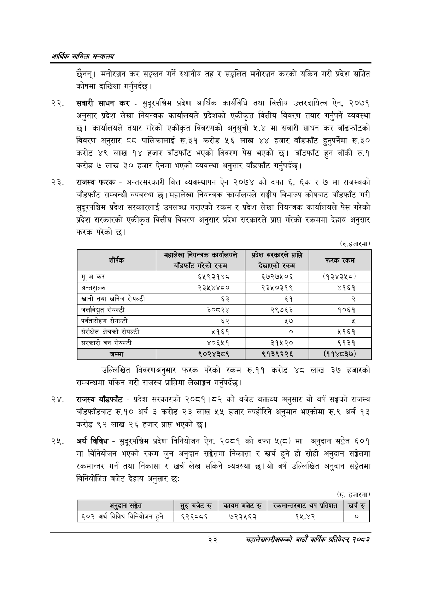

# Page 55 QA

## Rendered page


## Extracted text

```text
आर्थिक मामिला सन्वालय
छैनन्‌। मनोरञ्जन कर सङ्कलन गर्ने स्थानीय तह र सङ्कलित मनोरञ्जन करको यकिन गरी प्रदेश सञ्चित कोषमा दाखिला गर्नुपर्दछ |
सवारी साधन कर -सुदूरपश्चिम प्रदेश आर्थिक कार्यविधि तथा वित्तीय उत्तरदायित्व ऐन, २०७९ अनुसार प्रदेश लेखा नियन्त्रक कार्यालयले प्रदेशको एकीकृत वित्तीय विवरण तयार गर्नुपर्ने व्यवस्था छ। कार्यालयले तयार गरेको एकीकृत विवरणको अनुसुची ५.४ मा सवारी साधन कर बाँडफाँटको विवरण अनुसार ८८ पालिकालाई रु.३१ करोड ५६ लाख ४४ हजार बाँडफाँट हुनुपर्नेमा रु.३० करोड लाख १४ हजार बाँडफाँट भएको विवरण पेस भएको छ। बाँडफाँट हुन बाँकी रु.१ करोड ७ लाख ३० हजार ऐनमा भएको व्यवस्था अनुसार बाँडफाँट गर्नुपर्दछ |
राजस्व फरक -अन्तरसरकारी वित्त व्यवस्थापन ऐन २०७४ को दफा ६, ६क र ७ मा राजस्वको बाँडफाँट सम्बन्धी व्यवस्था छ। महालेखा नियन्त्रक कार्यालयले सङ्घीय विभाज्य कोषबाट बाँडफाँट गरी सुदूरपश्चिम प्रदेश सरकारलाई उपलब्ध गराएको रकम र प्रदेश लेखा नियन्त्रक कार्यालयले पेस गरेको प्रदेश सरकारको एकीकृत वित्तीय विवरण अनुसार प्रदेश सरकारले प्राप्त गरेको रकममा देहाय अनुसार फरक परेको
(रु.हजारमा)
उल्लिखित विवरणअनुसार फरक परेको रकम रु.११ करोड ४८ लाख ३७ हजारको सम्बन्धमा यकिन गरी राजस्व प्राप्तिमा लेखाङ्कन गर्नुपर्दछ |
राजस्व बाँडफाँट -प्रदेश सरकारको २०८१।८२ को बजेट वक्तव्य अनुसार यो वर्ष सङ्घको राजस्व बाँडफाँडबाट रु.१० अर्ब ३ करोड २३ लाख ५५ हजार व्यहोरिने अनुमान भएकोमा रु.९ अर्ब १३ करोड ९२ लाख २६ हजार प्रापत भएको |
अर्थ विविध -सुदूरपश्चिम प्रदेश विनियोजन ऐन, २०८१ को दफा ५(८) मा अनुदान सङ्गेत ६०१ मा विनियोजन भएको रकम जुन अनुदान सङ्ेतमा निकासा र खर्च हुने हो सोही अनुदान सङ्गेतमा रकमान्तर गर्न तथा निकासा र खर्च लेख सकिने व्यवस्था छ। यो वर्ष उल्लिखित अनुदान सङ्गेतमा विनियोजित बजेट देहाय अनुसार छः
(रु. हजारमा)
३३
महालेखापरीक्षकको आठाँ वाषिकि प्रतिवेदन्‌ २०८२

| . शीर्षक | भहालेखा नेबन्त्रक कार्यालषल - बाँडफाँट गरेको रकम | प्रदेश सरकारले समन दखाएका रकम | फरक रकम |
| --- | --- | --- | --- |
| मू अकर | ६५९३१४८ | ६५७२७५०६ | (१३४३४८। |
| अन्तशुल्क | २३५४४८० | २३५०३१९ | ४१६१ |
| 'खानी तथा खनिज रोयल्टी | ६३ | ६१ |  |
| जलबिुत रोयल्टी | ३०८२४ | २९७६३ | १०६१ |
| पर्वतारोहण रोयल्टी | ६२ | ५७ |  |
| संरक्षित क्षेत्रको रोयल्टी | ५१६१ |  | २१६१ |
| सरकारी वन रोयल्टी | ४०६५१ | ३१५२० | ९१३१ |
| जम्मा | ९०२४३८९ | ९१३९२२६ | (११४८३७) |

| अनुदान सङ्गेत                |   सुरु बजेट रु |   कायम बजेट रु |   रकमान्तरबाट थप प्रतिशत | &#124; खर्च रु   |
|------------------------------|----------------|----------------|--------------------------|------------------|
| ६०२ अर्थ विविध विनियोजन हुने |         ६२६८०६ |         ७२३५६३ |                    १५.४२ | &#124; ० &#124;  |
```

## Flags
- table_page
- medium_quality_table
