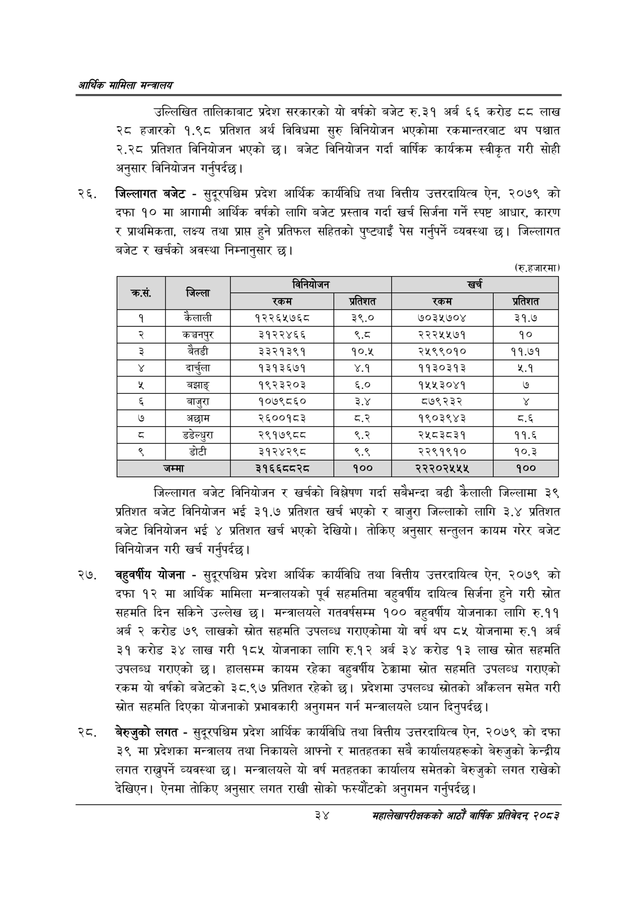

# Page 56 QA

## Rendered page


## Extracted text

```text
आर्थिक मामिला सन्वालय
उल्लिखित तालिकाबाट प्रदेश सरकारको यो वर्षको बजेट रु.३१ अर्ब ६६ करोड ६ लाख २८ हजारको १.९८ प्रतिशत अर्थ विविधमा सुरु विनियोजन भएकोमा रकमान्तरबाट थप पश्चात २.२८ प्रतिशत विनियोजन भएको छ। बजेट विनियोजन गर्दा वार्षिक कार्यक्रम स्वीकृत गरी सोही अनुसार विनियोजन गर्नुपर्दछ।
जिल्लागत बजेट -सुदूरपश्चिम प्रदेश आर्थिक कार्यविधि तथा वित्तीय उत्तरदायित्व ऐन, २०७९ को दफा १० मा आगामी आर्थिक वर्षको लागि बजेट प्रस्ताव गर्दा खर्च सिर्जना गर्ने स्पष्ट आधार, कारण र प्राथमिकता, लक्ष्य तथा प्राप्त हुने प्रतिफल सहितको पुष्ट्याइँ पेस गर्नुपर्ने व्यवस्था छ। जिल्लागत बजेट र खर्चको अवस्था निम्नानुसार छ।
(रु.हजारमा)
जिल्लागत बजेट विनियोजन र खर्चको विश्लेषण गर्दा सबैभन्दा बढी कैलाली जिल्लामा ३९ प्रतिशत बजेट विनियोजन भई ३१.७ प्रतिशत खर्च भएको र बाजुरा जिल्लाको लागि ३.४ प्रतिशत बजेट विनियोजन भई ४ प्रतिशत खर्च भएको देखियो। तोकिए अनुसार सन्तुलन कायम गरेर बजेट विनियोजन गरी खर्च गर्नुपर्दछ |
वहुवर्षीय योजना -सुदूरपश्चिम प्रदेश आर्थिक कार्यविधि तथा वित्तीय उत्तरदायित्व ऐन, २०७९ को दफा १२ मा आर्थिक मामिला मन्त्रालयको पूर्व सहमतिमा वहुवर्षीय दायित्व सिर्जना हुने गरी स्रोत सहमति दिन सकिने उल्लेख छ। मन्त्रालयले गतवर्षसम्म १०० वहुवर्षीय योजनाका लागि रु.११ अर्ब २ करोड ७९ लाखको स्रोत सहमति उपलव्ध गराएकोमा यो वर्ष थप ८५ योजनामा रु.१ अर्ब ३१ करोड ३४ लाख गरी १८५ योजनाका लागि रु.१२ अर्ब ३४ करोड १३ लाख स्रोत सहमति उपलब्ध गराएको छ। हालसम्म कायम रहेका वहुवर्षीय ठेक्कामा स्रोत सहमति उपलव्ध गराएको रकम यो वर्षको बजेटको ३८.९७ प्रतिशत रहेको छ। प्रदेशमा उपलव्ध स्रोतको आँकलन समेत गरी स्रोत सहमति दिएका योजनाको प्रभावकारी अनुगमन गर्न मन्त्रालयले ध्यान दिनुपर्दछ |
. बेरुजुको लगत -सुदूरपश्चिम प्रदेश आर्थिक कार्यविधि तथा वित्तीय उत्तरदायित्व ऐन, २०७९ को दफा ३९ मा प्रदेशका मन्त्रालय तथा निकायले आफ्नो र मातहतका सबै कार्यालयहरूको बेरुजुको केन्द्रीय लगत राख्नुपर्ने व्यवस्था | मन्त्रालयले यो वर्ष मतहतका कार्यालय समेतको बेरुजुको लगत राखेको देखिएन। ऐनमा तोकिए अनुसार लगत राखी सोको फस्यौटको अनुगमन गर्नुपर्दछ |
३४
महालेखापरीक्षकको आठाँ वाषिकि प्रतिवेदन्‌ २०८२

|  |  |  |  |  |  |
| --- | --- | --- | --- | --- | --- |
| क्रस. | जिल्ला | रकम | प्रतिशत | रकम | प्रतिशत |
| १ | कैलाली | १२२६५७६८ | ३९.० | ७०३५७०४ | ३१.७ |
| २ | कञ्चनपुर | ३१२२४६६ |  | २२२५५७१ | १० |
| ३ | बैतडी | ३३२१३९१ | १०.४५ | २५९९०१० | ११.७१ |
|  | दार्चुला | १३१३६७१ | ४.१ | ११३०३१३ | ५.१ |
| शर | बझाङ्‌ | १९२३२०३ | ६.० | १५५३०४१ | ७ |
|  | बाजुरा | १०७९८६० | ३.४ | ८७९२३२ |  |
| ७ | अछाम | २६००१८३ | व्.२ | १९०३९४३ | व्.६ |
|  | डडेल्धुरा | २९१७९८८ | ९.२ | २५८३८३१ | ११.६ |
| ९ | डोटी | ३१२४२९८ | ९.९ | २२९१९१० | १०.३ |
|  | जम्मा | ३१६६८८२८ | १०० | २२२०२५४५५ | १०० |
```

## Flags
- table_page
- medium_quality_table
