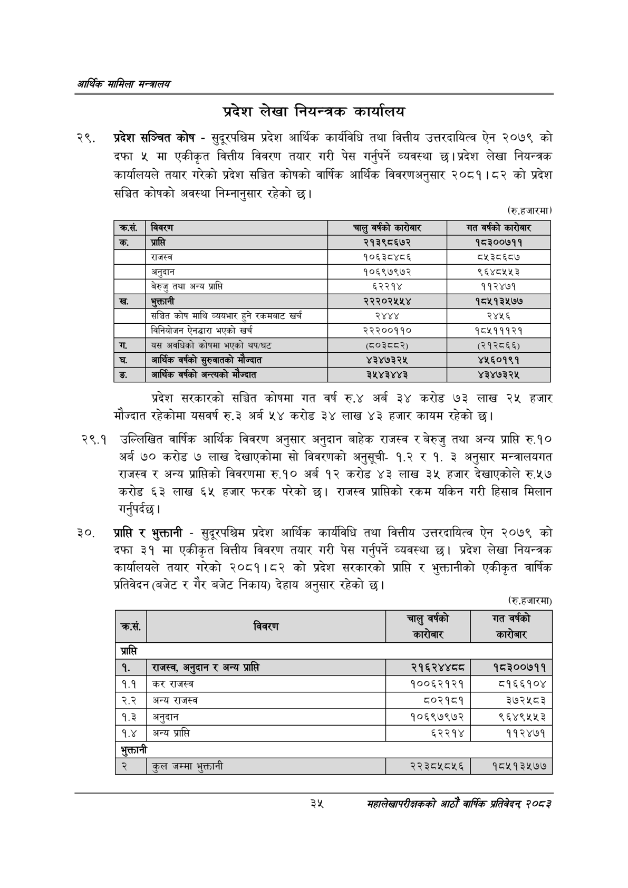

# Page 57 QA

## Rendered page


## Extracted text

```text
आर्थिक मामिला सन्वालय
प्रदेश लेखा नियन्त्रक कार्यालय
प्रदेश सञ्चित कोष -सुदूरपश्चिम प्रदेश आर्थिक कार्यविधि तथा वित्तीय उत्तरदायित्व ऐन २०७९ को दफा ५ मा एकीकृत वित्तीय विवरण तयार गरी पेस गर्नुपर्ने व्यवस्था छ। प्रदेश लेखा नियन्त्रक कार्यालयले तयार गरेको प्रदेश सञ्चित कोषको वार्षिक आर्थिक विवरणअनुसार २०८१।८२ को प्रदेश सञ्चित कोषको अवस्था निम्नानुसार रहेको छ।
(रु.हजारमा)
प्रदेश सरकारको सञ्चित कोषमा गत वर्ष रु.४ अर्ब ३४ करोड ७३ लाख २४ हजार मौज्दात रहेकोमा यसवर्ष रु.३ अर्ब ५४ करोड ३४ लाख ४३ हजार कायम रहेको छ।
२९.१ उल्लिखित वार्षिक आर्थिक विवरण अनुसार अनुदान बाहेक राजस्व र बेरुजु तथा अन्य प्राप्ति रु.१० अर्ब ७० करोड ७ लाख देखाएकोमा सो विवरणको अनुसूची१.२ र १. ३ अनुसार मन्त्रालयगत राजस्व र अन्य प्राप्तिको विवरणमा रु.१० अर्ब १२ करोड ४३ लाख ३५ हजार देखाएकोले रु.५७ करोड ६३ लाख ६५ हजार फरक परेको छ। राजस्व प्राप्तिको रकम यकिन गरी हिसाब मिलान गर्नुपर्दछ |
प्राप्ति र भुक्तानी -सुदूरपश्चिम प्रदेश आर्थिक कार्यविधि तथा वित्तीय उत्तरदायित्व ऐन २०७९ को दफा ३१ मा एकीकृत वित्तीय विवरण तयार गरी पेस गर्नुपर्ने व्यवस्था छ। प्रदेश लेखा नियन्त्रक कार्यालयले तयार गरेको २०८१।८२ को प्रदेश सरकारको प्राप्ति र भुक्तानीको एकीकृत वार्षिक प्रतिवेदन (बजेट र गैर बजेट निकाय) देहाय अनुसार रहेको छ।
(रु.हजारमा)
३५
महालेखापरीक्षकको आठाँ वाषिकि प्रतिवेदन्‌ २०८२

| क्रस. | विवरण | चालु वर्षको कारोबार | गत वर्षको कारोबार |
| --- | --- | --- | --- |
| क. | प्राप्ति | २१३९८६७२ | १८३००७११ |
|  | राजस्व | १०६३८४८६ | ८५३८६८४ |
|  | अनुदान | १०६९७९७२ | ९६४८५५३ |
|  | बेरुजु तथा अन्य प्राप्ति | ६२२१४ | ११२४७१ |
| ख. | भुक्तानी | २२२०२५५४ | १८५१३४५७७ |
|  | सञ्चित कोष माथि व्ययभार हुने १क५१८ खर्च | २४४४ | २४५६ |
|  | विनिवोजन ऐनद्धारा भएको खर्च | २२२००११० | १८५१११२१ |
|  | यस अवधिको कोषमा भएको थप/घट | (५०३८८२) | (२१२८६६) |
| घ. | अर्थिक वर्षको दुएबातको मौज्दात | ४३४७३२४५ | ४५६०१९१ |
| ङ | आर्थिक वर्षको अन्त्यको मंज्दात | ३५४३४४३ | ४३४७३२५ |

| . क्रस. | विवरण | चालु वर्षको कारेबार | गत वर्षको कारेबार |
| --- | --- | --- | --- |
| प्रासति |  |  |  |
| १. | राजस्व, अन्दान र अन्य प्राप्ति | २१६२४४८८ | १८३००७११ |
| १.१ | कर राजस्व | १००६२१२१ | ८१६६१०४ |
| २.२ | अन्य राजस्व | ८०२१८१ | ३७२५८३ |
| १.३ | अनुदान | १०६९७९७२ | ९६४९५५३ |
| १.४ | अन्य प्राप्ति | ६२२१४ | ११२४७१ |
| भुक्तानी |  |  |  |
| २ | कुल जम्मा भुक्तानी | २२३८५८५६ | १८५१३५७७ |
```

## Flags
- table_page
- medium_quality_table
