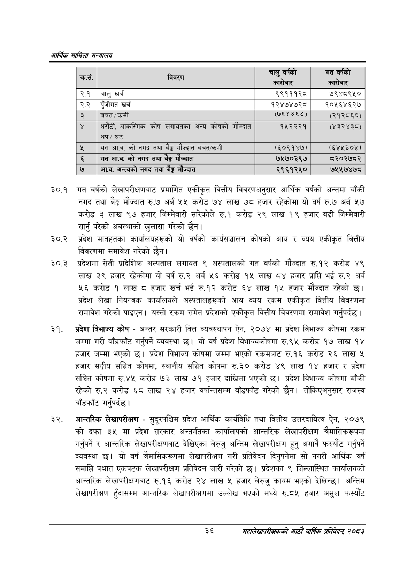

# Page 58 QA

## Rendered page


## Extracted text

```text
आर्थिक मामिला सन्वालय
३०.१ गत वर्षको लेखापरीक्षणबाट प्रमाणित एकीकृत वित्तीय विवरणअनुसार आर्थिक वर्षको अन्तमा बाँकी नगद तथा बेङ्ग मौज्दात रु.७ अर्ब ५५ करोड ७४ लाख ७८ हजार रहेकोमा यो वर्ष रु.७ अर्ब ५७ करोड ३ लाख ९७ हजार जिम्मेवारी सारेकोले रु.१ करोड २९ लाख १९ हजार बढी जिम्मेवारी सार्नु परेको अवस्थाको खुलासा गरेको छैन।
३०.२ प्रदेश मातहतका कार्यालयहरूको यो वर्षको कार्यसञ्चालन कोषको आय र व्यय एकीकृत वित्तीय विवरणमा समावेश गरेको छैन।
३०.३ प्रदेशमा सेती प्रादेशिक अस्पताल लगायत ९ अस्पतालको गत वर्षको मौज्दात रु.१२ करोड ४९ लाख ३९ हजार रहेकोमा यो वर्ष रु.२ अर्ब ५६ करोड १५ लाख ८४ हजार प्राप्ति भई रु.२ अर्ब ५६ करोड १ लाख ८ हजार खर्च भई रु.१२ करोड ६४ लाख १५ हजार मौज्दात रहेको छ। प्रदेश लेखा नियन्त्रक कार्यालयले अस्पतालहरूको आय व्यय रकम एकीकृत वित्तीय विवरणमा समावेश गरेको पाइएन। यस्तो रकम समेत प्रदेशको एकीकृत वित्तीय विवरणमा समावेश गर्नुपर्दछ |
प्रदेश विभाज्य कोष -अन्तर सरकारी वित्त व्यवस्थापन ऐन, २०७४ मा प्रदेश विभाज्य कोषमा रकम जम्मा गरी बाँडफाँट गर्नुपर्ने व्यवस्था छ। यो वर्ष प्रदेश विभाज्यकोषमा रु.९५ करोड १७ लाख १४ हजार जम्मा भएको छ। प्रदेश विभाज्य कोषमा जम्मा भएको रकमबाट रु.१६ करोड २६ लाख ५ हजार सङ्घीय सञ्चित कोषमा, स्थानीय सञ्चित कोषमा रु.३० करोड ४९ लाख १४ हजार र प्रदेश सञ्चित कोषमा रु.४५ करोड ७३ लाख ७१ हजार दाखिला भएको | प्रदेश विभाज्य कोषमा बाँकी रहेको रु.२ करोड ६८ लाख २४ हजार वर्षान्तसम्म बाँडफाँट गरेको छैन। तोकिएअनुसार राजस्व बाँडफाँट गर्नुपर्दछ |
आन्तरिक लेखापरीक्षण -सुदूरपश्चिम प्रदेश आर्थिक कार्यविधि तथा वित्तीय उत्तरदायित्व ऐन, २०७९ को दफा ३५ मा प्रदेश सरकार अन्तर्गतका कार्यालयको आन्तरिक लेखापरीक्षण त्रैमासिकरूपमा गर्नुपर्ने र आन्तरिक लेखापरीक्षणबाट देखिएका बेरुजु अन्तिम लेखापरीक्षण हुन्‌ अगावै फस्यौट गर्नुपर्ने व्यवस्था छ। यो वर्ष त्रैमासिकरूपमा लेखापरीक्षण गरी प्रतिवेदन दिनुपर्नेमा सो नगरी आर्थिक वर्ष समाप्ति पश्चात एकपटक लेखापरीक्षण प्रतिवेदन जारी गरेको छ। प्रदेशका ९ जिल्लास्थित कार्यालयको आन्तरिक लेखापरीक्षणबाट रु.१६ करोड २४ लाख ५ हजार बेरुजु कायम भएको देखिन्छ। अन्तिम लेखापरीक्षण हुँदासम्म आन्तरिक लेखापरीक्षणमा उल्लेख भएको मध्ये रु.८५ हजार असुल फस्यौंट
३६
महालेखापरीक्षकको आठाँ वाषिकि प्रतिवेदन्‌ २०८२

| . क्रस. | थी चेवरण | चाट्‌ वर्षको कारनार | गत वर्षको कारनार |
| --- | --- | --- | --- |
| २.१ | चालु खर्च | ९९१११२८ | ७९४८९५० |
| २.२ | पूँजीगत खर्च | १२४७४७२८ | १०५६४६२७४ |
| ३ | बचत /कमी | ९७६१३६८) | (२१२८६६) |
| ४ | , आकस्मिक कोष लगायतका अन्य कोषको भंण्दात थप/ घट | १५२२२१ | (४३२४३८) |
| १४ | यस आ.व. को नगद तथा बेङ्ग मौज्दात बचत/कमी | (६०९१४७) | (६४५३०४।) |
| ६ | गत आ.व. को नगद तथा ढेङ्ग ज्यात | ७५७०३९७ | ८२०२७८२ |
| ७ | आ.व. अन्त्यको नगद तथा ढेङ्ग ज्दात | ६९६१२५० | ७५५७४७८ |
```

## Flags
- table_page
- medium_quality_table
