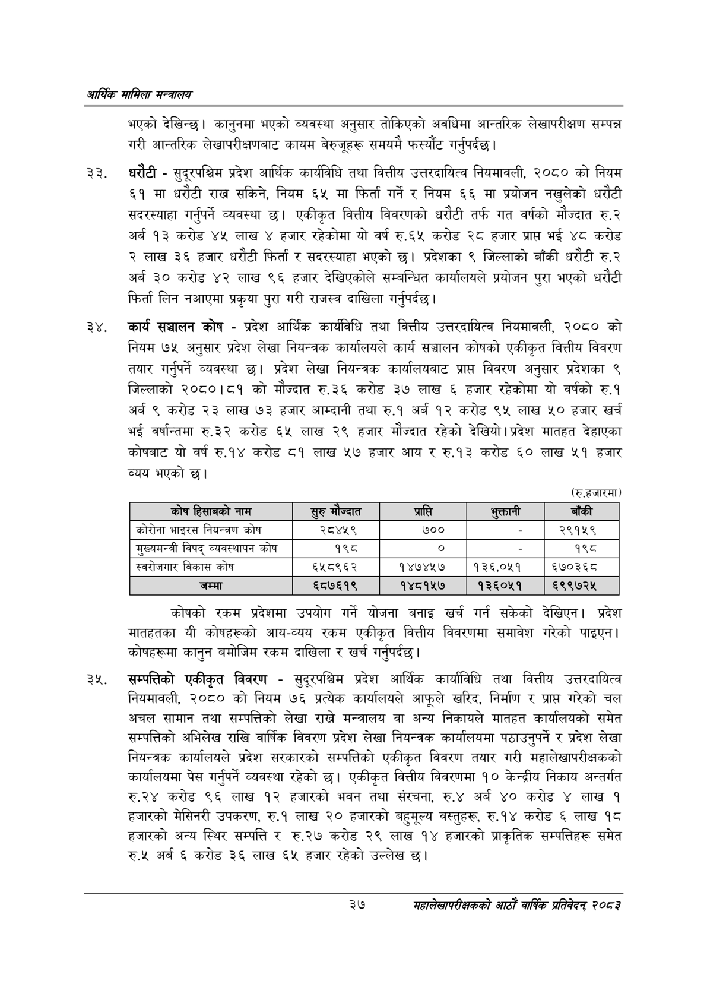

# Page 59 QA

## Rendered page


## Extracted text

```text
आर्थिक मामिला सन्वालय
भएको देखिन्छ। कानुनमा भएको व्यवस्था अनुसार तोकिएको अवधिमा आन्तरिक लेखापरीक्षण सम्पन्न गरी आन्तरिक लेखापरीक्षणबाट कायम बेरुजूहरू समयमै फस्यौंट गर्नुपर्दछ |
धरौटी -सुदूरपश्चिम प्रदेश आर्थिक कार्यविधि तथा वित्तीय उत्तरदायित्व नियमावली, २०८० को नियम ६१ मा धरौटी राख सकिने, नियम ६५ मा फिर्ता गर्ने र नियम ६६ मा प्रयोजन नखुलेको धरौटी सदरस्याहा गर्नुपर्ने व्यवस्था छ। एकीकृत वित्तीय विवरणको धरौटी तर्फ गत वर्षको मौज्दात रु.२ अर्ब १३ करोड ४५ लाख हजार रहेकोमा यो वर्ष रु.६५ करोड २८ हजार भई ४८ करोड २ लाख ३६ हजार धरौटी फिर्ता र सदरस्याहा भएको छ। प्रदेशका ९ जिल्लाको बाँकी धरौटी रु.२ अर्ब ३० करोड ४२ लाख ९६ हजार देखिएकोले सम्बन्धित कार्यालयले प्रयोजन पुरा भएको धरौटी फिर्ता लिन नआएमा प्रकृया पुरा गरी राजस्व दाखिला गर्नुपर्दछ |
कार्य सञ्चालन कोष -प्रदेश आर्थिक कार्यविधि तथा वित्तीय उत्तरदायित्व नियमावली, २०८० को नियम ७५ अनुसार प्रदेश लेखा नियन्त्रक कार्यालयले कार्य सञ्चालन कोषको एकीकृत वित्तीय विवरण तयार गर्नुपर्ने व्यवस्था छ। प्रदेश लेखा नियन्त्रक कार्यालयबाट प्राप्त विवरण अनुसार प्रदेशका ९ जिल्लाको २०८०।८१ को मौज्दात रु.३६ करोड ३७ लाख ६ हजार रहेकोमा यो वर्षको रु.१ अर्ब ९ करोड २३ लाख ७३ हजार आम्दानी तथा रु.१ अर्ब १२ करोड ९४५ लाख ५० हजार खर्च भई वर्षान्तमा रु.३२ करोड ६५ लाख २९ हजार मौज्दात रहेको देखियो। प्रदेश मातहत देहाएका कोषबाट यो वर्ष रु.१४ करोड ८१ लाख ५७ हजार आय र रु.१३ करोड ६० लाख ५१ हजार व्यय भएको छ।
(रु.हजारमा)
कोषको रकम प्रदेशमा उपयोग गर्ने योजना बनाइ खर्च गर्न सकेको देखिएन। प्रदेश मातहतका यी कोषहरूको आय-व्यय रकम एकीकृत वित्तीय विवरणमा समावेश गरेको पाइएन। कोषहरूमा कानुन बमोजिम रकम दाखिला र खर्च गर्नुपर्दछ।
सम्पत्तिको एकीकृत विवरण -सुदूरपश्चिम प्रदेश आर्थिक कार्यावधि तथा वित्तीय उत्तरदायित्व नियमावली, २०८० को नियम ७६ प्रत्येक कार्यालयले आफूले खरिद, निर्माण र प्राप्त गरेको चल अचल सामान तथा सम्पत्तिको लेखा राख्ने मन्त्रालय वा अन्य निकायले मातहत कार्यालयको समेत सम्पत्तिको अभिलेख राखि वार्षिक विवरण प्रदेश लेखा नियन्त्रक कार्यालयमा पठाउनुपर्ने र प्रदेश लेखा नियन्त्रक कार्यालयले प्रदेश सरकारको सम्पत्तिको एकीकृत विवरण तयार गरी महालेखापरीक्षकको कार्यालयमा पेस गर्नुपर्ने व्यवस्था रहेको | एकीकृत वित्तीय विवरणमा १० केन्द्रीय निकाय अन्तर्गत करोड ९६ लाख १२ हजारको भवन तथा संरचना, रु.४ अर्ब ४० करोड ४ लाख ९ हजारको मेसिनरी उपकरण, रु.१ लाख २० हजारको बहुमूल्य वस्तुहरू, रु.१४ करोड ६ लाख १८ हजारको अन्य स्थिर सम्पत्ति र रु.२७ करोड २९ लाख १४ हजारको प्राकृतिक सम्पत्तिहरू समेत रु.५ अर्ब ६ करोड ३६ लाख ६५ हजार रहेको उल्लेख छ।
३७
महालेखापरीक्षकको आठाँ वाषिकि प्रतिवेदन्‌ २०८२

| 'कोष (हसाजको नाम |  | प्राप्ति | भुक्तानी | बाँकी |
| --- | --- | --- | --- | --- |
| भाइरस निधन्त्रण कोष | २८४५९ | ७०० |  | २९१५९ |
| नुल्चसन्त्री विपद्‌ व्यवस्थापन कोष | १९८ | ० |  | १९८ |
| ल्वरोजगार विकास कोष | ६५८९६२ | १४७४५७ | १३६,०५१ | ६५७०३६८ |
| जम्मा | ६८७६१९ | १४८१५७ | १३६०५१ | ६९९७२४५ |
```

## Flags
- table_page
- medium_quality_table
