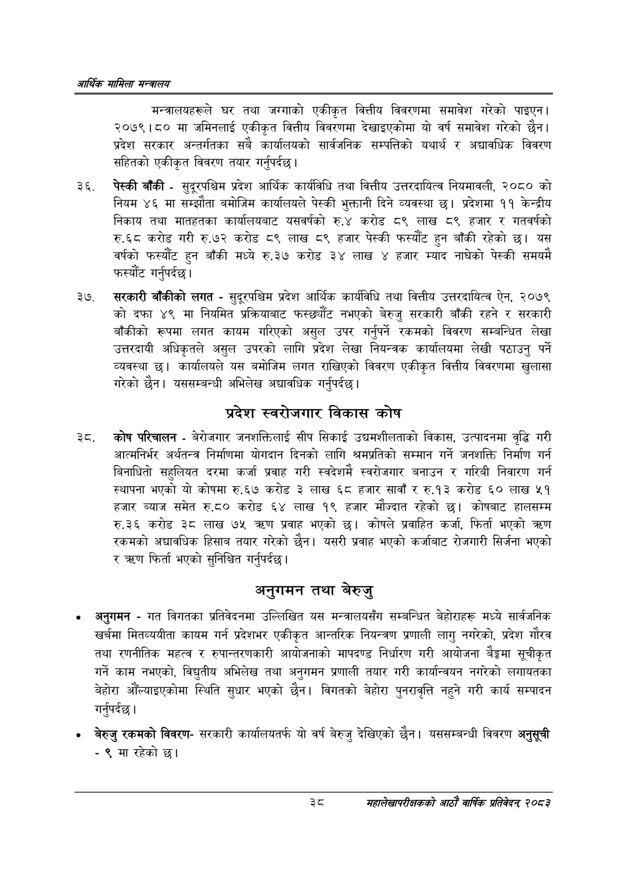

# Page 60 QA

## Rendered page


## Extracted text

```text
आर्थिक मामिला सन्वालय
मन्त्रालयहरूले घर तथा जग्गाको एकीकृत वित्तीय विवरणमा समावेश गरेको पाइएन | २०७९।८० मा जमिनलाई एकीकृत वित्तीय विवरणमा देखाइएकोमा यो वर्ष समावेश गरेको छैन। प्रदेश सरकार अन्तर्गतका सबै कार्यालयको सार्वजनिक सम्पत्तिको यथार्थ र अद्यावधिक विवरण सहितको एकीकृत विवरण तयार गर्नुपर्दछ |
पेस्की बाँकी -सुदूरपश्चिम प्रदेश आर्थिक कार्यविधि तथा वित्तीय उत्तरदायित्व नियमावली, २०८० को नियम ४६ मा सम्झौता बमोजिम कार्यालयले पेस्की भुक्तानी दिने व्यवस्था छ। प्रदेशमा ११ केन्द्रीय निकाय तथा मातहतका कार्यालयबाट यसवर्षको रु.४ करोड ८९ लाख ८९ हजार र गतवर्षको रु.६८ करोड गरी रु.७२ करोड ८९ लाख ८९ हजार पेस्की फस्यौट हुन बाँकी रहेको यस वर्षको फस्यौट हुन बाँकी मध्ये रु.३७ करोड ३४ लाख ४ हजार म्याद नाघेको पेस्की समयमै फस्यौट
गर्नुपर्दछ।
सरकारी बाँकीको लगत -सुदूरपश्चिम प्रदेश आर्थिक कार्यविधि तथा वित्तीय उत्तरदायित्व ऐन, २०७९ को दफा ४९ मा नियमित प्रक्रियाबाट फस्छ्चौट नभएको बेरुजु सरकारी बाँकी रहने र सरकारी बाँकीको रूपमा लगत कायम गरिएको असुल उपर गर्नुपर्ने रकमको विवरण सम्बन्धित लेखा उत्तरदायी अधिकृतले असुल उपरको लागि प्रदेश लेखा नियन्त्रक कार्यालयमा लेखी पठाउनु पर्ने व्यवस्था | कार्यालयले यस बमोजिम लगत राखिएको विवरण एकीकृत वित्तीय विवरणमा खुलासा गरेको छैन। यससम्बन्धी अभिलेख अद्यावधिक गर्नुपर्दछ |
प्रदेश स्वरोजगार विकास कोष
कोष परिचालन -बेरोजगार जनशक्तिलाई सीप सिकाई उद्यमशीलताको विकास, उत्पादनमा वृद्धि गरी आत्मनिर्भर अर्थतन्त्र निर्माणमा योगदान दिनको लागि श्रमप्रतिको सम्मान गर्ने जनशक्ति निर्माण गर्न बिनाधितो सहुलियत दरमा कर्जा प्रवाह गरी स्वदेशमै स्वरोजगार बनाउन र गरिबी निवारण गर्न स्थापना भएको यो कोषमा रु.६७ करोड ३ लाख ६८ हजार सावाँ र रु.१३ करोड ६० लाख ५१ हजार ब्याज समेत रु.८० करोड ६४ लाख १९ हजार मौज्दात रहेको छ। कोषबाट हालसम्म रु.३६ करोड ३८ लाख ७५ प्रवाह भएको छ। कोषले प्रवाहित कर्जा, फिर्ता भएको त्रधण रकमको अद्यावधिक हिसाब तयार गरेको छैन। यसरी प्रवाह भएको कर्जाबाट रोजगारी सिर्जना भएको र क्रण फिर्ता भएको सुनिश्चित गर्नुपर्दछ |
अनुगमन तथा बेरुजु
अनुगमन -गत विगतका प्रतिवेदनमा उल्लिखित यस मन्त्रालयसँग सम्बन्धित बेहोराहरू मध्ये सार्वजनिक खर्चमा मितव्ययीता कायम गर्न प्रदेशभर एकीकृत आन्तरिक नियन्त्रण प्रणाली लागु नगरेको, प्रदेश गौरव तथा रणनीतिक महत्व र रुपान्तरणकारी आयोजनाको मापदण्ड निर्धारण गरी आयोजना बैङ्कमा सूचीकृत गर्ने काम नभएको, विद्युतीय अभिलेख तथा अनुगमन प्रणाली तयार गरी कार्यान्वयन नगरेको लगायतका बेहोरा औँल्याइएकोमा स्थिति सुधार भएको छैन। विगतको बेहोरा पुनरावृत्ति नहुने गरी कार्य सम्पादन गर्नुपर्दछ |
० बेरुजु रकमको विवरणसरकारी कार्यालयतर्फ यो वर्ष बेरुजु देखिएको छैन। यससम्बन्धी विवरण अनुसूची -९ मा रहेको छ।
छि
महालेखापरीक्षकको आठाँ वाषिकि प्रतिवेदन्‌ २०८२
```

## Flags
- None
