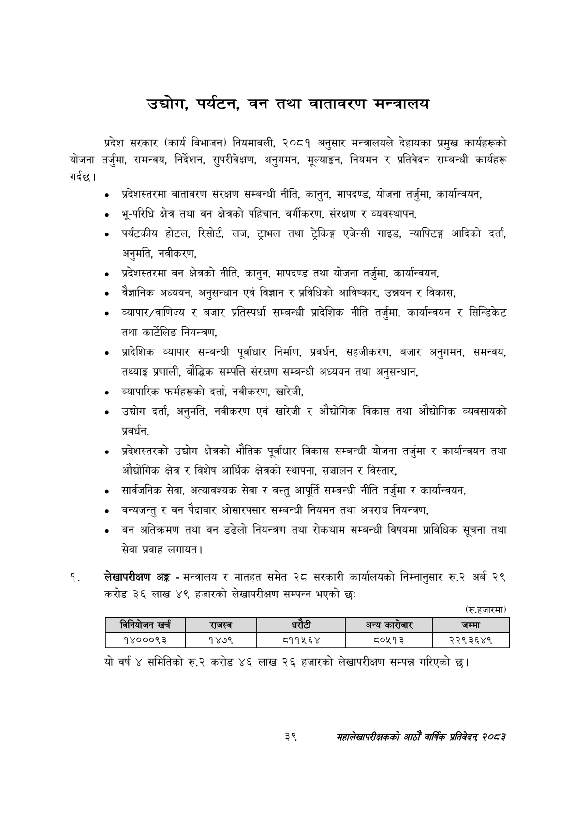

# Page 61 QA

## Rendered page


## Extracted text

```text
उद्योग, पर्यटन, वन तथा वातावरण मन्त्रालय
प्रदेश सरकार (कार्य विभाजन) नियमावली, २०८१ अनुसार मन्त्रालयले देहायका प्रमुख कार्यहरूको योजना तर्जुमा, समन्वय, निर्देशन, सुपरीवेक्षण, अनुगमन, मूल्याङ्कन, नियमन र प्रतिवेदन सम्बन्धी कार्यहरू गर्दछु।
प्रदेशस्तरमा वातावरण संरक्षण सम्बन्धी नीति, कानुन, मापदण्ड, योजना तर्जुमा, कार्यान्वयन,
भू-परिधि क्षेत्र तथा वन क्षेत्रको पहिचान, वर्गीकरण, संरक्षण र व्यवस्थापन,
पर्यटकीय होटल, रिसोर्ट, लज, ट्राभल तथा ट्रेकिङ्ग एजेन्सी गाइड, च्याफ्टिङ्ग आदिको दर्ता, अनुमति, नवीकरण,
प्रदेशस्तरमा वन क्षेत्रको नीति, कानुन, मापदण्ड तथा योजना तर्जुमा, कार्यान्वयन,
वैज्ञानिक अध्ययन, अनुसन्धान एवं विज्ञान र प्रविधिको आविष्कार, उन्नयन र विकास,
व्यापार/वाणिज्य र बजार प्रतिस्पर्धा सम्बन्धी प्रादेशिक नीति तर्जुमा, कार्यान्वयन र सिन्डिकेट तथा कार्टेलिङ नियन्त्रण,
प्रादेशिक व्यापार सम्बन्धी पूर्वाधार निर्माण, प्रवर्धन, सहजीकरण, बजार अनुगमन, समन्वय, तथ्याङ्क प्रणाली, बौद्धिक सम्पत्ति संरक्षण सम्बन्धी अध्ययन तथा अनुसन्धान,
व्यापारिक फर्महरूको दर्ता, नवीकरण, खारेजी,
उद्योग दर्ता, अनुमति, नवीकरण एवं खारेजी र औद्योगिक विकास तथा औद्योगिक व्यवसायको प्रवर्धन,
प्रदेशस्तरको उद्योग क्षेत्रको भौतिक पूर्वाधार विकास सम्बन्धी योजना तर्जुमा र कार्यान्वयन तथा औद्योगिक क्षेत्र र विशेष आर्थिक क्षेत्रको स्थापना, सञ्चालन र विस्तार,
सार्वजनिक सेवा, अत्यावश्यक सेवा र वस्तु आपूर्ति सम्बन्धी नीति तर्जुमा र कार्यान्वयन,
वन्यजन्तु र वन पैदावार ओसारपसार सम्बन्धी नियमन तथा अपराध नियन्त्रण,
वन अतिक्रमण तथा वन डढेलो नियन्त्रण तथा रोकथाम सम्बन्धी विषयमा प्राविधिक सूचना तथा सेवा प्रवाह लगायत |
लेखापरीक्षण अङ्ग -मन्त्रालय र मातहत समेत २८ सरकारी कार्यालयको निम्नानुसार रु.२ अर्ब २९ करोड ३६ लाख ४९ हजारको लेखापरीक्षण सम्पन्न भएको छ:
(रु.हजारमा)
यो वर्ष ४ समितिको रु.२ करोड ४६ लाख २६ हजारको लेखापरीक्षण सम्पन्न गरिएको छ।
३९
महालेखापरीक्षकको आठाँ वाषिकि प्रतिवेदन्‌ २०८२

|  |  | ननिकोजन खर्च | राजस्व |  |  | अन्य बररेजार | जम्मा |
| --- | --- | --- | --- | --- | --- | --- | --- |
|  |  | १४०००९३ | १४७९ | ८११५६४ |  | ८०५१३ | २२९३६४९ |
```

## Flags
- table_page
- medium_quality_table
