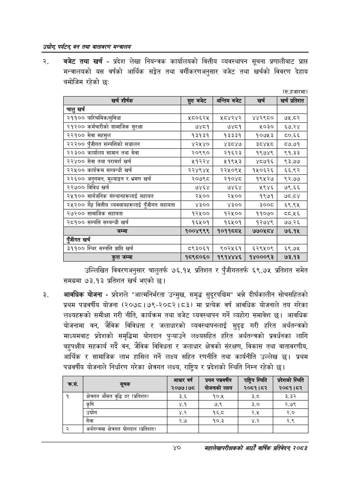

# Page 62 QA

## Rendered page


## Extracted text

```text
उद्योग पर्यटन्‌ वन तथा वातावरण सन्वालय
बजेट तथा खर्च -प्रदेश लेखा नियन्त्रक कार्यालयको वित्तीय व्यवस्थापन सूचना प्रणालीबाट प्राप्त मन्त्रालयको यस वर्षको आर्थिक सङ्गेत तथा वर्गीकरणअनुसार बजेट तथा खर्चको विवरण देहाय बमोजिम रहेको छ:
(रु.हजारमा)
उल्लिखित विवरणअनुसार चालुतर्फ ७६.१५ प्रतिशत र पुँजीगततर्फ ६९.७४५ प्रतिशत समेत समग्रमा ७३.१३ प्रतिशत खर्च भएको छ।
आवधिक योजना -प्रदेशले "आत्मनिर्भरता उन्मुख, समृद्ध सुदूरपश्चिम" भन्ने दीर्घकालीन सोचसहितको प्रथम पञ्चवर्षीय योजना (२०७८।७९-२०८२।८३) मा प्रत्येक वर्ष आवधिक योजनाले तय गरेका लक्ष्यहरूको समीक्षा गरी नीति, कार्यक्रम तथा बजेट व्यवस्थापन गर्ने व्यहोरा समावेश छ। आवधिक योजनामा वन, जैविक विविधता र जलाधारको व्यवस्थापनलाई सुदृढ गरी हरित अर्थतन्त्रको माध्यमबाट प्रदेशको समृद्धिमा योगदान पुन्याउने लक्ष्यसहित हरित अर्थतन्त्रको प्रवर्धनका लागि बहुपक्षीय सहकार्य गर्दै वन, जैविक विविधता र जलाधार क्षेत्रको संरक्षण, विकास तथा वातावरणीय, आर्थिक र सामाजिक लाभ हासिल गर्ने लक्ष्य सहित रणनीति तथा कार्यनीति उल्लेख छ। प्रथम पञ्चवर्षीय योजनाले निर्धारण गरेका क्षेत्रगत लक्ष्य, राष्ट्रिय र प्रदेशको स्थिति निम्न रहेको छ।
४०
महालेखापरीक्षकको आठ वार्षिक प्रतिवेदन्‌ २०५३

| खर्च शीर्षक | सुरु बजेट | अन्तिम बजेट | खर्च | खर्च प्रतिशत |
| --- | --- | --- | --- | --- |
| चालु खर्च |  |  |  |  |
| २११०० पारिश्रमिक/सुविधा | श२८०६२५ | १८४२४२ | ४४२९८० | ७५.८२ |
| २१२०० कर्मचारीको सामाजिक सुरक्षा | ७४८१ | ७४८१ | २०३० | ६७.२४ |
| २२१०० सेवा महसुल | १३१३१ | १३३३१ | १०७१५३ | ८०.६६ |
| २२२०० पुँजीगत सन्पत्तिको सञ्चालन | ४२५४० | ४३८४७ | ३४५८ | ८०७.७१ |
| २२३०० कार्यालय सामान तथा सेवा | २०९९० | २१६२३ | १९७४९ | ९१.३३ |
| २२४०० सेवा तथा परामर्श खर्च | ५१२२४ | २१९५३ | ४८७१६ | ९३.७४ |
| २२५०० कार्यक्रम सम्बन्धी खर्च | २२४९४४५ | २२५०९५ | १५०६२६ | ६६.९२ |
| २२६०० अनुगमन, मूल्याङ्कन र भ्रमण खर्च | २०७९८ | २१०४८ | १९५२७ | ९२.७७ |
| २२७०० विविध खर्च | ७४६४ | ७४६४ | २९४६ | ७९.६६ |
| २५१०० सार्बजनिक संस्थानहरूलाई सहायत | २५०० | २५०० | १९७१ | ७८.८४ |
| २५२०० गैह्र वित्तीय ०५१८।५६७०ई पुँजीगत सहायता | ४३०० | ४३०० | ३००८ | ६९.९५ |
| २७२०० सामाजिक सहायता | १२५०० | १२५०० | ११०७० | य्य.५६ |
| २८१०० सम्पत्ति सम्बन्धी खर्च | १६४५०१ | १६५०१ | १२७४९ | ७७.२६ |
| जम्मा | १००४९९९ | १०११८८५ | ७७०५८४ | ७६.१५ |
| ंजीगत खर्च |  |  |  |  |
| ३११०० स्थिर सम्पत्ति प्राप्ति खर्च | ८९३०६१ | ९०२५६१ | ६२९५०९ | ६९.७५ |
| कुल जम्मा | १८९८०६० | १९१४४४६ | १४०००९३ | ७३.१३ |

| कस. | सूचक | आधार वर्ष २०७७।७८ | प्रथम पञचरपीय बागनाका लक्ष्य | राष्ट्रिय स्थिति २०८१।८२ | प्रदेशको स्थिति २०८१।८२ |
| --- | --- | --- | --- | --- | --- |
| १ | क्षेत्रगत औसत वृद्धि दर (प्रतिशत) | ३.६ | १०.४५ | ३.८ | ३.३२ |
|  | कृषि | ४.१ | ७.९ | ३.० | २.७९ |
|  | उच्चोग | ४.२ | १६.८ | २.५ | २.० |
|  | सेवा | २.७ | १०.३ | ४.२ | २.९ |
|  | अर्थतन्त्रमा क्षेत्रगत योगदान (प्रतिशत) |  |  |  |  |
```

## Flags
- table_page
- medium_quality_table
