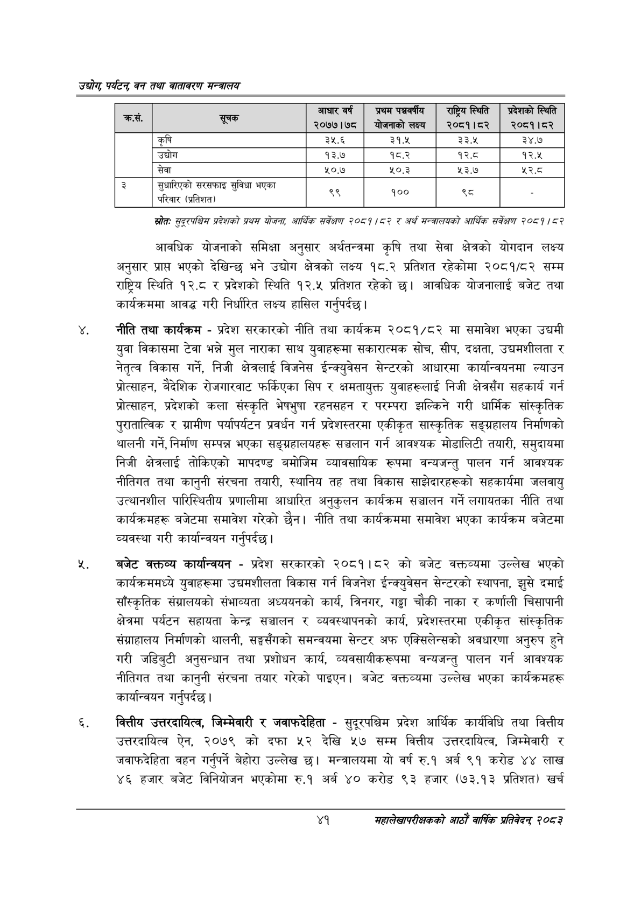

# Page 63 QA

## Rendered page


## Extracted text

```text
उद्योग पर्यटन्‌ वन तथा वातावरण सन्वालय
स्रोतः सुद्रपश्चिय प्रदेशको प्रथस योजना; आर्थिक सर्वेक्षण २०८१/८२ र अर्थ मन्त्रालयको आर्थिक सर्वेक्षण २०५९ १५७
आवधिक योजनाको समिक्षा अनुसार अर्थतन्त्रमा कृषि तथा सेवा क्षेत्रको योगदान लक्ष्य अनुसार प्राप्त भएको देखिन्छ भने उद्योग क्षेत्रको लक्ष्य १८.२ प्रतिशत रहेकोमा २०८१/८२ सम्म राष्ट्रिय स्थिति १२.८ र प्रदेशको स्थिति १२.५ प्रतिशत रहेको छ। आवधिक योजनालाई बजेट तथा कार्यक्रममा आवद्ध गरी निर्धारित लक्ष्य हासिल गर्नुपर्दछ |
नीति तथा कार्यक्रम -प्रदेश सरकारको नीति तथा कार्यक्रम २०८१/८२ मा समावेश भएका उद्यमी युवा विकासमा टेवा भन्ने मुल नाराका साथ युवाहरूमा सकारात्मक सोच, सीप, दक्षता, उद्यमशीलता र नेतृत्व विकास गर्ने, निजी क्षेत्रलाई विजनेस ईन्क्युवेसन सेन्टरको आधारमा कार्यान्वयनमा ल्याउन प्रोत्साहन, बैदेशिक रोजगारवाट फर्किएका सिप र क्षमतायुक्त युवाहरूलाई निजी क्षेत्रसँग सहकार्य गर्न प्रोत्साहन, प्रदेशको कला संस्कृति भेषभुषा रहनसहन र परम्परा झल्किने गरी धार्मिक सांस्कृतिक पुरातात्विक र ग्रामीण पर्यापर्यटन प्रवर्धन गर्न प्रदेशस्तरमा एकीकृत सास्कृतिक सङ्ग्रहालय निर्माणको थालनी गर्ने, निर्माण सम्पन्न भएका सङ्ग्रहालयहरू सञ्चलान गर्न आवश्यक मोडालिटी तयारी, समुदायमा निजी क्षेत्रलाई तोकिएको मापदण्ड बमोजिम व्यावसायिक रूपमा वन्यजन्तु पालन गर्न आवश्यक नीतिगत तथा कानुनी संरचना तयारी, स्थानिय तह तथा विकास साझेदारहरूको सहकार्यमा जलवायु उत्थानशील पारिस्थितीय प्रणालीमा आधारित अनुकुलन कार्यक्रम सञ्चालन गर्ने लगायतका नीति तथा कार्यक्रमहरू बजेटमा समावेश गरेको छैन। नीति तथा कार्यक्रममा समावेश भएका कार्यक्रम बजेटमा व्यवस्था गरी कार्यान्वयन गर्नुपर्दछ |
बजेट कक्तव्य कार्यान्वयन -प्रदेश सरकारको २०८१।८२ को बजेट वक्तव्यमा उल्लेख भएको कार्यक्रममध्ये युवाहरूमा उद्यमशीलता विकास गर्न विजनेश ईन्क्युवेसन सेन्टरको स्थापना, झुसे दमाई साँस्कृतिक संग्रालयको संभाव्यता अध्ययनको कार्य, , चौकी नाका र कर्णाली चिसापानी क्षेत्रमा पर्यटन सहायता केन्द्र सञ्चालन र व्यवस्थापनको कार्य, प्रदेशस्तरमा एकीकृत सांस्कृतिक संग्राहालय निर्माणको थालनी, सङ्गसँगको समन्वयमा सेन्टर अफ एक्सिलेन्सको अवधारणा अनुरुप हुने गरी जडिबुटी अनुसन्धान तथा प्रशोधन कार्य, व्यवसायीकरूपमा वन्यजन्तु पालन गर्न आवश्यक नीतिगत तथा कानुनी संरचना तयार गरेको पाइएन। बजेट वक्तव्यमा उल्लेख भएका कार्यक्रमहरू कार्यान्वयन गर्नुपर्दछ |
वकित्तीय उत्तरदायित्व, जिम्मेवारी र जवाफदेहिता -सुदूरपश्चिम प्रदेश आर्थिक कार्यविधि तथा वित्तीय उत्तरदायित्व ऐन, २०७९ को दफा ५२ देखि ५७ सम्म वित्तीय उत्तरदायित्व, जिम्मेवारी र जवाफदेहिता वहन गर्नुपर्ने बेहोरा उल्लेख छ। मन्त्रालयमा यो वर्ष रु.१ अर्ब ९१ करोड ४४ लाख ४६ हजार बजेट विनियोजन भएकोमा रु.१ अर्ब ४० करोड ९३ हजार (७३.१३ प्रतिशत) खर्च
४१
महालेखापरीक्षकको आठाँ वाषिकि प्रतिवेदन्‌ २०८२

| क्रस. | सूचक | आधार वर्ष २०७७।७८ | प्रथम पापर्पीय | राष्ट्रिय स्थिति २०८१।०२ | प्रदेशको स्थिति २०८१।८२ |
| --- | --- | --- | --- | --- | --- |
|  | कृषि | ३५.६ | ३१.५ | ३३.४५ | ३४.७ |
|  | उच्चोग | १३.७ | १८.२ | १२.८ | १२.४५ |
|  | सेवा | ५०.७ | %०.३ | ४३ | २.८ |
| ३ | सुधारिएको सुविधा भएका परिवार (प्रतिशत)? | ५ | १०० | त्र |  |
```

## Flags
- table_page
- medium_quality_table
