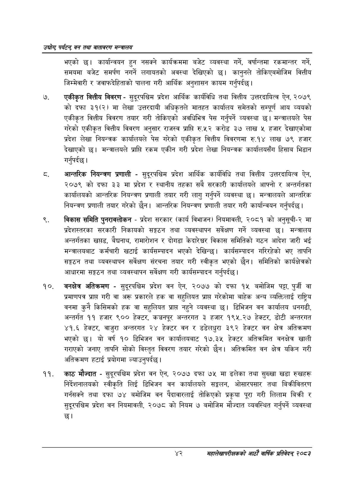

# Page 64 QA

## Rendered page


## Extracted text

```text
उद्योग पर्यटन्‌ वन तथा वातावरण सन्वालय
भएको छ। कार्यान्वयन हुन नसक्ने कार्यक्रममा बजेट व्यवस्था गर्ने, वर्षान्तमा रकमान्तर गर्ने, समयमा बजेट समर्पण नगर्ने लगायतको अवस्था देखिएको छ। कानुनले तोकिएवमोजिम वित्तीय जिम्मेवारी र जवाफदेहिताको पालना गरी आर्थिक अनुशासन कायम गर्नुपर्दछ |
एकीकृत वित्तीय विवरण -सुदूरपश्चिम प्रदेश आर्थिक कार्यविधि तथा वित्तीय उत्तरदायित्व ऐन, २०७९ को दफा ३१(२) मा लेखा उत्तरदायी अधिकृतले मातहत कार्यालय समेतको सम्पूर्ण आय व्ययको एकीकृत वित्तीय विवरण तयार गरी तोकिएको अवधिभित्र पेस गर्नुपर्ने व्यवस्था छ। मन्त्रालयले पेस गरेको एकीकृत वित्तीय विवरण अनुसार राजस्व प्राप्ति रु.५२ करोड ३० लाख ५ हजार देखाएकोमा प्रदेश लेखा नियन्त्रक कार्यालयले पेस गरेको एकीकृत वित्तीय विवरणमा रु.१४ लाख ७९ हजार देखाएको छ। मन्त्रालयले प्राप्ति रकम एकीन गरी प्रदेश लेखा नियन्त्रक कार्यालयसँग हिसाब भिडान गर्नुपर्दछ |
आन्तरिक नियन्त्रण प्रणाली -सुदूरपश्चिम प्रदेश आर्थिक कार्यविधि तथा वित्तीय उत्तरदायित्व ऐन, २०७९ को दफा ३३ मा प्रदेश र स्थानीय तहका सबै सरकारी कार्यालयले आफ्नो र अन्तर्गतका कार्यालयको आन्तरिक नियन्त्रण प्रणाली तयार गरी लागु गर्नुपर्ने व्यवस्था छ। मन्त्रालयले आन्तरिक नियन्त्रण प्रणाली तयार गरेको छैन। आन्तरिक नियन्त्रण प्रणाली तयार गरी कार्यान्वयन गर्नुपर्दछ |
विकास समिति पुनरावलोकन -प्रदेश सरकार (कार्य विभाजन) नियमावली, २०८१ को अनुसूची-२ मा प्रदेशस्तरका सरकारी निकायको सङ्गठन तथा व्यवस्थापन सर्वेक्षण गर्ने व्यवस्था छ। मन्त्रालय अन्तर्गतका खप्तड, वैद्यनाथ, रामारोशन र दोगडा केदारेशवर विकास समितिको गठन आदेश जारी भई मन्त्रालयबाट कर्मचारी खटाई कार्यसम्पादन भएको देखिन्छ। कार्यसम्पादन गरिरहेको भए तापनि सङ्गठन तथा व्यवस्थापन सर्वेक्षण संरचना तयार गरी स्वीकृत भएको छैन। समितिको कार्यक्षेत्रको आधारमा सङ्गठन तथा व्यवस्थापन सर्वेक्षण गरी कार्यसम्पादन गर्नुपर्दछ |
वनक्षेत्र अतिक्रमण -सुदूरपश्चिम प्रदेश वन ऐन, २०७७ को दफा १५ बमोजिम पट्टा, पुर्जी वा प्रमाणपत्र प्राप्त गरी वा अरू प्रकारले हक वा सहुलियत प्राप्त गरेकोमा बाहेक अन्य व्यक्तिलाई राष्ट्रिय वनमा कुनै किसिमको हक वा सहुलियत प्राप्त नहुने व्यवस्था छ। डिभिजन वन कार्यालय धनगढी, अन्तर्गत ११ हजार ९०० हेक्टर, कञ्चनपूर अन्तरगत ३ हजार १९५.२७ हेक्टर, डोटी अन्तरगत ४१.६ हेक्टर, वाजुरा अन्तरगत २४ हेक्टर वन र डडेलधुरा ३९२ हेक्टर वन क्षेत्र अतिक्रमण भएको छ। यो वर्ष १० डिभिजन वन कार्यालयबाट १७.३५ हेक्टर अतिक्रमित वनक्षेत्र खाली गराएको जनाए तापनि सोको विस्तृत विवरण तयार गरेको छैन। अतिक्रमित वन क्षेत्र यकिन गरी अतिक्रमण हटाई प्रयोगमा ल्याउनुपर्दछ।
काठ मौज्दात -सुदूरपश्चिम प्रदेश वन ऐन, २०७७ दफा ७५ मा ढलेका तथा सुख्खा खडा रुखहरू निर्देशनालयको स्वीकृति लिई डिभिजन वन कार्यालयले सङ्कलन, ओसारपसार तथा बिक्रीवितरण गर्नसक्ने तथा दफा ७४ बमोजिम वन पैदावारलाई तोकिएको प्रकृया पूरा गरी लिलाम बिक्री र सुदूरपश्चिम प्रदेश वन नियमावली, २०७८ को नियम ७ बमोजिम मौज्दात व्यवस्थित गर्नुपर्ने व्यवस्था छ।
४२
महालेखापरीक्षकको आठाँ वाषिकि प्रतिवेदन्‌ २०८२
```

## Flags
- None
