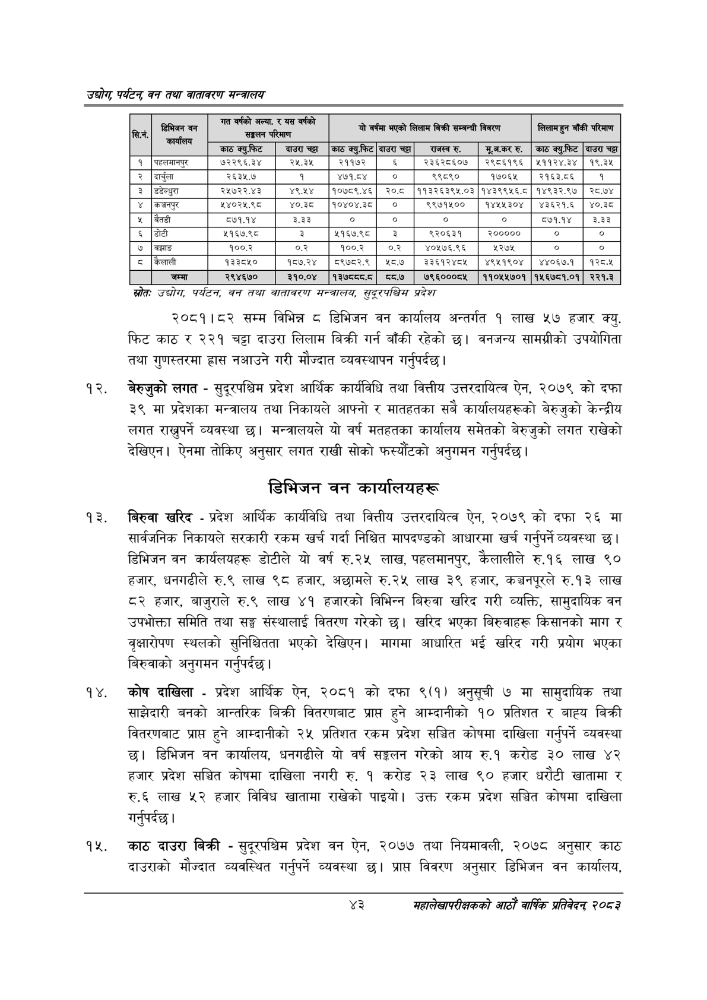

# Page 65 QA

## Rendered page


## Extracted text

```text
उद्योग पर्यटन्‌ वन तथा वातावरण सन्वालय
स्रोतः ज्योग; पर्यटन; वन तथा वातावरण सन्तवालय, खुद्रपश्चिस प्रदेश
२०८१।८२ सम्म विभिन्न ८ डिभिजन वन कार्यालय अन्तर्गत १ लाख ५७ हजार क्यु. फिट काठ र २२१ चट्टा दाउरा लिलाम बिक्री गर्न बाँकी रहेको छ। वनजन्य सामग्रीको उपयोगिता तथा गुणस्तरमा हास नआउने गरी मौज्दात व्यवस्थापन गर्नुपर्दछ |
बेरुजुको लगत -सुदूरपश्चिम प्रदेश आर्थिक कार्यविधि तथा वित्तीय उत्तरदायित्व ऐन, २०७९ को दफा ३९ मा प्रदेशका मन्त्रालय तथा निकायले आफ्नो र मातहतका सबै कार्यालयहरूको बेरुजुको केन्द्रीय लगत राख्नुपर्ने व्यवस्था | मन्त्रालयले यो वर्ष मतहतका कार्यालय समेतको बेरुजुको लगत राखेको देखिएन। ऐनमा तोकिए अनुसार लगत राखी सोको फस्यौटको अनुगमन गर्नुपर्दछ |
डिभिजन वन कार्यालयहरू
बिरुवा खरिद -प्रदेश आर्थिक कार्यविधि तथा वित्तीय उत्तरदायित्व ऐन, २०७९ को दफा २६ मा सार्वजनिक निकायले सरकारी रकम खर्च गर्दा निश्चित मापदण्डको आधारमा खर्च गर्नुपर्ने व्यवस्था छ। डिभिजन वन कार्यलयहरू डोटीले यो वर्ष रु.२५ लाख, पहलमानपुर, कैलालीले रु.१६ लाख ९० हजार, धनगढीले रु.९ लाख ९८ हजार, अछामले रु.२५ लाख ३९ हजार, कञ्चनपूरले रु.१३ लाख ८२ हजार, बाजुराले रु.९ लाख ४१ हजारको विभिन्न बिरुवा खरिद गरी व्यक्ति, सामुदायिक वन उपभोक्ता समिति तथा सङ्घ संस्थालाई वितरण गरेको छ। खरिद भएका बिरुवाहरू किसानको माग र वृक्षारोपण स्थलको सुनिश्चितता भएको देखिएन। मागमा आधारित भई खरिद गरी प्रयोग भएका बिरुवाको अनुगमन गर्नुपर्दछ |
कोष दाखिला -प्रदेश आर्थिक ऐन, २०८१ को दफा ९(१) अनुसूची ७ मा सामुदायिक तथा साझेदारी बनको आन्तरिक बिक्री वितरणबाट प्राप्त हुने आम्दानीको १० प्रतिशत र बाह्य बिक्री वितरणबाट प्राप्त हुने आम्दानीको २५ प्रतिशत रकम प्रदेश सञ्चित कोषमा दाखिला गर्नुपर्ने व्यवस्था छ। डिभिजन वन कार्यालय, धनगढीले यो वर्ष सङ्कलन गरेको आय रु.१ करोड ३० लाख ४२ हजार प्रदेश सञ्चित कोषमा दाखिला नगरी रु. १ करोड २३ लाख ९० हजार धरौटी खातामा र रु.६ लाख ५२ हजार विविध खातामा राखेको पाइयो। उक्त रकम प्रदेश सञ्चित कोषमा दाखिला गर्नुपर्दछ |
काठ दाउरा बिक्री -सुदूरपश्चिम प्रदेश वन ऐन, २०७७ तथा नियमावली, २०७८ अनुसार काठ दाउराको मौज्दात व्यवस्थित गर्नुपर्ने व्यवस्था प्राप्त विवरण अनुसार डिभिजन वन कार्यालय,
४३
महालेखापरीक्षकको आठाँ वाषिकि प्रतिवेदन्‌ २०८२

| सि.न, | \| कार्यालय | सद सङ्कलन | परिमाण | ो | वर्षमा भएको | लिलाम विक्री सम्वन्धी | विवरण | लिलान हुन बाँकी | परिमाण |
| --- | --- | --- | --- | --- | --- | --- | --- | --- | --- |
|  |  | 'काठ क्युफिट | दाउरा चट्टा | काठ क्युफिट | दाउरा चट्टा | राजस्व रु. | मूअ.कर रु. | काठमक्यु.फिट | दाउरा चट्टा |
| १ | पहलबानपुर | ७२२९६.३४ | २५.३५ | २११७२ |  | २३६२८६०७ | २९८६१९६ | ५११२४.३४ | १९.३५ |
| २ | दार्चुला | २६३५.७ | १ | ४७१.८४ | ० | ९९८९० | १७०६४५ | २१६३.८६ | १ |
| रे | डडेल्धुरा | २५७२२.४३ | ४९.५४ | १०७८९.४६ | २०.८ | ११३२६३९५.०३ | १४३९९५६.८ | १४९३२.९७ | २८.७४ |
| ४ | कञ्चनपुर | २४०२५.९८ | ०.३ | १०४०४.३८ |  | ९९७१५०० | १४४५५३०४ | ४३६२१.६ | ०.३ |
| ५ | बैतडी | ५७१.१४ | २३३ | ० | ० | ० | ० | ८७१.१४ | उइे.ईेई |
| ६ | डोटी | ५१६७.९८ | २ | ५१६७.९८ | ३ | ९२०६३१ | २००००० | ० | ० |
| ७ | बझाङ | १००.२ | ०.२ | १००.२ | ०.२ | ४०५७६.९६ | २२७५ | ० | ० |
| ८ | कैलाली | १३३८५० | १८७.२४ | ८९७८२.९ | ८.७ | ३३६१२४८५ | ४९५१९०४ | ४४०६७.१ | १२८४ |
|  | जम्मा | २९४६७० | ३१०.०४ | ९३६५५५५ | ५.७ | ७९६०००८५ | ११०५५७०१ | १५६७८१.०१ | २२१.३ |
```

## Flags
- table_page
- medium_quality_table
