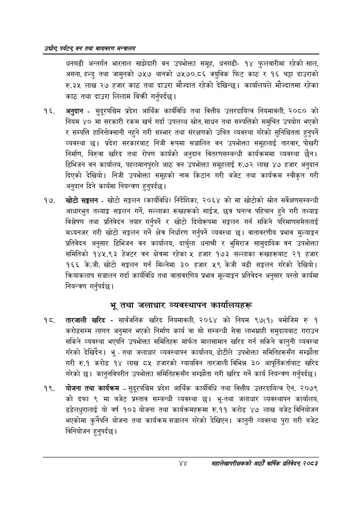

# Page 66 QA

## Rendered page


## Extracted text

```text
उद्योग पर्यटन्‌ वन तथा वातावरण सन्वालय
धनगढी अन्तर्गत भारताल साझेदारी वन उपभोक्ता समूह, धनगढी१४ फुलवारीमा रहेको साल, असना, हल्दु तथा जामुनको ७५७ थानको ७५७०.८६ क्युविक फिट काठ र १६ चट्टा दाउराको रु.३५ लाख २७ हजार काठ तथा दाउरा मौज्दात रहेको देखिन्छ। कार्यालयले मौज्दातमा रहेका काठ तथा दाउरा लिलाम बिक्री |
गर्नुपर्दछ
अनुदान -सुदूरपश्चिम प्रदेश आर्थिक कार्यविधि तथा वित्तीय उत्तरदायित्व नियमावली, २०८० को नियम ४० मा सरकारी रकम खर्च गर्दा उपलब्ध स्रोत, साधन तथा सम्पत्तिको समुचित उपयोग भएको र सम्पत्ति हानिनोक्सानी नहुने गरी सम्भार तथा संरक्षणको उचित व्यवस्था गरेको सुनिश्चितता हुनुपर्ने व्यवस्था छ। प्रदेश सरकारबाट निजी रूपमा सञ्चालित वन उपभोक्ता समूहलाई तारवार, पोखरी निर्माण, बिरुवा खरिद तथा रोपण कार्यको अनुदान वितरणसम्बन्धी कार्यक्रममा व्यवस्था छैन। डिभिजन वन कार्यालय, पहलमानपुरले आठ वन उपभोक्ता समूहलाई रु.७२ लाख ४७ हजार अनुदान दिएको देखियो। निजी उपभोक्ता समूहको नाम किटान गरी बजेट तथा कार्यक्रम स्वीकृत गरी अनुदान दिने कार्यमा नियन्त्रण हुनुपर्दछ |
खोटो सङ्कलन -खोटो सङ्लन (कार्यविधि) निर्देशिका, २०६४ को मा खोटोको स्रोत सर्वेक्षणसम्बन्धी आधारभुत तथ्याङ्क सङ्कलन गर्ने, सल्लाका रूखहरूको साईज, छत्र घनत्व पहिचान हुने गरी तथ्याङ्क विश्लेषण तथा प्रतिवेदन तयार गर्नुपर्ने र खोटो दिगोरूपमा सङ्कलन गर्न सकिने परिमाणसमेतलाई मध्यनजर गरी खोटो सङ्लन गर्ने क्षेत्र निर्धारण गर्नुपर्ने व्यवस्था छ। वातावरणीय प्रभाव मुल्याङ्कन प्रतिवेदन अनुसार डिभिजन वन कार्यालय, दार्चुला धनाश्री र भुमिराज सामुदायिक वन उपभोक्ता समितिको १४५.९३ हेक्टर वन क्षेत्रमा रहेका ५ हजार १७३ सल्लाका रूखहरूबाट २१ हजार १६६ के.जी. खोटो सङ्कलन गर्न मिल्नेमा ३० हजार ५९ केजी बढी सङ्गलन गरेको देखियो। क्रियाकलाप सञ्चालन गर्दा कार्यविधि तथा वातावरणिय प्रभाव मूल्याङ्कन प्रतिवेदन अनुसार यस्तो कार्यमा नियन्त्रण गर्नुपर्दछ।
भू तथा जलाधार व्यवस्थापन
कार्यालयहरू
तारजाली खरिद -सार्वजनिक खरिद नियमावली, २०६४ को नियम ९७(१) बमोजिम रु १ करोडसम्म लागत अनुमान भएको निर्माण कार्य वा सो सम्बन्धी सेवा लाभग्राही समुदायबाट गराउन सकिने व्यवस्था भएपनि उपभोक्ता समितिहरू मार्फत मालसामान खरिद गर्न सकिने कानुनी व्यवस्था गरेको देखिदैन। भू -तथा जलाधार व्यवस्थापन कार्यालय, डोटीले उपभोक्ता समितिहरूसँग सम्झौता गरी रु.१ करोड १४ लाख ८५ हजारको ग्यायविन तारजाली विभिन्न ३० आपूर्तिकर्ताबाट खरिद गरेको छ। कानुनविपरीत उपभोक्ता समितिहरूसँग सम्झौता गरी खरिद गर्ने कार्य नियन्त्रण गर्नुपर्दछ |
योजना तथा कार्यक्रम -सुदूरपश्चिम प्रदेश आर्थिक कार्यविधि तथा वित्तीय उत्तरदायित्व ऐन, २०७९ दफा ९ मा बजेट प्रस्ताव सम्बन्धी व्यवस्था छ। भू-तथा जलाधार व्यवस्थापन कार्यालय, डडेलधुरालाई यो वर्ष १०३ योजना तथा कार्यक्रमहरूमा रु.११ करोड ४७ लाख बजेट विनियोजन भएकोमा कुनैपनि योजना तथा कार्यक्रम सञ्चालन गरेको देखिएन। कानुनी व्यवस्था पुरा गरी बजेट विनियोजन हुनुपर्दछ |
४४
महालेखापरीक्षकको आठाँ वाषिकि प्रतिवेदन्‌ २०८२
```

## Flags
- None
