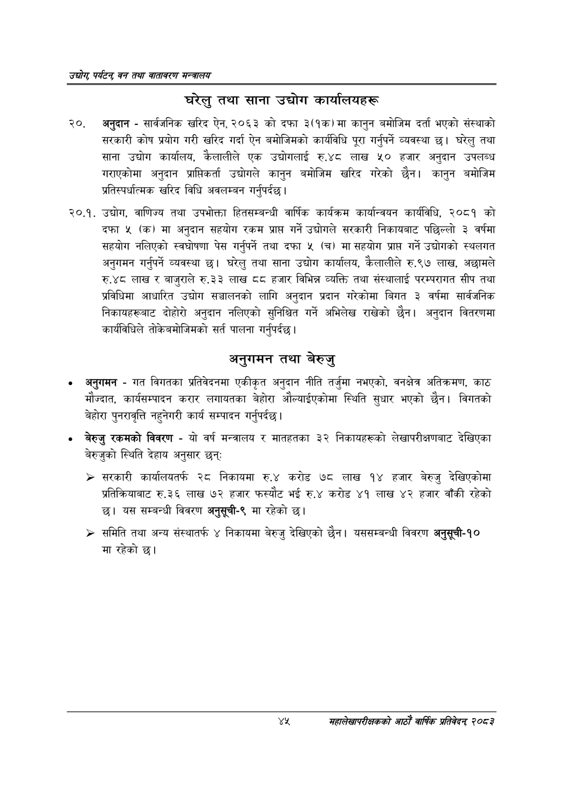

# Page 67 QA

## Rendered page


## Extracted text

```text
उद्योग पर्यटन्‌ वन तथा वातावरण सन्वालय
घरेलु तथा साना उद्योग कार्यालयहरू
२०, अनुदान -सार्वजनिक खरिद ऐन, २०६३ को दफा ३(१क) मा कानुन बमोजिम दर्ता भएको संस्थाको सरकारी कोष प्रयोग गरी खरिद गर्दा ऐन बमोजिमको कार्यविधि पूरा गर्नुपर्ने व्यवस्था छ। घरेलु तथा साना उद्योग कार्यालय, कैलालीले एक उद्योगलाई रु.४८ लाख ५० हजार अनुदान उपलब्ध गराएकोमा अनुदान प्राप्तिकर्ता उद्योगले कानुन बमोजिम खरिद गरेको छैन। कानुन बमोजिम प्रतिस्पर्धात्मक खरिद विधि अवलम्बन गर्नुपर्दछ |
२०.१. उद्योग, वाणिज्य तथा उपभोक्ता हितसम्बन्धी वार्षिक कार्यक्रम कार्यान्वयन कार्यविधि, २०८१ को दफा ५ (क) मा अनुदान सहयोग रकम प्राप्त गर्ने उद्योगले सरकारी निकायबाट पछिल्लो ३ वर्षमा सहयोग नलिएको स्वघोषणा पेस गर्नुपर्ने तथा दफा ५ (च) मा सहयोग प्राप्त गर्ने उद्योगको स्थलगत अनुगमन गर्नुपर्ने व्यवस्था | घरेलु तथा साना उद्योग कार्यालय, कैलालीले रु.९७ लाख, अछामले रु.४८ लाख र बाजुराले ©.३३ लाख ८८ हजार विभिन्न व्यक्ति तथा संस्थालाई परम्परागत सीप तथा प्रविधिमा आधारित उद्योग सञ्चालनको लागि अनुदान प्रदान गरेकोमा बिगत ३ वर्षमा सार्वजनिक निकायहरूबाट दोहोरो अनुदान नलिएको सुनिश्चित गर्ने अभिलेख राखेको छैन। अनुदान वितरणमा कार्यविधिले तोकेबमोजिमको सर्त पालना गर्नुपर्दछ |
अनुगमन तथा बेरुजु
अनुगमन -गत विगतका प्रतिवेदनमा एकीकृत अनुदान नीति तर्जुमा नभएको, वनक्षेत्र अतिक्रमण, काठ मौज्दात, कार्यसम्पादन करार लगायतका बेहोरा औल्याईएकोमा स्थिति सुधार भएको छैन। विगतको बेहोरा पुनरावृत्ति नहुनेगरी कार्य सम्पादन गर्नुपर्दछ |
बेरुजु रकमको विवरण -यो वर्ष मन्त्रालय र मातहतका ३२ निकायहरूको लेखापरीक्षणबाट देखिएका बेरुजुको स्थिति देहाय अनुसार छन्‌ः
» सरकारी कार्यालयतर्फ २८ निकायमा रु.४ करोड ७८ लाख १४ हजार बेरुजु देखिएकोमा प्रतिक्रियाबाट रु.३६ लाख ७२ हजार फस्यौट भई रु.४ करोड ४१ लाख ४२ हजार वाँकी रहेको छ। यस सम्बन्धी विवरण अनुसूची-९ मा रहेको छ।
> समिति तथा अन्य संस्थातर्फ ४ निकायमा बेरुजु देखिएको छैन। यससम्बन्धी विवरण अनुसूची-१० मा रहेको छ।
महालेखापरीक्षकको आठाँ वाषिकि प्रतिवेदन्‌ २०८२
```

## Flags
- None
