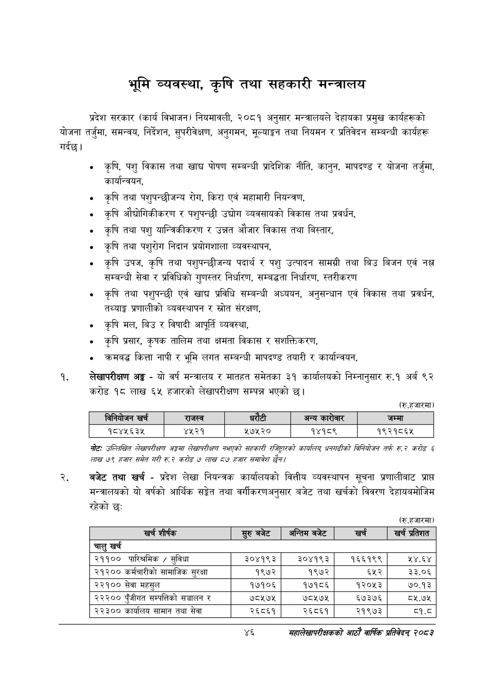

# Page 68 QA

## Rendered page


## Extracted text

```text
भूमि व्यवस्था, कृषि तथा सहकारी मन्त्रालय
गर्दछु। प्रदेश सरकार (कार्य विभाजन) नियमावली, २०८१ अनुसार मन्त्रालयले देहायका प्रमुख कार्यहरूको योजना तर्जुमा, समन्वय, निर्देशन, सुपरीवेक्षण, अनुगमन, मूल्याङ्गन तथा नियमन र प्रतिवेदन सम्बन्धी कार्यहरू
० कृषि, पशु विकास तथा खाद्य पोषण सम्बन्धी प्रादेशिक नीति, कानुन, मापदण्ड र योजना तर्जुमा, कार्यान्वयन,
«० कृषि तथा पशुपन्छीजन्य रोग, किरा एवं महामारी नियन्त्रण,
० कृषि औद्योगिकीकरण र पशुपन्छी उद्योग व्यवसायको विकास तथा प्रवर्धन,
० कृषि तथा पशु यान्त्रिकीकरण र उन्नत औजार विकास तथा बिस्तार,
कृषि तथा पशुरोग निदान प्रयोगशाला व्यवस्थापन,
कृषि उपज, कृषि तथा पशुपन्छीजन्य पदार्थ र पशु उत्पादन सामग्री तथा बिउ बिजन एवं | सम्बन्धी सेवा र प्रविधिको गुणस्तर निर्धारण, सम्बद्धता निर्धारण, स्तरीकरण
कृषि तथा पशुपन्छी एवं खाद्य प्रविधि सम्बन्धी अध्ययन, अनुसन्धान एवं विकास तथा प्रवर्धन, तथ्याङ्क प्रणालीको व्यवस्थापन र स्रोत संरक्षण,
कृषि मल, बिउ र विषादी आपूर्ति व्यवस्था,
० कृषि प्रसार, कृषक तालिम तथा क्षमता विकास र सशक्तिकरण,
क्रमबद्ध कित्ता नापी र भूमि लगत सम्बन्धी मापदण्ड तयारी र कार्यान्वयन,
लेखापरीक्षण अङ्ग -यो वर्ष मन्त्रालय र मातहत समेतका ३१ कार्यालयको निम्नानुसार रु.१ अर्ब ९२ करोड १८ लाख ६५ हजारको लेखापरीक्षण सम्पन्न भएको छ।
(रु.हजारमा)
नोटः उल्लिखित लेखापरीक्षण अङ्गमा लेखापरीक्षण नभएको सहकारी रजिट्राको कायलियु धनगढीको बिनियोजन तर्फ €७ करोड § लाख ७९१ हजार समेत गरी रु २ करोङ ७ लाख ८७ हजार समावेश /
बजेट तथा खर्च -प्रदेश लेखा नियन्त्रक कार्यालयको वित्तीय व्यवस्थापन सूचना प्रणालीबाट प्राप्त मन्त्रालयको यो वर्षको आर्थिक सङ्गेत तथा वर्गीकरणअनुसार बजेट तथा खर्चको विवरण देहायबमोजिम रहेको छ:
(रु.हजारमा)
४६
महालेखापरीक्षकको वार्षिक प्रतिवेदन २०५३

|  |  | 'ननेकोजन खरी |  | राजस्व |  | धरटी | अन्य कारोबार | जम्मा |
| --- | --- | --- | --- | --- | --- | --- | --- | --- |
|  |  | १८४५६३५ |  | ४५२१ | ५७५२० |  | १४१८९ | १९२१८६४५ |

| शीष्क | सुरुबबेट | अन्तिम बजेट | खर्च | खच प्रतिशत |
| --- | --- | --- | --- | --- |
| चालु खर्च |  |  |  |  |
| २११०० पारिश्रमिक / सुविधा | ३०४१९३ | ३०४१९३ | १६६१९९ | ५४.६४ |
| २१२०० कर्मचारीको लामाजिक सुरक्षा | १९७२ | १९७२ | ६५२ | ३३.०६ |
| २२१०० सेवा महसुल | १७१०६ | १७१८६ | १२०५३ | ७०.१३ |
| २२२०० पुँजीगत खम्पत्तिको सञ्चालन | ७८५७४५ | ७८५७४५ | ६७३७६ | ८१२.७५ |
| २२३०० कार्यालय सामान तथा सेवा | २६८६१ | २६८६१ | २१९७३ | ८१.८ |
```

## Flags
- table_page
- medium_quality_table
