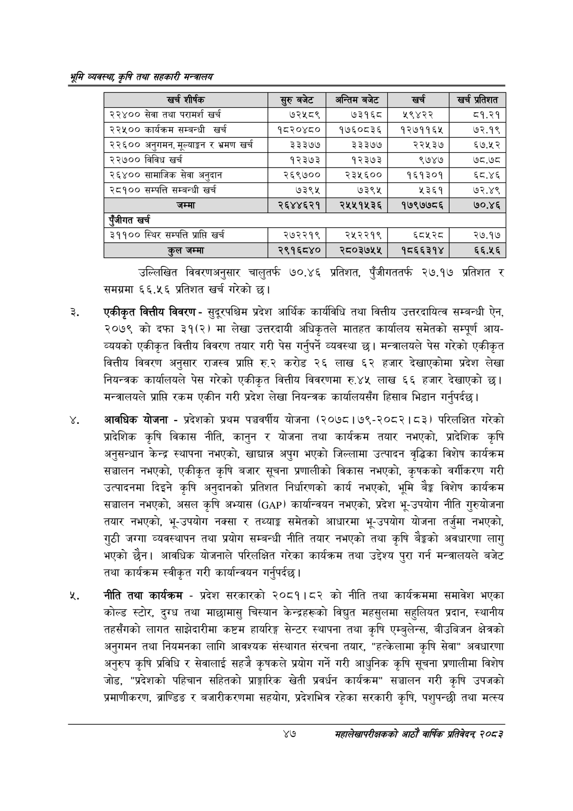

# Page 69 QA

## Rendered page


## Extracted text

```text
भूमि व्यवस्थ; कृषि तथा सहकारी मन्त्रालय
उल्लिखित विवरणअनुसार चालुतर्फ ७७०.४६ प्रतिशत, पुँजीगततर्फ २७.१७ प्रतिशत र समग्रमा ६६.५६ प्रतिशत खर्च गरेको छ।
एकीकृत वित्तीय विवरण -सुदूरपश्चिम प्रदेश आर्थिक कार्यविधि तथा वित्तीय उत्तरदायित्व सम्बन्धी ऐन, २०७९ को दफा ३१(२) मा लेखा उत्तरदायी अधिकृतले मातहत कार्यालय समेतको सम्पूर्ण आयव्ययको एकीकृत वित्तीय विवरण तयार गरी पेस गर्नुपर्ने व्यवस्था | मन्त्रालयले पेस गरेको एकीकृत वित्तीय विवरण अनुसार राजस्व प्राप्ति करोड २६ लाख ६२ हजार देखाएकोमा प्रदेश लेखा नियन्त्रक कार्यालयले पेस गरेको एकीकृत वित्तीय विवरणमा रु.४५ लाख ६६ हजार देखाएको छ। मन्त्रालयले प्राप्ति रकम एकीन गरी प्रदेश लेखा नियन्त्रक कार्यालयसँग हिसाब भिडान गर्नुपर्दछ |
आवधिक योजना -प्रदेशको प्रथम पञ्चवर्षीय योजना (२०७८।७९-२०८२। ८३) परिलक्षित गरेको प्रादेशिक कृषि विकास नीति, कानुन र योजना तथा कार्यक्रम तयार नभएको, प्रादेशिक कृषि अनुसन्धान केन्द्र स्थापना नभएको, खाद्यान्न अपुग भएको जिल्लामा उत्पादन वृद्धिका विशेष कार्यक्रम सञ्चालन नभएको, एकीकृत कृषि बजार सूचना प्रणालीको विकास नभएको, कृषकको वर्गीकरण गरी उत्पादनमा दिइने कृषि अनुदानको प्रतिशत निर्धारणको कार्य नभएको, भूमि बेङ्ग विशेष कार्यक्रम सञ्चालन नभएको, असल कृषि अभ्यास () कार्यान्वयन नभएको, प्रदेश भू-उपयोग नीति गुरुयोजना तयार नभएको, भू-उपयोग नक्सा र तथ्याङ्क समेतको आधारमा भू-उपयोग योजना तर्जुमा नभएको, गुठी जग्गा व्यवस्थापन तथा प्रयोग सम्बन्धी नीति तयार नभएको तथा कृषि बैङ्कको अवधारणा लागु भएको छैन। आवधिक योजनाले परिलक्षित गरेका कार्यक्रम तथा उद्देश्य पुरा गर्न मन्त्रालयले बजेट तथा कार्यक्रम स्वीकृत गरी कार्यान्वयन गर्नुपर्दछ |
नीति तथा कार्यक्रम -प्रदेश सरकारको २०८१।८२ को नीति तथा कार्यक्रममा समावेश भएका कोल्ड स्टोर, दुग्ध तथा माछामासु चिस्यान केन्द्रहरूको विद्युत महसुलमा सहुलियत प्रदान, स्थानीय तहसँगको लागत साझेदारीमा कष्टम हायरिङ्ग सेन्टर स्थापना तथा कृषि एम्बुलेन्स, बीउबिजन क्षेत्रको अनुगमन तथा नियमनका लागि आवश्यक संस्थागत संरचना तयार, "हत्केलामा कृषि सेवा" अवधारणा अनुरुप कृषि प्रविधि र सेवालाई सहजै कृषकले प्रयोग गर्ने गरी आधुनिक कृषि सूचना प्रणालीमा विशेष जोड, "प्रदेशको पहिचान सहितको प्राङ्गारिक खेती प्रवर्धन कार्यक्रम" सञ्चालन गरी कृषि उपजको प्रमाणीकरण, ब्राण्डिङ र बजारीकरणमा सहयोग, प्रदेशभित्र रहेका सरकारी कृषि, पशुपन्छी तथा मत्स्य
४७
महालेखापरीक्षकको आठाँ वाषिकि प्रतिवेदन्‌ २०८२

| खच शीर्षक | सुरु बबेट | अन्तिम बजेट |  | खच प्रतेशत |
| --- | --- | --- | --- | --- |
| २२४०० सेवा तथा परामर्श खर्च | ७२५८९ | ७३१६८ | १९४२२ | ८१.२१ |
| २२५०० कार्यक्रम सम्बन्धी खर्च | १८२०४८० | १७६०८३६ | १२७११६४ | ७२.१९ |
| २२६०० अनुगमन, भूलयाङ्का र भ्रमण खर्च | ३३३७७ | ३३३७७ | २२५३७ | ६७.५२ |
| २२७०० विविध खर्च | १२३७३ | १२३७३ | ९७४७ | ७८.७८ |
| २६४०० चामाजिक सेवा अनुदान | २६९७०० | २३५६०० | १६१३०१ | ६८.४६ |
| २८१०० सम्पत्ति सम्बन्धी खर्च | ७३९५ | ७३९५ | ५३६१ | ७२.४९ |
| जम्मा | २६४४६२१ | २५५१५३६ | १७९७७८६ | ७०.४६ |
| पूँजीगत खर्च |  |  |  |  |
| ३११०० स्थिर सम्पत्ति प्राप्ति खर्च | २७२२१९ | २५२२१९ | ६८४५२८ | २७.१७ |
| जम्मा | २९१६८४० | २८०३७५५ | १८६६३१४ | ६६.५६ |
```

## Flags
- table_page
- medium_quality_table
