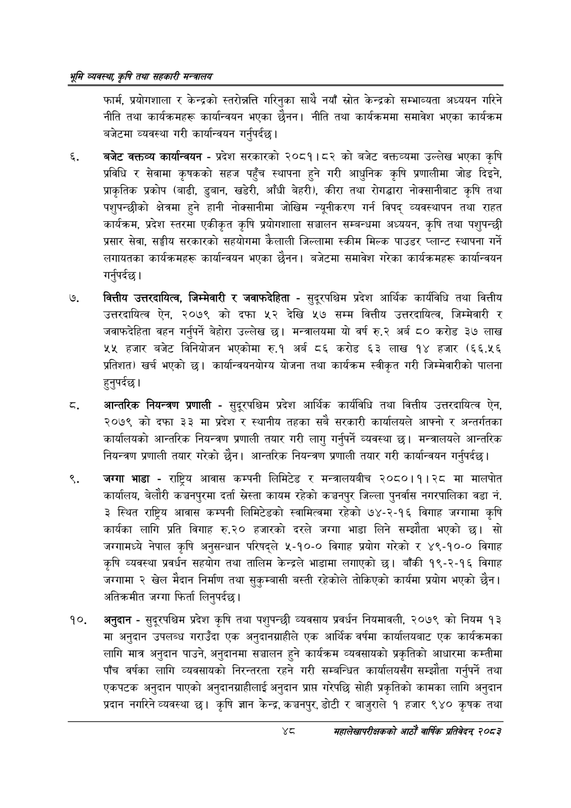

# Page 70 QA

## Rendered page


## Extracted text

```text
भूमि व्यवस्थ; कृषि तथा सहकारी मन्त्रालय
फार्म, प्रयोगशाला र केन्द्रको स्तरोक्नत्ति गरिनुका साथै नयाँ स्रोत केन्द्रको सम्भाव्यता अध्ययन गरिने नीति तथा कार्यक्रमहरू कार्यान्वयन भएका छैनन। नीति तथा कार्यक्रममा समावेश भएका कार्यक्रम बजेटमा व्यवस्था गरी कार्यान्वयन गर्नुपर्दछ।
बजेट वक्तव्य कार्यान्वयन -प्रदेश सरकारको २०८१।८२ को बजेट वक्तव्यमा उल्लेख भएका कृषि प्रविधि र सेवामा कृषकको सहज पहुँच स्थापना हुने गरी आधुनिक कृषि प्रणालीमा जोड दिइने, प्राकृतिक प्रकोप (बाढी, डुबान, खडेरी, आँधी बेहरी), कीरा तथा रोगद्धारा नोक्सानीबाट कृषि तथा पशुपन्छीको क्षेत्रमा हुने हानी नोक्सानीमा जोखिम न्यूनीकरण गर्न विपद्‌ व्यवस्थापन तथा राहत कार्यक्रम, प्रदेश स्तरमा एकीकृत कृषि प्रयोगशाला सञ्चालन सम्बन्धमा अध्ययन, कृषि तथा पशुपन्छी प्रसार सेवा, सङ्घीय सरकारको सहयोगमा कैलाली जिल्लामा स्कीम मिल्क पाउडर प्लान्ट स्थापना गर्ने लगायतका कार्यक्रमहरू कार्यान्वयन भएका छैनन। बजेटमा समावेश गरेका कार्यक्रमहरू कार्यान्वयन गर्नुपर्दछ |
वित्तीय उत्तरदायित्व, जिम्मेवारी र जवाफदेहिता -सुदूरपश्चिम प्रदेश आर्थिक कार्यविधि तथा वित्तीय उत्तरदायित्व ऐन, २०७९ को दफा ५२ देखि ५७ सम्म वित्तीय उत्तरदायित्व, जिम्मेवारी र जवाफदेहिता वहन गर्नुपर्ने बेहोरा उल्लेख छ। मन्त्रालयमा यो वर्ष रु.२ अर्ब ८० करोड ३७ लाख ४५५ हजार बजेट विनियोजन भएकोमा रु.१ अर्ब ८६ करोड ३ लाख १४ हजार (६६.५६ प्रतिशत) खर्च भएको छ। कार्यान्वयनयोग्य योजना तथा कार्यक्रम स्वीकृत गरी जिम्मेवारीको पालना हुनुपर्दछ।
आन्तरिक नियन्त्रण प्रणाली -सुदूरपश्चिम प्रदेश आर्थिक कार्यविधि तथा वित्तीय उत्तरदायित्व ऐन, २०७९ को दफा ३३ मा प्रदेश र स्थानीय तहका सबै सरकारी कार्यालयले आफ्नो र अन्तर्गतका कार्यालयको आन्तरिक नियन्त्रण प्रणाली तयार गरी लागु गर्नुपर्ने व्यवस्था छ। मन्त्रालयले आन्तरिक नियन्त्रण प्रणाली तयार गरेको छैन। आन्तरिक नियन्त्रण प्रणाली तयार गरी कार्यान्वयन गर्नुपर्दछ |
जग्गा भाडा -राष्ट्रिय आवास कम्पनी लिमिटेड र मन्त्रालयबीच २०८०।१।२८ मा मालपोत कार्यालय, बेलौरी कञ्चनपुरमा दर्ता ख्रेस्ता कायम रहेको कञ्चनपुर जिल्ला पुनर्वास नगरपालिका वडा नं. ३ स्थित राष्ट्रिय आवास कम्पनी लिमिटेडको स्वामित्वमा रहेको ७४-२-१६ विगाह जग्गामा कृषि कार्यका लागि प्रति विगाह रु.२० हजारको दरले जग्गा भाडा लिने सम्झौता भएको छ। सो जग्गामध्ये नेपाल कृषि अनुसन्धान परिषद्ले ५-१०-० विगाह प्रयोग गरेको र ४९-१०-० विगाह कृषि व्यवस्था प्रवर्धन सहयोग तथा तालिम केन्द्रले भाडामा लगाएको छ। बाँकी १९-२-१६ विगाह जग्गामा २ खेल मैदान निर्माण तथा सुकुम्बासी बस्ती रहेकोले तोकिएको कार्यमा प्रयोग भएको छैन। अतिक्रमीत जग्गा फिर्ता लिनुपर्दछ।
अनुदान -सुदूरपश्चिम प्रदेश कृषि तथा पशुपन्छी व्यवसाय प्रवर्धन नियमावली, २०७९ को नियम १३ मा अनुदान उपलब्ध गराउँदा एक अनुदानग्राहीले एक आर्थिक वर्षमा कार्यालयबाट एक कार्यक्रमका लागि मात्र अनुदान पाउने, अनुदानमा सञ्चालन हुने कार्यक्रम व्यवसायको प्रकृतिको आधारमा कम्तीमा पाँच वर्षका लागि व्यवसायको निरन्तरता रहने गरी सम्बन्धित कार्यालयसँग सम्झौता गर्नुपर्ने तथा एकपटक अनुदान पाएको अनुदानग्राहीलाई अनुदान प्राप्त गरेपछि सोही प्रकृतिको कामका लागि अनुदान प्रदान नगरिने व्यवस्था छ। कृषि ज्ञान केन्द्र, कञ्चनपुर, डोटी र बाजुराले १ हजार ९४० कृषक तथा
शव
महालेखापरीक्षकको आठाँ वाषिकि प्रतिवेदन्‌ २०८२
```

## Flags
- None
