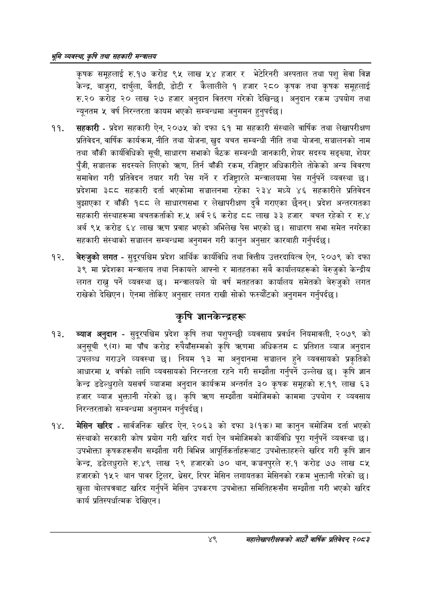

# Page 71 QA

## Rendered page


## Extracted text

```text
भूमि व्यवस्थ; कृषि तथा सहकारी मन्त्रालय
कृषक समूहलाई रु.१७ करोड ९५ लाख ५४ हजार र भेटेरिनरी अस्पताल तथा पशु सेवा विज्ञ केन्द्र, बाजुरा, दार्चुला, बैतडी, डोटी र कैलालीले १ हजार २८० कृषक तथा कृषक समूहलाई रु.२० करोड २० लाख २७ हजार अनुदान वितरण गरेको देखिन्छ। अनुदान रकम उपयोग तथा न्यूनतम ५ वर्ष निरन्तरता कायम भएको सम्बन्धमा अनुगमन हुनुपर्दछ |
सहकारी -प्रदेश सहकारी ऐन, २०७५ को दफा ६१ मा सहकारी संस्थाले वार्षिक तथा लेखापरीक्षण प्रतिवेदन, वार्षिक कार्यक्रम, नीति तथा योजना, खुद बचत सम्बन्धी नीति तथा योजना, सञ्चालनको नाम तथा बाँकी कार्यविधिको सूची, साधारण सभाको बैठक सम्बन्धी जानकारी, शेयर सदस्य सङ्ख्या, शेयर पुँजी, सञ्चालक सदस्यले लिएको त्र्रण, तिर्न बाँकी रकम, रजिष्ट्रार अधिकारीले तोकेको अन्य विवरण समावेश गरी प्रतिवेदन तयार गरी पेस गर्ने र रजिष्ट्रारले मन्त्रालयमा पेस गर्नुपर्ने व्यवस्था | प्रदेशमा ३८८ सहकारी दर्ता भएकोमा सञ्चालनमा रहेका २३४ मध्ये ४६ सहकारीले प्रतिवेदन बुझाएका र बाँकी १८८ ले साधारणसभा र लेखापरीक्षण दुवै गराएका छैनन्‌। प्रदेश अन्तरगतका सहकारी संस्थाहरूमा बचतकर्ताको रु.५ अर्व २६ करोड दद लाख ३३ हजार बचत रहेको र रु.४ अर्ब ९५ करोड ६४ लाख प्रवाह भएको अभिलेख पेस भएको छ। साधारण सभा समेत नगरेका सहकारी संस्थाको सञ्चालन सम्बन्धमा अनुगमन गरी कानुन अनुसार कारबाही गर्नुपर्दछ |
बेरुजुको लगत -सुदूरपश्चिम प्रदेश आर्थिक कार्यविधि तथा वित्तीय उत्तरदायित्व ऐन, २०७९ को दफा ३९ मा प्रदेशका मन्त्रालय तथा निकायले आफ्नो र मातहतका सबै कार्यालयहरूको बेरुजुको केन्द्रीय लगत राख्नु पर्ने व्यवस्था छ। मन्त्रालयले यो वर्ष मतहतका कार्यालय समेतको बेरुजुको लगत राखेको देखिएन। ऐनमा तोकिए अनुसार लगत राखी सोको फस्यौंटको अनुगमन गर्नुपर्दछ |
कृषि ज्ञानकेन्द्रहरू
ब्याज अनुदान -सुदूरपश्चिम प्रदेश कृषि तथा पशुपन्छी व्यवसाय प्रवर्धन नियमावली, २०७९ को अनुसूची ९(ग) मा पाँच करोड रुपैयाँसम्मको कृषि त्रणमा अधिकतम ८ प्रतिशत व्याज अनुदान उपलब्ध गराउने व्यवस्था छ। नियम १३ मा अनुदानमा सञ्चालन हुने व्यवसायको प्रकृतिको आधारमा ५ वर्षको लागि व्यवसायको निरन्तरता रहने गरी सम्झौता गर्नुपर्ने उल्लेख | कृषि ज्ञान केन्द्र डडेल्धुराले यसवर्ष ब्याजमा अनुदान कार्यक्रम अन्तर्गत ३० कृषक समूहको रु.१९ लाख ६३ हजार ब्याज भुक्तानी गरेको छ। कृषि सम्झौता बमोजिमको काममा उपयोग र व्यवसाय निरन्तरताको सम्बन्धमा अनुगमन गर्नुपर्दछ।
मेसिन खरिद -सार्वजनिक खरिद ऐन, २०६३ को दफा ३(१क) मा कानुन बमोजिम दर्ता भएको संस्थाको सरकारी कोष प्रयोग गरी खरिद गर्दा ऐन बमोजिमको कार्यविधि पूरा गर्नुपर्ने व्यवस्था छ। उपभोक्ता कृषकहरूसँग सम्झौता गरी विभिन्न आपूर्तिकर्ताहरूबाट उपभोक्ताहरुले खरिद गरी कृषि ज्ञान केन्द्र, डडेलधुराले रु.४९ लाख २९ हजारको ७० थान, कञ्चनपुरले रु.१ करोड ७७ लाख ८५ हजारको १५२ थान पावर ट्रिलर, भ्रेसर, रिपर मेसिन लगायतका मेसिनको रकम भुक्तानी गरेको छ। खुला बोलपत्रबाट खरिद गर्नुपर्ने मेसिन उपकरण उपभोक्ता समितिहरूसँग सम्झौता गरी भएको खरिद कार्य प्रतिस्पर्धात्मक देखिएन |
४९
महालेखापरीक्षकको आठाँ वाषिकि प्रतिवेदन्‌ २०८२
```

## Flags
- None
