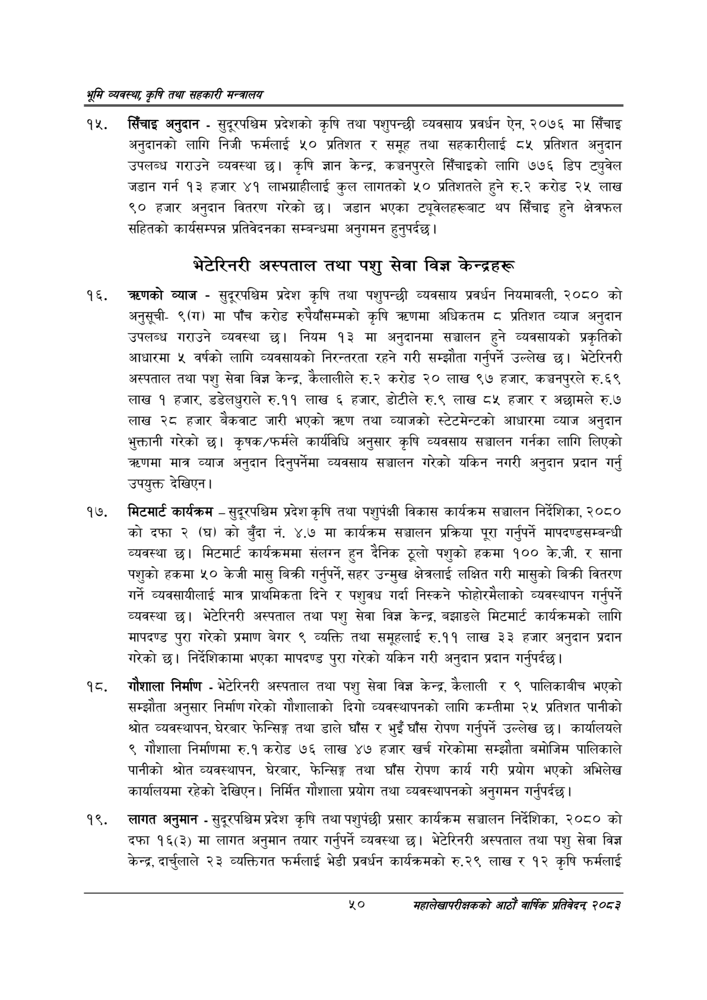

# Page 72 QA

## Rendered page


## Extracted text

```text
भूमि व्यवस्थ; कृषि तथा सहकारी मन्त्रालय
सिँचाइ अनुदान -सुदूरपश्चिम प्रदेशको कृषि तथा पशुपन्छी व्यवसाय प्रवर्धन ऐन, २०७६ मा सिँचाइ अनुदानको लागि निजी फर्मलाई ५० प्रतिशत र समूह तथा सहकारीलाई ८५ प्रतिशत अनुदान उपलब्ध गराउने व्यवस्था छ। कृषि ज्ञान केन्द्र, कञ्चनपुरले सिँचाइको लागि ७७६ डिप ट्युवेल जडान गर्न १३ हजार ४१ लाभग्राहीलाई कुल लागतको ५० प्रतिशतले हुने रु.२ करोड २५ लाख ० हजार अनुदान वितरण गरेको छ। जडान भएका ट्यूवेलहरूबाट थप सिँचाइ हुने क्षेत्रफल सहितको कार्यसम्पन्न प्रतिवेदनका सम्बन्धमा अनुगमन हुनुपर्दछ |
भेटेरिनरी अस्पताल तथा पशु सेवा विज्ञ केन्द्रहरू
व्याज -सुदूरपश्चिम प्रदेश कृषि तथा पशुपन्छी व्यवसाय प्रवर्धन नियमावली, २०८० को अनुसूची९(ग) मा पाँच करोड रुपैयाँसम्मको कृषि त्रहणमा अधिकतम ८ प्रतिशत व्याज अनुदान उपलब्ध गराउने व्यवस्था छ। नियम १३ मा अनुदानमा सञ्चालन हुने व्यवसायको प्रकृतिको आधारमा ५ वर्षको लागि व्यवसायको निरन्तरता रहने गरी सम्झौता गर्नुपर्ने उल्लेख छ। भेटेरिनरी अस्पताल तथा पशु सेवा विज्ञ केन्द्र, कैलालीले रु.२ करोड २० लाख ९७ हजार, कञ्चनपुरले रु.६९ लाख १ हजार, डडेलधुराले रु.११ लाख ६ हजार, डोटीले रु.९ लाख ८५ हजार र अछामले रु.७ लाख २८ हजार बैकवाट जारी भएको त्रृण तथा व्याजको स्टेटमेन्टको आधारमा व्याज अनुदान भुक्तानी गरेको | कृषक/फर्मले कार्यविधि अनुसार कृषि व्यवसाय सञ्चालन गर्नका लागि लिएको च्रणमा मात्र व्याज अनुदान दिनुपर्नेमा व्यवसाय सञ्चालन गरेको यकिन नगरी अनुदान प्रदान गर्नु उपयुक्त देखिएन |
मिटमार्ट कार्यक्रम -सुदूरपश्चिम प्रदेश कृषि तथा पशुपंक्षी विकास कार्यक्रम सञ्चालन निर्देशिका, २०८० कोदफा २ (घ)को बुँदा नं. ४.७ मा कार्यक्रम सञ्चालन प्रक्रिया पूरा गर्नुपर्ने मापदण्डसम्बन्धी व्यवस्था छु। मिटमार्ट कार्यक्रममा संलग्न हुन दैनिक ठूलो पशुको हकमा १०० के.जी. र साना पशुको हकमा ५० केजी मासु बिक्री गर्नुपर्ने, सहर उन्मुख क्षेत्रलाई लक्षित गरी मासुको बिक्री वितरण गर्ने व्यवसायीलाई मात्र प्राथमिकता दिने र पशुवध गर्दा निस्कने फोहोरमैलाको व्यवस्थापन गर्नुपर्ने व्यवस्था छ। भेटेरिनरी अस्पताल तथा पशु सेवा विज्ञ केन्द्र, बझाङले मिटमार्ट कार्यक्रमको लागि मापदण्ड पुरा गरेको प्रमाण बेगर ९ व्यक्ति तथा समूहलाई रु.११ लाख ३३ हजार अनुदान प्रदान गरेको छ। निर्देशिकामा भएका मापदण्ड पुरा गरेको यकिन गरी अनुदान प्रदान गर्नुपर्दछ |
गौशाला निर्माण -भेटेरिनरी अस्पताल तथा पशु सेवा विज्ञ केन्द्र, कैलाली र ९ पालिकाबीच भएको सम्झौता अनुसार निर्माण गरेको गौशालाको दिगो व्यवस्थापनको लागि कम्तीमा २५ प्रतिशत पानीको श्रोत व्यवस्थापन, घेरबार फेन्सिङ्ग तथा डाले घाँस र भुइँ घाँस रोपण गर्नुपर्ने उल्लेख छ। कार्यालयले ९ गौशाला निर्माणमा रु.१ करोड ७६ लाख ४७ हजार खर्च गरेकोमा सम्झौता बमोजिम पालिकाले पानीको श्रोत व्यवस्थापन, घेरबार, फेन्सिङ्ग तथा घाँस रोपण कार्य गरी प्रयोग भएको अभिलेख कार्यालयमा रहेको देखिएन। निर्मित गौशाला प्रयोग तथा व्यवस्थापनको अनुगमन गर्नुपर्दछ |
१९, लागत अनुमान -सुदूरपश्चिम प्रदेश कृषि तथा पशुपंछी प्रसार कार्यक्रम सञ्चालन निर्देशिका, २०८० को दफा १६(३) मा लागत अनुमान तयार गर्नुपर्ने व्यवस्था | भेटेरिनरी अस्पताल तथा पशु सेवा विज्ञ केन्द्र, दार्चुलाले २३ व्यक्तिगत फर्मलाई भेडी प्रवर्धन कार्यक्रमको रु.२९ लाख र १२ कृषि फर्मलाई
५०
महालेखापरीक्षकको आठाँ वाषिकि प्रतिवेदन्‌ २०८२
```

## Flags
- None
