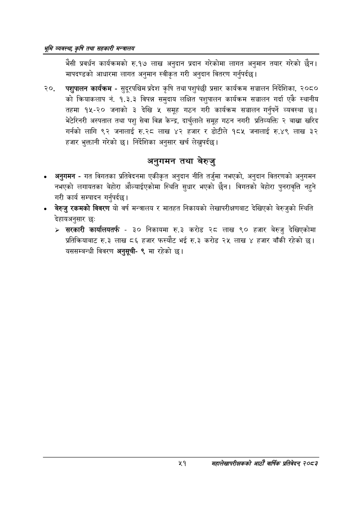

# Page 73 QA

## Rendered page


## Extracted text

```text
भूमि व्यवस्थ; कृषि तथा सहकारी मन्त्रालय
भैसी प्रवर्धन कार्यक्रमको रु.१७ लाख अनुदान प्रदान गरेकोमा लागत अनुमान तयार गरेको छैन। मापदण्डको आधारमा लागत अनुमान स्वीकृत गरी अनुदान वितरण गर्नुपर्दछ।
पशुपालन कार्यक्रम -सुदूरपश्चिम प्रदेश कृषि तथा पशुपंछी प्रसार कार्यक्रम सञ्चालन निर्देशिका, २०८० को क्रियाकलाप नं. १.३.३ विपन्न समुदाय लक्षित पशुपालन कार्यक्रम सञ्चालन गर्दा एकै स्थानीय तहमा १५-२० जनाको ३ देखि ५ समूह गठन गरी कार्यक्रम सञ्चालन गर्नुपर्ने व्यवस्था | भेटेरिनरी अस्पताल तथा पशु सेवा विज्ञ केन्द्र, दार्चुलाले समूह गठन नगरी प्रतिव्यक्ति २ बाख्रा खरिद गर्नको लागि ९२ जनालाई रु.२८ लाख ४२ हजार र डोटीले १८५ जनालाई रु.४९ लाख ३२ हजार भुक्तानी गरेको छ। निर्देशिका अनुसार खर्च लेख्नुपर्दछ।
अनुगमन तथा बेरुजु
० अनुगमन -गत विगतका प्रतिवेदनमा एकीकृत अनुदान नीति तर्जुमा नभएको, अनुदान वितरणको अनुगमन नभएको लगायतका बेहोरा औल्याईएकोमा स्थिति सुधार भएको छैन। विगतको बेहोरा पुनरावृत्ति नहुने गरी कार्य सम्पादन |
गर्नुपर्दछ
० बेरुजु रकमको विवरण यो वर्ष मन्त्रालय र मातहत निकायको लेखापरीक्षणबाट देखिएको बेरुजुको स्थिति देहायअनुसार छः
> सरकारी कार्यालयतर्फ -३० निकायमा रु.३ करोड २८ लाख ९० हजार बेरुजु देखिएकोमा प्रतिक्रियाबाट रु.३ लाख ८६ हजार फस्यौट भई रु.३ करोड २५ लाख ४ हजार बाँकी रहेको यससम्बन्धी विवरण अनुसूची९ मा रहेको छ।
४५१
महालेखापरीक्षकको आठाँ वाषिकि प्रतिवेदन्‌ २०८२
```

## Flags
- None
